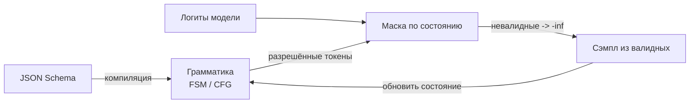
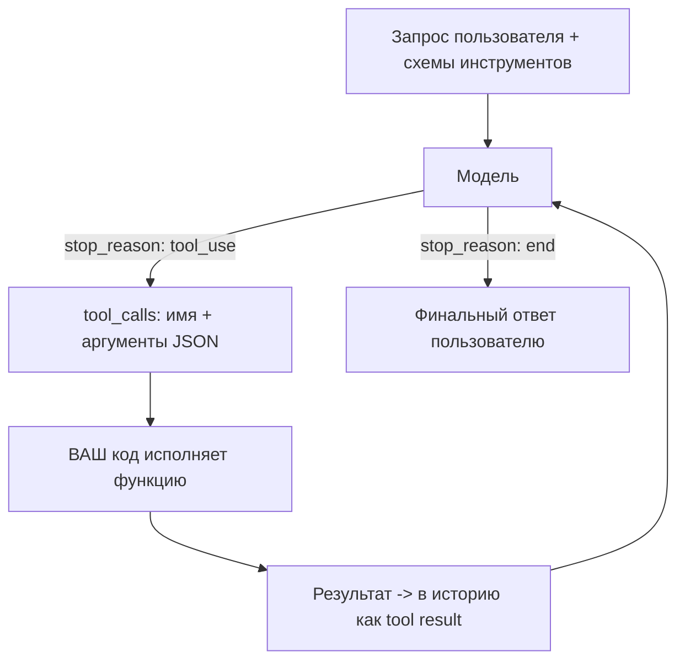

# API провайдеров: structured outputs, tool use, стриминг

Три механизма, на которых стоит почти любое LLM-приложение поверх провайдерского
API: **гарантированно валидный структурированный вывод** (structured outputs),
**вызов инструментов** (tool use / function calling) и **стриминг** ответа. Эта
заметка — про их механику, а не про синтаксис SDK: как constrained decoding
физически не даёт модели сгенерировать невалидный JSON, что реально происходит в
цикле tool use на вашем коде, и почему стриминг — это про TTFT и буферизацию, а не
«красиво печатается». Механика трансформера-декодера — предпосылка (DSWoK §4.1);
здесь прикладная дельта по API. Раздел **волатильный**: режимы и гарантии
провайдеров меняются — сверяй `last_reviewed`.

## Суть

Провайдерский API даёт сырой текстовый генератор; чтобы строить на нём надёжный
продукт, нужны три вещи. (1) **Structured outputs** превращают «попросили JSON —
иногда получили» в гарантию схемы. (2) **Tool use** даёт модели вызывать ваш код:
модель не исполняет функции — она возвращает *намерение* вызвать, исполняете вы, и
цикл повторяется. (3) **Стриминг** отдаёт токены по мере генерации, снижая
воспринимаемую задержку (TTFT) — но требует SSE и аккуратной сборки частичных tool
calls. Все три — фундамент `1.3-agents-from-scratch` и `1.5-backend`.

## Механика

### Три уровня гарантий структурированного вывода

| Подход | Что гарантирует | Чего НЕ гарантирует | Как добиться |
|---|---|---|---|
| **prompt-only** | ничего | ни синтаксис, ни схему | «верни JSON» в промпте + парсинг + ретраи |
| **JSON mode** | синтаксически валидный JSON | соответствие *вашей* схеме (поля, типы, enum) | флаг `response_format=json_object` |
| **strict / structured outputs** | **полное соответствие схеме** | семантическую правильность значений | constrained decoding по JSON Schema |

Разрыв в надёжности велик: OpenAI сообщает, что с **Structured Outputs**
(strict-режим, август 2024) соответствие схеме = **100%**, тогда как та же модель
на prompt-only следовании сложной схеме давала **<40%**. Важно: structured outputs
гарантируют *форму*, но не *смысл* — модель может вернуть валидное по схеме, но
фактически неверное значение. Это всё ещё надо эвалить (`1.4-evaluation`).

### Constrained decoding: грамматика → маска токенов

Как strict-режим даёт 100%: на каждом шаге декодирования вывод физически
ограничивается так, чтобы оставаться валидным. Пошагово:

1. **Компиляция схемы.** JSON Schema (или regex) превращается в **грамматику** —
   конечный автомат (finite state machine, FSM) для регулярных языков или
   **контекстно-свободную грамматику** (context-free grammar, CFG) для вложенных
   структур (OpenAI использует CFG — она выразительнее FSM).
2. **Маска токенов на каждом шаге.** По текущему состоянию автомата вычисляется
   множество токенов, которые **сохраняют вывод на валидном пути**. Логиты всех
   остальных токенов выставляются в $-\infty$:

$$
\text{logit}'_i = \begin{cases} \text{logit}_i, & \text{токен } i \in \text{разрешённые(состояние)} \\ -\infty, & \text{иначе} \end{cases}
$$

3. **Сэмплирование** идёт только из разрешённых токенов → невалидный токен
   сгенерировать невозможно. Состояние автомата обновляется, шаг повторяется.



### Где живёт overhead constrained decoding

Стоимость — в двух местах: **компиляция грамматики** (разово на схему) и
**применение маски** на каждом токене (вычислить разрешённое множество по
словарю ~100k+ токенов). Наивно второе медленно. Современные движки это почти
убирают: **XGrammar** (arXiv:2411.15100) делит словарь на *контекстно-независимые*
токены (проверяются заранее и кэшируются) и *контекстно-зависимые* (немного,
проверяются в рантайме), предвычисляет **кэш масок токенов** на этапе компиляции.
Итог — до **100×** меньше задержка на токен для CFG против прежних методов и до
**80×** ускорение end-to-end; <40 мкс/токен, «почти нулевой» overhead по TPOT. На
2026 XGrammar — дефолтный бэкенд structured outputs в vLLM/SGLang/TensorRT-LLM (см.
`2.4-inference-serving`). Альтернатива — **outlines** (FSM-индекс по regex).
Вывод: «structured outputs тормозят» — устаревший тезис при современном движке.

### Tool use loop: модель возвращает намерение, исполняете вы

Function calling / tool use не значит, что модель что-то исполняет. Цикл:



1. Вы передаёте список инструментов (имя, описание, JSON Schema аргументов).
2. Модель решает вызвать инструмент → возвращает `tool_call` (имя + аргументы,
   причём аргументы — это structured output по схеме инструмента, отсюда та же
   механика масок).
3. **Ваш код** исполняет функцию, результат добавляется в историю сообщений как
   tool result.
4. Модель видит результат и либо вызывает ещё инструмент, либо выдаёт финальный
   ответ. Это и есть основа агентного цикла (`1.3-agents-from-scratch`).

### Параллельные tool calls

Модель может в одном ответе вернуть **несколько** tool_calls сразу (например,
запросить погоду в трёх городах). Их можно исполнить параллельно (`asyncio`,
`1.5-backend`) и вернуть все результаты разом. Тонкости: каждый результат
сопоставляется с вызовом по `tool_call_id`; провайдеры дают флаг отключения
параллельности (`parallel_tool_calls=false`), когда порядок важен или инструменты
имеют побочные эффекты с зависимостями.

### Стриминг: SSE, TTFT/ITL, частичные tool calls

Без стриминга пользователь ждёт весь ответ → задержка = TTFT + ITL × число токенов
(см. `2.4-inference-serving`). Стриминг отдаёт токены по мере генерации:
воспринимаемая задержка падает до **TTFT** (time-to-first-token). Механика:

- **Транспорт — SSE (Server-Sent Events):** ответ как поток событий `data: {...}`,
  каждое — дельта (кусок текста или фрагмент tool_call). HTTP-соединение держится
  открытым.
- **Стриминг tool calls приходит по частям:** имя функции и аргументы-JSON
  собираются из дельт инкрементально — нельзя парсить, пока не накопили целиком
  (аргументы — невалидный JSON в середине потока).
- **Буферизация — частый баг:** прокси/фреймворк может буферизовать SSE и отдать
  всё разом, убив весь смысл (нужно отключать буфер, слать `flush`). На бэкенде —
  не аккумулировать весь ответ перед отправкой (`1.5-backend`).

## Практические соображения

### Расхождения провайдеров (проверять на дату)

| Аспект | OpenAI | Anthropic | Замечание |
|---|---|---|---|
| Strict structured outputs | да (`strict: true`, JSON Schema) | через tool-use схему / `tool_choice` | детали схемы (required, additionalProperties) различаются |
| JSON mode (только синтаксис) | да | — | у Anthropic — через принуждение к tool/prefill |
| Параллельные tool calls | да (`parallel_tool_calls`) | да | сопоставление по id |
| Принуждение к вызову | `tool_choice` | `tool_choice` | «обязательно вызови инструмент X» |

Не полагайся на единый код для всех провайдеров: подмножества JSON Schema,
поддерживаемые strict-режимом, у провайдеров **разные** (например, ограничения на
`anyOf`, рекурсию, форматы). Тестируй схему на конкретном провайдере.

### Дефолты и рычаги

- **structured outputs включать всегда, когда выход парсится кодом** — дешевле, чем
  ретраи и парсинг с регекспами.
- **Описание инструмента — это промпт.** Модель выбирает инструмент по имени и
  description; нечёткое описание → неверный выбор. Пиши их как для джуна.
- **Ретраи с экспоненциальной паузой** на rate limit / 5xx (`1.5-backend`).
- **temperature=0** для детерминированных извлечений; выше — для генерации.
- **Стриминг — для UX чата;** для фоновых задач (батч, очереди) стриминг не нужен,
  там важнее throughput (`1.5-backend`, `2.4-inference-serving`).

## Режимы отказа

- **Невалидный JSON на prompt-only под нагрузкой.** Нет гарантии формата, на части
  запросов модель добавляет текст/markdown вокруг JSON. Симптом: периодические
  ошибки парсинга. Фикс: structured outputs (strict) вместо парсинга-с-ретраями.
- **JSON валидный, но схема не та (нет поля, чужой тип).** Использован JSON mode, а
  не strict. Симптом: KeyError/валидатор падает на части ответов. Фикс: strict со
  схемой; провалидировать схему на конкретном провайдере.
- **Парсинг аргументов tool_call падает при стриминге.** Пытаетесь распарсить JSON
  до конца потока (в середине он невалиден). Фикс: аккумулировать дельты по
  `tool_call_id`, парсить по завершении.
- **Стриминг «не стримит» — всё приходит разом.** Прокси/сервер буферизует SSE.
  Симптом: TTFT равен полной латентности. Фикс: отключить буферизацию, слать flush,
  проверить промежуточные прокси.
- **Бесконечный цикл tool use.** Модель повторно вызывает инструмент, не сходясь.
  Симптом: растущая история, рост стоимости. Фикс: лимит шагов, детектор повторов
  (`1.3-agents-from-scratch`).
- **«Structured outputs тормозят».** Старый движок без кэша масок или сложная CFG.
  Фикс: движок с XGrammar/outlines; упростить схему. На современном стеке overhead
  близок к нулю.
- **Модель «галлюцинирует» аргументы инструмента.** Нечёткое описание/схема
  аргументов. Фикс: явные типы, enum, описания полей; strict-схема аргументов.

## Код

```python
# Tool-use loop на своём коде (псевдо-провайдер-агностично): цикл намерение->исполнение.
import json

def get_weather(city: str) -> str:        # ваш реальный код
    return f"{city}: +18C, ясно"

TOOLS = {"get_weather": get_weather}
TOOL_SCHEMAS = [{
    "name": "get_weather",
    "description": "Текущая погода в городе. Вызывай, если спрашивают про погоду.",
    "parameters": {"type": "object",
                   "properties": {"city": {"type": "string"}},
                   "required": ["city"], "additionalProperties": False},
}]

def run(client, user_msg, max_steps=6):
    messages = [{"role": "user", "content": user_msg}]
    for step in range(max_steps):                 # лимит шагов: страховка от петель
        resp = client.create(messages=messages, tools=TOOL_SCHEMAS,
                              parallel_tool_calls=True)
        if resp.stop_reason != "tool_use":         # модель готова с финальным ответом
            return resp.text
        messages.append(resp.assistant_message)    # сохранить намерение в историю
        for call in resp.tool_calls:               # параллельные вызовы — все сразу
            try:
                args = json.loads(call.arguments)   # аргументы валидны (strict-схема)
                result = TOOLS[call.name](**args)   # ИСПОЛНЯЕТ ВАШ КОД, не модель
            except Exception as e:
                result = f"ERROR: {e}"              # ошибку тоже вернуть модели
            messages.append({"role": "tool", "tool_call_id": call.id,
                             "content": result})    # сопоставление по id
    raise RuntimeError("превышен лимит шагов tool use")  # не зацикливаться молча
```

```python
# Сборка частичного tool_call из SSE-стрима: парсить ТОЛЬКО по завершении.
buf = {}                                     # tool_call_id -> накопленные аргументы
for event in stream:                         # SSE: дельты приходят кусками
    for d in event.tool_call_deltas:
        buf.setdefault(d.id, {"name": d.name, "args": ""})
        buf[d.id]["args"] += d.arguments_fragment   # JSON в середине НЕвалиден
# json.loads(buf[id]["args"]) вызывать здесь, после потока — не внутри цикла.
```

## Вопросы для самопроверки

1. Чем JSON mode отличается от strict structured outputs, и какой класс багов
   ловит только второе?
2. Опиши механику constrained decoding: как схема превращается в гарантию валидного
   вывода на уровне сэмплирования токенов?
3. Почему CFG выразительнее FSM и зачем это для JSON со вложенностью?
4. Где живёт overhead constrained decoding и как XGrammar делает его «почти
   нулевым»? Что значит «контекстно-независимые токены»?
5. В каком смысле модель «не вызывает» инструмент? Что именно происходит на каждом
   круге tool-use loop?
6. Почему аргументы tool_call нельзя парсить в середине стрима и как собирать их
   правильно?
7. Что такое TTFT и почему стриминг снижает именно *воспринимаемую* задержку, а не
   общую латентность?
8. У тебя стриминг «приходит разом». Где искать причину и почему буферизация SSE
   ломает весь смысл?
9. Structured outputs дали 100% валидной схемы, но приложение всё равно выдаёт
   мусор. Что они НЕ гарантируют и чем это закрыть?
10. Когда параллельные tool calls опасны и как их отключить?

## Ссылки

- [P][D][V] OpenAI — Introducing Structured Outputs in the API (strict, 100% схемы)
  https://openai.com/index/introducing-structured-outputs-in-the-api/
- [P] Dong et al. — XGrammar: Flexible and Efficient Structured Generation Engine
  (2024), arXiv:2411.15100 (кэш масок токенов, near-zero overhead)
- [P] JSONSchemaBench — бенчмарк structured outputs (2025), arXiv:2501.10868
- [D][V] Anthropic — Tool use overview
  https://docs.anthropic.com/en/docs/build-with-claude/tool-use/overview
- [D] outlines — constrained decoding через FSM/regex
  https://github.com/dottxt-ai/outlines
- [G] Structured decoding в vLLM (механика масок)
  https://www.bentoml.com/blog/structured-decoding-in-vllm-a-gentle-introduction
- Предпосылки: DSWoK §4.1 (декодер трансформера — основа сэмплирования токенов).
- Дальше: `1.3-agents-from-scratch` (tool-use loop → агент); `1.5-backend`
  (SSE/стриминг, параллельные вызовы, ретраи на бэкенде); `2.4-inference-serving`
  (TTFT/ITL, XGrammar в движках); `1.4-evaluation` (проверка смысла, не только формы).
