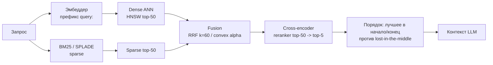

# RAG на практике: эмбеддеры, векторные БД, чанкинг, гибрид и реранк

> Прикладной слой Retrieval-Augmented Generation (RAG, генерация с обогащением
> поиском): как из «у нас есть документы» собрать ретривер, который реально
> попадает в нужный чанк и кладёт его на видное место в контекст. Базовый
> пайплайн (indexing → retrieval → generation), двухбашенные ретриверы и базовые
> метрики качества разобраны в **DSWoK §4.3** (RAG), **§2.1** (dual-encoder /
> двухбашенные модели) и **§3.2** (эмбеддинги) — здесь только **дельта**: выбор
> эмбеддера и его асимметрия, выбор векторной БД и индекса, числа чанкинга,
> реранкеры и гибридный поиск с фьюжном. Тема волатильная (лидерборды, модели,
> дефолты движков меняются) — сверяйся с `last_reviewed`.

## Суть

RAG нужен, чтобы LLM отвечала по актуальным/приватным данным без дообучения и без
галлюцинаций «из головы». Качество ответа ограничено сверху качеством retrieval:
если нужный фрагмент не попал в top-k или попал, но утонул в середине контекста,
никакой промпт не спасёт. Прикладная инженерия RAG — это четыре рычага, каждый со
своим компромиссом: (1) **эмбеддер** (что считать «близким»), (2) **индекс
векторной БД** (recall ↔ latency ↔ память), (3) **чанкинг** (гранулярность
смысла), (4) **поверх retrieval — гибрид + реранк** (точность top-k и порядок).
Связь с соседями: провайдерские API эмбеддингов и structured output — в
`1.1-provider-apis`; RAG как инструмент агента — `1.3-agents-from-scratch`;
метрики (faithfulness, context precision/recall) — `1.4-evaluation`; подготовка и
дедуп корпуса под индексацию — `2.3-data-preparation`.

## Механика

### Выбор эмбеддера: размерность, семейства, асимметрия query/document

Эмбеддер (модель, переводящая текст в плотный вектор) определяет геометрию
«похожести». Прикладные параметры:

**Размерность.** Типичные значения: **384** (`all-MiniLM-L6-v2`), **768**
(`bge-base`, `e5-base`), **1024** (`bge-large`, `e5-large`, `bge-m3` dense),
**1536** (OpenAI `text-embedding-3-small`), **3072** (`text-embedding-3-large`).
Размерность подтверждена по карточкам моделей HuggingFace и спецификациям OpenAI;
для 384/1024/1536/3072 — совпадение по двум независимым обзорам (PE Collective,
document360). Больше измерений → выше потолок качества, но дороже хранить и искать
(память индекса и latency растут ~линейно с d). **Matryoshka-эмбеддинги**
(`text-embedding-3`, ряд BGE) позволяют усечь вектор (1536→512) с плавной
деградацией — рычаг «качество против стоимости».

**Семейства retrieval-эмбеддеров.** **E5** (`intfloat/e5-*`), **BGE**
(`BAAI/bge-*`), **GTE** (`Alibaba-NLP/gte-*`) — открытые лидеры MTEB
(Massive Text Embedding Benchmark — сводный лидерборд retrieval/clustering/STS).
Не выбирай по одному среднему числу MTEB: смотри подзадачу **Retrieval** и язык;
лидерборд волатилен (модели сменяются ежемесячно).

**Асимметрия query/document — частый молчаливый баг.** E5, BGE, GTE,
Qwen3-Embedding обучены с **разными инструкционными префиксами** для запроса и
документа. E5 требует буквально `query: ...` и `passage: ...`; BGE добавляет к
**запросу** инструкцию вида `Represent this sentence for searching relevant
passages:`, а документы кодирует без неё. Применишь префикс документа к запросу
(или забудешь префикс вовсе) — получишь тихую просадку recall без единой ошибки в
логах. Это асимметричный поиск: пространство запросов и пространство документов
выровнены только при правильных префиксах (подтверждено доками E5/BGE и обзором
Milvus).

### Индексы ANN: HNSW vs IVF vs PQ

Точный (brute-force) поиск по N векторам — O(N·d) на запрос, не масштабируется.
Approximate Nearest Neighbor (ANN, приближённый поиск ближайших) меняет немного
recall на радикальное ускорение. Три семейства (механику индексирования см. также
DSWoK §4.3, здесь — прикладные параметры и компромиссы):

**HNSW (Hierarchical Navigable Small World — иерархический навигируемый
малый мир).** Многослойный граф: верхние слои разрежены (длинные «прыжки»),
нижний содержит все узлы. Поиск спускается жадно сверху вниз. Параметры:
- **M** — число рёбер на узел (связность). Больше M → выше recall и память,
  медленнее построение. Дефолт **16**; для высокого recall 24–48.
- **ef_construction** — размер списка кандидатов при вставке. Больше → качественнее
  граф и выше recall, дольше build. Дефолт **200**.
- **ef_search** (он же `ef`) — размер списка кандидатов на запросе. **Главная
  ручка recall↔latency в рантайме.** Пример (10M векторов): `ef_search=500` →
  recall ~98% при ~5 мс; `ef_search=100` → recall ~85% при ~1 мс (Milvus/Zilliz
  FAQ; диапазоны совпадают с Qdrant course). Дефолт ~100.

**IVF (Inverted File — инвертированный список).** K-means делит пространство на
**nlist** ячеек (кластеров). Запрос ищется только в **nprobe** ближайших ячейках.
- **nlist** — число кластеров (типично √N…4√N). Больше → мельче ячейки, быстрее, но
  легче промахнуться мимо нужной.
- **nprobe** — сколько ячеек просматривать. **Ручка recall↔latency**: nprobe=1
  быстро/низкий recall, nprobe→nlist приближается к brute-force.

**PQ (Product Quantization — поквартирное/произведённое квантование).** Сжимает
**сами векторы**, не структуру поиска. Вектор размерности d режется на **m**
подвекторов; для каждого подпространства k-means строит **кодбук** из
$2^{\text{nbits}}$ центроидов (обычно nbits=8 → 256 центроидов). Вектор хранится
как m байт (индексы центроидов) вместо d·4 байт fp32. Пример Pinecone: сжатие
до ~97% (например d=128 fp32 = 512 байт → m=8 байт). Цена — приближённые
расстояния (по кодбукам), просадка recall. Память PQ: `m · nbits / 8` байт на
вектор + сам кодбук. Обычно комбинируют: **IVF-PQ** (ячейки + сжатие) для
миллиардных корпусов на ограниченной RAM.

| Индекс | Recall | Latency | Память | Когда |
|---|---|---|---|---|
| **HNSW** | высокий | низкая (граф) | **высокая** (граф в RAM, ~M·8 байт/узел сверх вектора) | дефолт до ~10–50M, нужен низкий latency |
| **IVF(Flat)** | средне-высокий (∝ nprobe) | средняя | средняя (хранит полные векторы) | большие корпуса, build быстрее HNSW |
| **PQ / IVF-PQ** | ниже (lossy) | низкая | **минимальная** (сжатие ~10–97%) | млрд векторов, RAM — узкое место |

(сводка по Qdrant/pgvector docs, Pinecone PQ-серии, FAISS wiki — три источника.)

### Гибридный поиск: dense + sparse и фьюжн

Плотный (dense) вектор ловит семантику, но промахивается на редких терминах,
кодах, именах. Разреженный (sparse) lexical-поиск ловит точные совпадения:
- **BM25** — классический лексический скоринг (TF с насыщением + нормировка длины).
- **SPLADE** (Sparse Lexical AnD Expansion, arXiv:2107.05720) — *learned sparse*:
  BERT назначает веса терминам и **расширяет** документ семантически близкими
  токенами (term expansion), оставаясь разреженным (размерность = словарь, ~30k+).
  `bge-m3` умеет выдавать dense+sparse+multi-vector одной моделью.

Результаты двух ретриверов нужно **слить (fusion)**. Два подхода:

**RRF (Reciprocal Rank Fusion — слияние по обратным рангам).** Игнорирует сырые
скоры (они в разных шкалах!), работает только с рангами:

$$\text{RRF}(d) = \sum_{i} \frac{1}{k + \text{rank}_i(d)}$$

- $d$ — документ; $\text{rank}_i(d)$ — его ранг (1, 2, …) в i-м ретривере;
- $k$ — сглаживающая константа, **по умолчанию ≈60** (эмпирический оптимум
  Cormack et al. 2009 на TREC; бенчмарки находят k∈[40,80] сопоставимыми —
  подтверждено BigData Boutique и Salesforce/Glaforge). Большой k снижает влияние
  топовых рангов, делая фьюжн «мягче».

**Convex combination (выпуклая комбинация скоров).** Нормирует скоры и смешивает:

$$\text{score}(d) = \alpha \cdot s_{\text{dense}}(d) + (1-\alpha) \cdot s_{\text{sparse}}(d)$$

- $\alpha\in[0,1]$ — вес плотного поиска; типичный диапазон тюнинга **0.3–0.7**,
  нейтральный старт 0.5.
- Точнее RRF при настройке под домен, **но требует нормировки и тюнинга** на
  валидации; чувствительна к сдвигу шкал. RRF — zero-shot и робастнее «из
  коробки», но convex combination лучше генерализует при настройке (TM2C2 и др.;
  ср. «From BM25 to Corrective RAG»).



### Реранкинг: bi-encoder vs cross-encoder

Ретривер (двухбашенный bi-encoder, DSWoK §2.1) кодирует запрос и документ
**независимо** → быстро (документы предвычислены), но модель **никогда не видит
пару вместе** и теряет тонкие сигналы релевантности. **Cross-encoder** подаёт пару
`[query, document]` одним входом и считает **полное взаимное внимание** → точнее,
но запускается **по разу на каждого кандидата** (нельзя предвычислить). Отсюда
паттерн: bi-encoder достаёт top-50…100 дёшево, cross-encoder переранжирует их в
top-5…10. Эффект: рост NDCG@10 на +5…+15 пунктов, Hit@1 в отдельных бенчмарках с
~63% до ~83% (arXiv:2409.07691, обзор Milvus — два источника).

| | Bi-encoder (ретривер) | Cross-encoder (реранкер) |
|---|---|---|
| Вход | query и doc раздельно | пара [query, doc] вместе |
| Внимание | нет взаимного | полное взаимное (token-level) |
| Стоимость запроса | 1 forward на запрос + ANN | N forward (по кандидату) |
| Предвычисление | да (векторы в индексе) | нет |
| Роль | широкий отбор top-k | точная переранжировка top-n |
| Латентность | мс | десятки–сотни мс на 50–100 кандидатов |

### Lost-in-the-middle: порядок важнее, чем кажется

Liu et al. «Lost in the Middle» (arXiv:2307.03172, TACL 2024) показали
**U-образную** кривую: LLM лучше всего использует информацию в **начале и конце**
контекста и хуже — в **середине**, даже когда нужный документ туда попал.
Прикладное следствие: после реранка **не** вали документы подряд — клади самые
релевантные в начало и конец, наименее важные в середину; держи top-k небольшим.
Это не баг ретривера, а свойство внимания (подтверждено Liu et al. и последующими
работами Found-in-the-Middle).

### Чанкинг: размеры, overlap, recursive, late chunking

Чанк — единица индексации; слишком крупный размывает эмбеддинг, слишком мелкий
теряет контекст. Прикладные дефолты (механику индексации см. DSWoK §4.3):
- **Размер 256–512 токенов**, бенчмарк-дефолт **512** (Vecta/langcopilot 2026:
  recursive 512 обошёл semantic 69% против 54% по composite accuracy).
- **Overlap 10–20%** (для 512 → 50–100 токенов; для 256 → 25–50). Перекрытие
  страхует от разрыва смысла на границе. Подтверждено двумя обзорами 2026.
- **Recursive splitting** — режет по иерархии разделителей (абзац → предложение →
  слово), сохраняя структуру; рабочий дефолт для большинства корпусов.
- **Late chunking** (поздний чанкинг) — сначала прогнать **весь длинный документ**
  через long-context эмбеддер, потом усреднить токен-эмбеддинги по чанкам.
  Каждый чанк наследует контекст всего документа → лечит «оторванные» местоимения и
  разорванные аргументы. Выигрыш растёт с длиной документа (Jina; langcopilot).

### Векторные БД: Qdrant vs pgvector vs FAISS

| | Qdrant | pgvector | FAISS |
|---|---|---|---|
| Тип | сервис-СУБД (Rust) | расширение Postgres | библиотека (C++/Python) |
| Индексы | HNSW (+ квантование) | HNSW, IVFFlat | Flat/HNSW/IVF/PQ/IVF-PQ |
| Метаданные/фильтры | сильная фильтрация (payload) | SQL-WHERE, JOIN | нет (только векторы) |
| Масштаб | млрд, шардинг | хорош до ~50–100M | ограничен RAM процесса |
| Когда | прод, фильтры, нужен сервис | уже есть Postgres, единое хранилище | прототип/эмбеддинг в код, max скорость |

Тезисы (Tigerdata, glukhov, Estha — три источника): **FAISS** быстрее всех на
чистом векторном поиске, но это *библиотека* без сервера, фильтров и персистентности
— её встраивают в приложение. **pgvector** даёт вектор-поиск без новой БД и честный
SQL-JOIN метаданных, но cost-планировщик Postgres иногда выбирает приближённый скан
там, где точный был бы и точнее, и не медленнее; буксует за ~50–100M. **Qdrant** —
purpose-built: сильная фильтрация по payload и квантование на борту, прод-масштаб.

## Практические соображения

- **Префиксы эмбеддера** — первое, что проверять при «плохом RAG»: правильный
  `query:`/`passage:` (E5) или инструкция запроса (BGE). Тихая просадка без ошибок.
- **Дефолтный стек**: recursive 512/64 чанки → bge/e5-large (1024) с префиксами →
  HNSW(M=16, ef_construction=200) в Qdrant → гибрид (dense + BM25/SPLADE, RRF k=60)
  top-50 → cross-encoder (`bge-reranker`) top-5 → переупорядочить против
  lost-in-the-middle.
- **ef_search** крути на валидации под целевой recall/latency; это рантайм-ручка,
  индекс не пересобирать.
- **PQ/IVF-PQ** включай, только когда RAM реально узкое место (десятки–сотни млн+);
  до того HNSW проще и точнее.
- **alpha** в convex combination тюнь на 20–50 размеченных запросах; нет разметки —
  бери RRF (zero-shot).
- **Реранк** окупается, когда генератор чувствителен к шуму в top-k; добавляет
  десятки–сотни мс — учитывай в latency-бюджете (`1.5-backend`).
- **Эвалить retrieval отдельно** от генерации: context recall/precision до того, как
  винить LLM (`1.4-evaluation`).

## Режимы отказа

- **Низкий recall, «БД ничего не находит».** Причина: слишком малый `ef_search`
  (HNSW) или `nprobe` (IVF) — поиск застревает в локальном минимуме. Симптом: точный
  brute-force находит, ANN — нет. Фикс: поднять ef_search/nprobe; при необходимости
  M/ef_construction (пересборка).
- **Асимметрия префиксов query/document.** Причина: к запросу применён префикс
  документа или нет префикса. Симптом: системно низкая релевантность на хорошей
  модели, метрики ретривера в полу. Фикс: выставить правильные префиксы per модель.
- **Lost-in-the-middle.** Причина: нужный чанк есть в контексте, но в середине при
  большом k. Симптом: ответ игнорирует факт, который физически передан. Фикс:
  меньше k, реранк, лучшее в начало/конец.
- **Гибрид хуже одиночного dense.** Причина: смешаны сырые скоры разных шкал в
  convex combination без нормировки, либо неудачный alpha. Симптом: фьюжн просаживает
  метрики против чистого dense. Фикс: нормировать скоры или перейти на RRF (ранги,
  шкало-независим).
- **Битый чанкинг.** Причина: фикс-размер режет посреди таблицы/кода/предложения.
  Симптом: чанки с обрывками, реранкер их топит. Фикс: recursive splitting, overlap
  10–20%, late chunking на длинных документах.
- **PQ убил точность.** Причина: слишком агрессивное сжатие (большой m или мелкий
  кодбук). Симптом: recall обвалился после перехода на PQ. Фикс: больше nbits/меньше
  сжатие, IVF-PQ с rerank по полным векторам, либо HNSW если RAM позволяет.

## Код

```python
# Гибридный поиск (dense + BM25) -> RRF-слияние -> cross-encoder реранк.
# Иллюстрирует механику фьюжна и реранка, а не API конкретной БД.
from sentence_transformers import SentenceTransformer, CrossEncoder
from rank_bm25 import BM25Okapi
import numpy as np

# 1) Эмбеддер с ПРАВИЛЬНЫМИ префиксами (E5-стиль): query vs passage асимметрия.
embedder = SentenceTransformer("intfloat/e5-large-v2")  # dim=1024
def embed_query(q):    return embedder.encode("query: " + q, normalize_embeddings=True)
def embed_passage(p):  return embedder.encode("passage: " + p, normalize_embeddings=True)

docs = [...]                                   # список текстов-чанков (512 ток., overlap ~64)
doc_vecs = np.stack([embed_passage(d) for d in docs])
bm25 = BM25Okapi([d.lower().split() for d in docs])   # sparse-ветка

def dense_search(q, k=50):                     # cosine = dot (векторы нормированы)
    sims = doc_vecs @ embed_query(q)
    return np.argsort(-sims)[:k]               # индексы по убыванию похожести

def sparse_search(q, k=50):
    return np.argsort(-bm25.get_scores(q.lower().split()))[:k]

def rrf_fuse(rankings, k=60):                  # k=60 — эмпирический дефолт RRF
    scores = {}
    for ranking in rankings:                   # ranking = список doc_id по рангу
        for rank, doc_id in enumerate(ranking, start=1):
            scores[doc_id] = scores.get(doc_id, 0) + 1.0 / (k + rank)  # 1/(k+rank)
    return sorted(scores, key=scores.get, reverse=True)

reranker = CrossEncoder("BAAI/bge-reranker-large")  # cross-encoder: пара [q, doc] вместе

def retrieve(q, top_n=5):
    fused = rrf_fuse([list(dense_search(q)), list(sparse_search(q))])[:50]
    # cross-encoder видит запрос и документ совместно -> точная, но дорогая переранжировка
    pairs = [(q, docs[i]) for i in fused]
    order = np.argsort(-reranker.predict(pairs))
    ranked = [fused[i] for i in order][:top_n]
    # против lost-in-the-middle: лучшее в начало и конец, слабое в середину
    head, tail = ranked[0::2], ranked[1::2]
    return head + tail[::-1]
```

## Вопросы для самопроверки

1. Почему cross-encoder точнее bi-encoder, но его нельзя поставить на первый этап
   поиска по миллиону документов? Что именно нельзя предвычислить?
2. Чем `ef_search` отличается от `ef_construction`, и какую из двух ручек ты крутишь
   в проде без пересборки индекса?
3. Дано: recall@10 упал после перехода с HNSW на IVF-PQ. Перечисли три независимых
   причины и как их различить.
4. Почему RRF выбрасывает сырые скоры, а convex combination — нет? В каком случае
   convex combination тихо просадит гибрид против чистого dense?
5. Объясни роль k≈60 в RRF. Что произойдёт при k=1 и при k=10000?
6. Что такое асимметрия query/document в E5/BGE и как именно она ломает retrieval,
   не выдавая ни одной ошибки в логах?
7. Документ есть в контексте, но LLM его игнорирует. Какой феномен и какие два
   приёма (порядок и размер) его смягчают?
8. PQ: вектор d=768 fp32. Как из 3072 байт получить 96 байт и какой ценой по
   recall? Что добавляет IVF поверх PQ?
9. Когда late chunking даёт выигрыш над recursive splitting, а когда — нет?
10. Ты выбираешь между Qdrant, pgvector и FAISS для прод-сервиса с фильтрацией по
    метаданным на 200M векторов. Что отпадает и почему?

## Ссылки

- [P] Liu et al. — Lost in the Middle: How Language Models Use Long Contexts
  (TACL 2024), arXiv:2307.03172 — U-образная кривая позиции [V: модели догоняют].
- [P] Formal et al. — SPLADE: Sparse Lexical and Expansion Model (2021),
  arXiv:2107.05720 — learned sparse, term expansion.
- [P] Cormack et al. — Reciprocal Rank Fusion (SIGIR 2009) — происхождение k≈60.
- [P] Reranker-бенчмарк — arXiv:2409.07691 (Q&A retrieval, NDCG/Hit@1 cross-encoder).
- [G][V] HNSW M/ef_construction/ef_search и recall↔latency — Milvus/Zilliz FAQ;
  Qdrant course (https://qdrant.tech/documentation/concepts/indexing/).
- [G] Product Quantization (сжатие 97%, кодбуки) — Pinecone FAISS-серия
  https://www.pinecone.io/learn/series/faiss/product-quantization/
- [D] Qdrant docs (HNSW, payload-фильтры, квантование); pgvector
  https://github.com/pgvector/pgvector ; FAISS wiki (Flat/IVF/PQ).
- [D] MTEB leaderboard https://huggingface.co/spaces/mteb/leaderboard [V];
  карточки E5/BGE/GTE на HuggingFace (префиксы query/passage).
- [G] RRF vs convex combination, alpha-тюнинг — BigData Boutique; Salesforce/Glaforge;
  «From BM25 to Corrective RAG» (fusion CC vs RRF).
- [G] Qdrant vs pgvector vs FAISS — Tigerdata, glukhov.org, Estha [V].
- [G] Чанкинг 256–512/overlap/recursive/late — langcopilot, Vecta benchmark 2026 [V].
- Перекрёстно: `1.1-provider-apis` (API эмбеддингов, structured output),
  `1.3-agents-from-scratch` (RAG как tool), `1.4-evaluation` (метрики RAG:
  faithfulness, context precision/recall), `2.3-data-preparation`
  (эмбеддинги для дедупа, подготовка корпуса).
- Предпосылки DSWoK: §4.3 (RAG-пайплайн indexing/retrieval, базовые метрики),
  §2.1 (двухбашенные/dual-encoder ретриверы), §3.2 (эмбеддинги).
