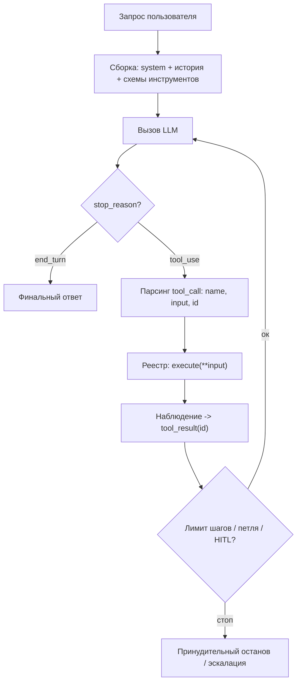

# Агентные системы на своём коде

Агент (agent) — это система, в которой LLM **сама управляет** своим процессом:
решает, какой инструмент (tool) вызвать, читает результат (observation) и решает,
что делать дальше, пока задача не закрыта. В отличие от фиксированного пайплайна
(workflow), где порядок шагов задан кодом, агент строит траекторию динамически.
Эта заметка — про то, **как агентный цикл устроен на прямых вызовах tool-use API**
(`1.1-provider-apis`), а не про «возьми LangGraph/CrewAI». Понимая голый цикл, вы
отлаживаете любой фреймворк. Раздел волатильный: цены кэша, дефолтные лимиты SDK и
рекомендации провайдеров меняются — проверяйте `last_reviewed`.

## Суть

Различие, с которого Anthropic начинает «Building Effective Agents»: **workflow** —
«системы, где LLM и инструменты оркестрируются через предопределённые пути в коде»;
**agent** — «системы, где LLM динамически направляет собственные процессы и
использование инструментов, сохраняя контроль над тем, как решает задачу». Workflow
даёт предсказуемость, агент — гибкость ценой предсказуемости.

Главный практический тезис источника: **начинай с простого**. «Для многих
приложений оптимизации одиночного вызова LLM с retrieval и few-shot обычно
достаточно». Многошаговую агентность добавляют, **только когда более простые
решения не справляются**. Агенты оправданы для открытых задач, где «трудно или
невозможно предсказать нужное число шагов». То есть агент — это не «модно», а
ответ на конкретное свойство задачи: непредсказуемая глубина/ветвление.

Соседние темы: API tool-use — `1.1-provider-apis`; исполнение инструментов,
очереди, идемпотентность — `1.5-backend`; переиспользование KV системного промпта
(prefix caching) — `2.4-inference-serving`; оценка траекторий агента —
`1.4-evaluation`.

## Механика

### Минимальный цикл агента

Агент на прямых API — это цикл вокруг одного факта: tool-use API **не исполняет**
инструменты, оно лишь возвращает *намерение* вызвать инструмент (блок `tool_use` с
именем, аргументами и `tool_use_id`). Исполняет — ваш код, и кладёт результат
обратно в диалог как `tool_result`. Шаги:

1. **Сформировать запрос**: системный промпт + история сообщений + JSON-схемы
   доступных инструментов (`tools=[...]`).
2. **Вызвать LLM.** Получить ответ. Проверить `stop_reason`.
3. **Развилка по `stop_reason`:**
   - `end_turn` (модель ответила текстом) → задача закрыта, выйти из цикла.
   - `tool_use` → модель просит инструмент(ы). Идти дальше.
4. **Распарсить tool-call(ы)**: для каждого блока `tool_use` взять `name`, `input`
   (словарь аргументов), `id`.
5. **Исполнить**: найти инструмент в **реестре** (`tool_map[name]`), вызвать
   `execute(**input)`. Обернуть ошибки — не давать исключению уронить цикл.
6. **Вернуть наблюдение**: добавить в историю `tool_result` с тем же
   `tool_use_id` и сериализованным результатом.
7. **Проверить ограничители**: лимит шагов, лимит токенов, детектор петель,
   точки human-in-the-loop. Если превышены — остановиться.
8. **Повторить с шага 2.**



Это ровно петля **ReAct** (Reasoning + Acting, рассуждение + действие; Yao et al.,
2022, arXiv:2210.03629): модель чередует *мысль* (Thought), *действие* (Action) и
*наблюдение* (Observation). Ключевая идея ReAct — рассуждение и действие
**переплетены**: рассуждение помогает строить и править план, действия
заземляют рассуждение во внешних источниках. На HotpotQA/Fever это снижает
галлюцинации chain-of-thought; на ALFWorld даёт +34% абсолютного успеха, на
WebShop +10% против baseline. Современный tool-use API — это и есть ReAct, где
«мысль» спрятана в reasoning-токенах, а «действие» формализовано как `tool_use`.

### Реестр инструментов и контракт

Инструмент = (1) JSON-схема для модели (имя, описание, типы аргументов) и (2)
исполняемая функция в вашем коде. Anthropic: хорошее описание инструмента содержит
**пример использования, краевые случаи, формат входа и границы с другими
инструментами**; применяйте «poka-yoke» — стройте аргументы так, чтобы ошибиться
было трудно. Это ACI (agent-computer interface) — его качество влияет на успех не
меньше выбора модели.

### Память и сжатие контекста

История растёт каждый шаг (запрос модели + tool_result). Без управления контекст
переполняется и дорожает квадратично по вниманию. Стратегии:

- **Скользящее окно (sliding window)**: держать последние N сообщений + системный
  промпт. Просто, но теряет ранний контекст.
- **Суммаризация (summarization/compaction)**: периодически свернуть старые шаги в
  краткое резюме отдельным вызовом LLM. Сохраняет смысл, добавляет вызов и риск
  потери деталей.
- **Внешняя память (external memory)**: писать факты/результаты в хранилище (файл,
  векторная БД — см. `1.2-rag-applied`) и подтягивать релевантное по запросу, а не
  держать всё в окне. Масштабируется лучше всего.

### Prefix caching: переиспользование KV системного промпта

Системный промпт + схемы инструментов в агенте **неизменны** и повторяются на
каждом из десятков шагов. Prefix caching кэширует KV-состояние общего префикса,
чтобы не пересчитывать prefill (см. механику в `2.4-inference-serving`,
RadixAttention/automatic prefix caching). Числа (волатильны):

- **Anthropic prompt caching**: до **~90% дешевле** и до **~85% быстрее** на длинных
  промптах; чтение из кэша стоит **0.1×** базовой цены входных токенов (cache write
  дороже базовой ~1.25×). Пример: книга на 100K токенов — отклик с 11.5 с до 2.4 с.
- **OpenAI prompt caching**: автоматически на префиксах **>1024 токенов** (шаг
  кэширования 128 токенов); **−50%** на кэшированных токенах, до **−80% TTFT**.

Расхождение между провайдерами: скидка 90% (Anthropic) vs 50% (OpenAI) — разные
ценовые модели (Anthropic берёт плату за запись в кэш, OpenAI — нет). Для агента с
длинным стабильным системным промптом это превращает дорогой многошаговый цикл в
дешёвый: каждый шаг переиспользует префикс предыдущего.

### Ограничители: лимит шагов, токенов, детектор петель, HITL

Агент без тормозов уходит в бесконечный цикл и жжёт бюджет. Anthropic прямо
советует «условия остановки (например, максимум итераций) для контроля».

- **Лимит шагов (max steps/turns)**: типичный дефолт самодельных циклов — **10**
  (Monigatti, from-scratch). Прод-агенты ставят выше под задачу, но всегда конечно.
- **Лимит токенов/стоимости**: жёсткий потолок суммарных токенов на сессию.
- **Детектор петель (loop detector)**: хранить хеш `(tool_name, input)` за сессию;
  по разным прод-разборам порог **3 одинаковых вызова** — частый дефолт без
  ложных срабатываний на легитимных ретраях, **жёсткий стоп ~5**. Ловят три
  паттерна: повтор идентичного вызова, чередование A-B-A-B, no-op-петли. Хорошая
  тактика — двухуровневая эскалация: при детекте сначала впрыснуть
  self-correction-подсказку (один шанс исправиться), при упорстве — hard stop.
- **Human-in-the-loop (HITL)**: пауза на подтверждение перед необратимыми
  действиями (платёж, удаление, отправка письма) или «при блокере».

## Практические соображения

### Workflow vs agent — когда что

| Признак задачи | Workflow (фикс. пайплайн) | Agent (динамический) |
|---|---|---|
| Число шагов | известно заранее | непредсказуемо |
| Ветвление | детерминированное, в коде | решает модель |
| Предсказуемость/аудит | высокая | ниже |
| Стоимость/латентность | предсказуемы | разброс, риск разрастания |
| Отладка | простая (трассируемый граф) | сложная (нестабильные траектории) |
| Примеры | классификация→роутинг→извлечение; RAG-пайплайн | кодинг-агент, ресёрч, поддержка с инструментами |

Правило: **сначала одиночный вызов, потом workflow, агент — в последнюю очередь**.
Если шаги фиксированы — это workflow, и не надо называть его агентом.

### Паттерны агентов/оркестрации

| Паттерн | Идея | Когда брать | Цена |
|---|---|---|---|
| **ReAct** | мысль→действие→наблюдение в одном цикле | универсальный дефолт, нужен tool-use | петли, разрастание контекста |
| **Plan-execute** | сперва составить план, затем исполнять шаги | многошаговые задачи с зависимостями | план может устареть к исполнению |
| **Reflection** (evaluator-optimizer) | один LLM генерит, другой критикует в цикле | качество > скорости, есть критерий | +вызовы, риск зацикливания на правках |
| **Router** (routing) | классификатор направляет вход в спец-обработчик | разнородные запросы, узкая оптимизация веток | ошибка роутинга = неверная ветка |
| **Multi-agent** (orchestrator-workers) | оркестратор дробит задачу на под-агентов | широкие/параллельные подзадачи | сложность, стоимость, рассинхрон |

Plan-execute и reflection — это workflow-обвязка вокруг агентного ядра; router и
multi-agent — способы декомпозиции. Все строятся на той же базовой петле.

### Дефолты

- Начни с ReAct + 3-7 инструментов с отличными описаниями. Больше инструментов —
  хуже выбор.
- `temperature=0` для шага выбора инструмента (детерминизм, проще отлаживать).
- Системный промпт стабилен и в начале — чтобы prefix caching попадал.
- Логируй полную траекторию (`1.5-backend`, observability) — без трейсов агент
  неотлаживаем.

## Режимы отказа

- **Петля инструментов (tool loop).** *Симптом*: один и тот же вызов с теми же
  аргументами повторяется, токены/деньги текут, прогресса нет (классика —
  «$12 на 47 одинаковых вызовах»). *Причина*: модель игнорирует/не понимает
  observation, особенно при раздутом контексте (>100K токенов — деградация). *Фикс*:
  детектор петель (хеш `(tool, input)`, порог 3 / стоп 5), self-correction-подсказка,
  понятные сообщения об ошибке в tool_result.
- **Разрастание контекста (context bloat).** *Симптом*: каждый шаг дороже и
  медленнее, после N шагов — переполнение окна или провал в середине
  («lost in the middle»). *Причина*: вся история копится в промпте. *Фикс*:
  суммаризация/компакция, скользящее окно, внешняя память, обрезка громоздких
  tool_result.
- **Неверный парсинг tool_call.** *Симптом*: `KeyError`/исключение при
  `tool_map[name]`, или аргументы не проходят валидацию схемы. *Причина*: модель
  выдумала имя инструмента/невалидный JSON, код не обработал. *Фикс*: валидировать
  `input` по схеме (Pydantic), на неизвестное имя/ошибку возвращать `tool_result` с
  текстом ошибки (а не падать) — модель сама исправится на следующем шаге.
- **Нет условия остановки.** *Симптом*: агент крутится до таймаута/исчерпания
  бюджета. *Фикс*: жёсткий `max_steps` и лимит токенов всегда, даже для прототипа.
- **Необратимое действие без подтверждения.** *Симптом*: агент удалил/отправил/
  заплатил по галлюцинации. *Фикс*: HITL-чекпоинт перед side-effect, разделение
  read-only и mutating инструментов.

## Код

```python
# Минимальный агентный цикл на ПРЯМЫХ вызовах tool-use API (псевдо-Anthropic).
# Своё: реестр инструментов, лимит шагов, детектор повторов. Без фреймворка.
import json, hashlib

TOOLS_SCHEMA = [{
    "name": "get_weather",
    "description": "Погода в городе. Аргумент city: название на английском.",
    "input_schema": {"type": "object",
                     "properties": {"city": {"type": "string"}},
                     "required": ["city"]},
}]

def get_weather(city: str) -> str:           # реальная функция инструмента
    return json.dumps({"city": city, "temp_c": 17})

TOOL_REGISTRY = {"get_weather": get_weather}  # имя -> исполняемое

def run_agent(client, user_msg, system, max_steps=10):
    # system + TOOLS_SCHEMA неизменны => попадают в prefix cache (см. 2.4)
    messages = [{"role": "user", "content": user_msg}]
    seen_calls = {}                           # детектор петель: хеш(вызова) -> счётчик

    for step in range(max_steps):             # ЛИМИТ ШАГОВ: никогда не while True
        resp = client.messages.create(
            model="claude-x", system=system,
            tools=TOOLS_SCHEMA, messages=messages,
            cache_control={"type": "ephemeral"},  # кэшировать стабильный префикс
        )
        messages.append({"role": "assistant", "content": resp.content})

        if resp.stop_reason != "tool_use":    # модель ответила текстом => готово
            return resp.content[-1].text

        results = []
        for block in resp.content:
            if block.type != "tool_use":
                continue
            # ДЕТЕКТОР ПЕТЕЛЬ: одинаковый (имя, аргументы) > 3 раз => стоп
            key = hashlib.sha256(
                f"{block.name}:{json.dumps(block.input, sort_keys=True)}".encode()
            ).hexdigest()
            seen_calls[key] = seen_calls.get(key, 0) + 1
            if seen_calls[key] > 3:
                return "[остановлено: петля инструментов]"

            fn = TOOL_REGISTRY.get(block.name)
            try:                              # ОШИБКУ возвращаем модели, не падаем
                out = fn(**block.input) if fn else f"unknown tool {block.name}"
            except Exception as e:
                out = f"tool error: {e}"
            results.append({"type": "tool_result",
                            "tool_use_id": block.id, "content": out})

        messages.append({"role": "user", "content": results})  # наблюдения назад

    return "[остановлено: исчерпан лимит шагов]"  # ограничитель сработал
```

## Вопросы для самопроверки

1. Чем agent отличается от workflow по определению Anthropic, и какой признак
   задачи однозначно толкает к агенту, а не к фиксированному пайплайну?
2. tool-use API вернуло `tool_use`. Что в этот момент **уже произошло**, а что
   обязан сделать ваш код? Почему API не исполняет инструмент само?
3. Покажите, что современный tool-use-цикл изоморфен ReAct. Где в нём «Thought»,
   «Action», «Observation»?
4. У вас агент с системным промптом на 8K токенов и средней траекторией в 12 шагов.
   Оцените, во сколько раз prefix caching удешевит сессию и почему именно префикс
   кэшируется. Чем отличаются числа Anthropic и OpenAI и из-за чего?
5. Назовите три стратегии управления контекстом и компромисс каждой. Когда внешняя
   память бьёт суммаризацию?
6. Агент жжёт бюджет в петле. Как устроен детектор петель, какой порог разумен и
   почему сначала self-correction, а потом hard stop, а не сразу стоп?
7. Почему `max_steps` обязателен даже в прототипе, и чем лимит шагов отличается от
   лимита токенов как защита?
8. Когда взять plan-execute вместо чистого ReAct, и какой режим отказа у
   plan-execute, которого нет у ReAct?
9. Multi-agent красиво выглядит на схемах. Назовите три причины, по которым он
   часто **проигрывает** одному агенту с хорошими инструментами.
10. Модель вызвала несуществующий инструмент. Как обработать, чтобы агент
    самовосстановился, а не упал, — и почему нельзя просто бросить исключение?

## Ссылки

- [P][D] Anthropic — Building Effective Agents (workflow vs agent, паттерны,
  простота, ACI, стоп-условия) https://www.anthropic.com/research/building-effective-agents
- [P] Yao et al. — ReAct: Synergizing Reasoning and Acting in LMs (2022),
  arXiv:2210.03629 (Thought-Action-Observation; ALFWorld +34%, WebShop +10%)
- [G] L. Monigatti — AI Agent from Scratch in Python (цикл, реестр, `max_turns=10`,
  парсинг tool_use) https://www.leoniemonigatti.com/blog/ai-agent-from-scratch-in-python.html
- [D][V] Anthropic — Prompt caching (~90% cost / ~85% latency; cache read 0.1×)
  https://www.anthropic.com/news/prompt-caching
- [D][V] OpenAI — Prompt Caching in the API (>1024 токенов, −50%, −80% TTFT)
  https://openai.com/index/api-prompt-caching/
- [G][V] StuckLoopDetection / loop-guard (порог 3, hard stop ~5, A-B-A-B, no-op)
  https://medium.com/@kacperwlodarczyk/stuckloopdetection-how-we-stopped-an-agent-burning-12-on-47-identical-calls-a12b5ea1f193
- Перекрёстные: `1.1-provider-apis` (tool-use/structured outputs — основа цикла);
  `1.5-backend` (исполнение инструментов, очереди, идемпотентность, трейсинг);
  `2.4-inference-serving` (prefix caching / RadixAttention / KV-переиспользование);
  `1.2-rag-applied` (внешняя память); `1.4-evaluation` (оценка траекторий агента).
  Без DSWoK-пересечений — `dswok_refs: []`.
