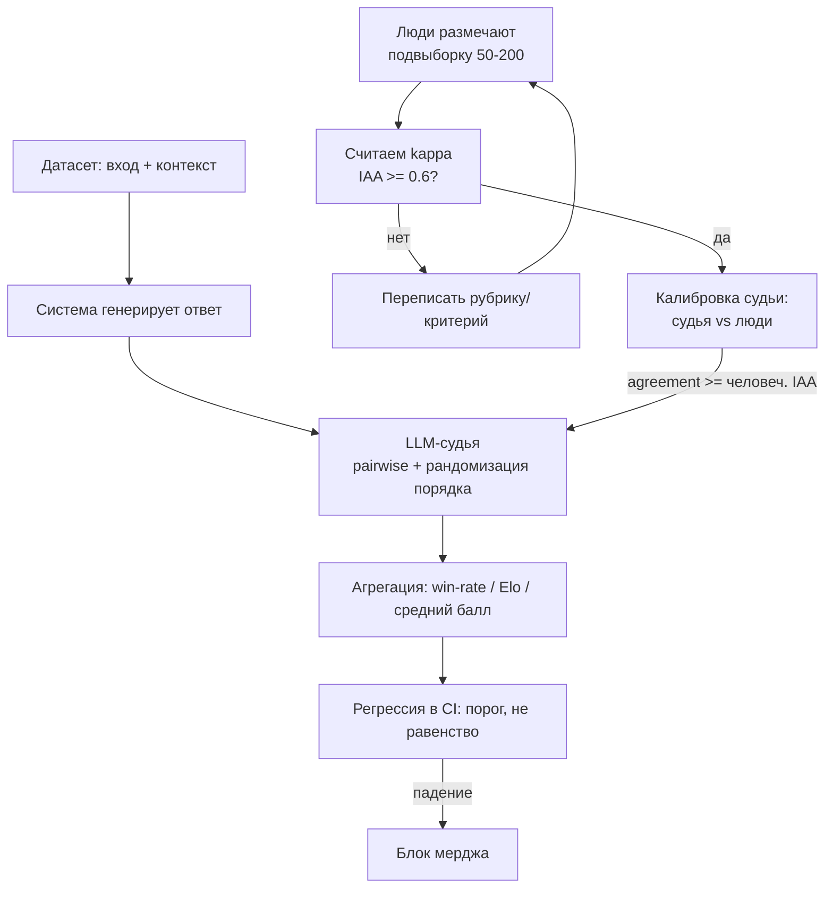

# Оценка LLM-систем: ручные эвалы, LLM-as-judge, регрессии в CI

> Как измерять качество LLM-приложения (а не базовой модели) так, чтобы числам можно
> было верить и принимать по ним решения о выкате. Три слоя: ручная разметка с
> измерением согласованности разметчиков, автоматический судья (LLM-as-judge) и
> регрессионные наборы в CI. Метрики retrieval/генерации для RAG разобраны в
> DSWoK §4.3 — здесь **дельта прикладного инженера**: как сделать судью, которому
> можно доверять, как погасить его смещения и как встроить эвал в пайплайн.
> Раздел волатильный: конкретные bias-числа привязаны к моделям 2023–2024 (MT-Bench),
> новые судьи смещены иначе — проверяй `last_reviewed` и даты источников.

## Суть

Эвал LLM-системы отличается от классического ML тем, что **нет единственно верного
ответа**: для генерации метрики вроде accuracy не определены, а reference-метрики
(BLEU/ROUGE) меряют поверхностное совпадение строк, а не смысл. Поэтому «золотой
стандарт» качества — суждение человека, но оно дорогое и шумное. Отсюда практическая
пирамида:

1. **Ручные эвалы** — люди размечают/ранжируют выходы. Дорого, медленно, но это
   калибровочный якорь. Обязательно мерить **согласованность разметчиков**
   (inter-annotator agreement, IAA): если люди между собой не согласны, никакая
   автометрика не спасёт — у задачи плохо определён критерий.
2. **LLM-as-judge** (LLM-судья) — сильная модель оценивает выходы вместо человека.
   Дёшево и масштабируемо, но судья **систематически смещён** и должен быть
   откалиброван по людям, прежде чем ему доверять.
3. **Регрессии в CI** — фиксированный набор кейсов прогоняется на каждое изменение
   промпта/модели; падение качества блокирует мердж. Связано с версионированием
   промптов (см. `3.2-cicd-versioning-tracking`) и дрейфом в проде
   (см. `3.3-production-monitoring`).

Ключевая мысль: автоматический эвал не заменяет человека, а **амортизирует** его —
человек размечает один раз небольшую выборку, по ней калибруется судья, дальше судья
масштабирует это суждение на тысячи кейсов.

## Механика

### Согласованность разметчиков и Cohen's kappa

Простой процент совпадений (raw agreement) обманчив: при двух категориях с перекосом
классов два разметчика, ставящих метку случайно, совпадут в ~50%+ случаев просто по
удаче. **Cohen's kappa** (каппа Коэна) корректирует наблюдаемое согласие на
ожидаемое случайно:

$$
\kappa = \frac{p_o - p_e}{1 - p_e}
$$

- $p_o$ — **observed agreement**, доля кейсов, где два разметчика поставили одну метку
  (то самое raw agreement);
- $p_e$ — **expected agreement** по случайности, считается из маргинальных частот:
  $p_e = \sum_k \hat p_{1,k}\,\hat p_{2,k}$, где $\hat p_{i,k}$ — доля, с которой
  разметчик $i$ ставит категорию $k$;
- числитель $p_o - p_e$ — согласие **сверх случайного**; знаменатель $1 - p_e$ —
  максимально возможное согласие сверх случайного. $\kappa=1$ — идеал, $\kappa=0$ —
  на уровне случайности, $\kappa<0$ — хуже случайного.

**Пороги интерпретации (Landis & Koch, 1977):** $<0$ — нет согласия, $0{,}01$–$0{,}20$
slight, $0{,}21$–$0{,}40$ fair, $0{,}41$–$0{,}60$ moderate, **$0{,}61$–$0{,}80$
substantial**, $0{,}81$–$1{,}0$ almost perfect. Прикладной ориентир: для прода
целятся в **$\kappa \geq 0{,}6{-}0{,}8$** (substantial); ниже $0{,}4$ — критерий
разметки надо переписывать, а не разметчиков менять. Важная оговорка из обоих
источников (Wikipedia, Grokipedia): эти пороги — **экспертное мнение без
эмпирического обоснования**, а сама каппа просаживается при сильном перекосе классов
(«kappa paradox»), поэтому её читают вместе с raw agreement и матрицей ошибок.

**Fleiss' kappa** — обобщение на **более двух** разметчиков (точнее: фиксированное
число оценок на кейс, но разные кейсы могут размечать разные люди). Та же логика
«согласие минус случайность / максимум минус случайность», но $p_e$ и $p_o$
агрегируются по всем парам разметчиков. Пороги Fleiss отличаются (>0,75 excellent,
0,40–0,75 fair-to-good, <0,40 poor) — не путать со шкалой Landis & Koch.

### LLM-as-judge: pairwise против абсолютной шкалы

Два режима, как судья выдаёт оценку:

- **Pairwise (попарное сравнение)**: судье дают вопрос и два ответа (A и B), он
  выбирает лучший (или ничью). Соответствует тому, как размечают люди в Chatbot
  Arena; даёт относительный сигнал, из которого через Elo/Bradley-Terry собирают
  рейтинг. Надёжнее, потому что «лучше из двух» — устойчивее, чем абсолютная цифра.
- **Pointwise / абсолютная шкала (single-answer grading)**: судья ставит ответу балл
  (напр. 1–10) по рубрике. Дёшево (один вызов на кейс, $O(n)$ вместо $O(n^2)$ пар),
  но шкала «плавает» между прогонами и моделями — балл 7 сегодня и завтра не один и
  тот же. Требует жёсткой рубрики и якорных примеров.



### Калибровка судьи по людям

Судья полезен только если согласуется с людьми **не хуже, чем люди согласуются между
собой**. Протокол: (1) собрать N≈100–300 размеченных людьми кейсов с измеренным
human–human agreement; (2) прогнать судью на тех же кейсах; (3) сравнить
judge–human agreement с human–human. Эталонный результат из Zheng et al.
(MT-Bench, arXiv:2306.05685): на не-ничейных голосах **GPT-4-судья совпал с
людьми-экспертами в 85%**, тогда как **люди между собой — в 81%** — то есть судья
достиг «человеческого» уровня согласия. Это и есть планка: если judge–human < human–human,
судье нельзя доверять как замене.

### Метрики по типам задач

| Тип задачи | Что меряем | Метрики |
|---|---|---|
| Классификация / extraction | строгая корректность есть | accuracy, F1, exact match, IAA на эталоне |
| Генерация (свободный текст) | нет одного ответа | LLM-judge (pairwise/балл), win-rate, изредка ROUGE/BLEU как слабый сигнал |
| RAG | retrieval + генерация раздельно | retrieval: precision@k/recall@k/MRR/nDCG (см. DSWoK §4.3); генерация: RAGAS |

**RAGAS** (RAG Assessment) даёт прикладные LLM-метрики для RAG; не переписываю
retrieval-метрики из DSWoK §4.3, а добавляю генеративную дельту:

- **Faithfulness (верность контексту)** = (число утверждений ответа, подтверждённых
  retrieved-контекстом) / (всего утверждений ответа). Ловит галлюцинации
  «не из контекста».
- **Answer/Response Relevancy** — судья генерирует $N$ вопросов из ответа (дефолт
  $N=3$) и считает средний косинус близости их эмбеддингов к исходному вопросу:
  $\frac{1}{N}\sum_{i=1}^{N}\cos(E_{g_i}, E_o)$. Низко — ответ ушёл от вопроса.
- **Context Precision / Recall** — относятся к retrieval-слою (см. DSWoK §4.3).

## Практические соображения

### Компромиссы методов оценки

| Метод | Стоимость | Масштаб | Корреляция с качеством | Когда |
|---|---|---|---|---|
| Ручная разметка | очень высокая | низкий | эталон (если IAA высок) | калибровка, спорные/высокорисковые кейсы |
| LLM-as-judge | низкая | высокий | высокая после калибровки | основная масса генеративных эвалов |
| Reference-based (BLEU/ROUGE/exact) | ~нулевая | очень высокий | низкая для генерации, высокая для extraction | классификация, есть точный эталон |
| Embedding-similarity | низкая | высокий | средняя (семантика, но не фактология) | дешёвый дрейф-сигнал, дедуп |

### Pairwise против pointwise

| | Pairwise | Pointwise (балл) |
|---|---|---|
| Стоимость | $O(n^2)$ пар (или Elo-сэмплинг) | $O(n)$ |
| Стабильность шкалы | высокая (относительно) | низкая (балл «плавает») |
| Что даёт | ранжирование/win-rate | абсолютный балл по рубрике |
| Главное смещение | position bias | калибровка шкалы |
| Когда | сравнение версий A/B, лидерборд | мониторинг абсолютного уровня |

Практика: для **регрессий A/B** (новый промпт vs старый) — pairwise с рандомизацией;
для **трекинга абсолютного уровня в проде** — pointwise по жёсткой рубрике плюс
периодическая калибровка.

### Регрессии в CI

- **Порог, а не строгое равенство.** LLM недетерминированы (даже при `temperature=0`
  возможен дрейф из-за провайдера, см. `1.1-provider-apis`). Ассерт «выход ==
  эталон» будет флакать. Вместо этого: метрика (judge-score, faithfulness, pass-rate)
  **≥ порога** или **не упала более чем на δ** относительно базлайна.
- **Размер набора.** Стартовый минимум — **10–20+ репрезентативных кейсов** на
  фичу/промпт (Braintrust), включая edge-cases и прошлые баги (как unit-тесты).
  Растёт по мере выявления провалов; держать сбалансированным по сценариям.
- **Версионирование промптов.** Промпт — артефакт, а не строка в коде: версия,
  привязка к eval-прогону и метрике (см. `3.2-cicd-versioning-tracking`). Иначе
  невозможно сказать, какой промпт дал какой результат.

## Режимы отказа

- **Position bias (позиционное смещение).** *Способ:* в pairwise судья видит A и B в
  фиксированном порядке. *Симптом:* судья систематически предпочитает первый ответ —
  у GPT-4 на MT-Bench согласованность при перестановке всего **65%**, «biased toward
  first» **30%**; у GPT-3.5 согласованность **46%**, к первому склоняется **50%**
  (Zheng et al., Table 2). *Фикс:* **рандомизация порядка** + прогон каждой пары в
  обе стороны (A/B и B/A); засчитывать победу только при согласии обоих прогонов,
  иначе ничья (см. код).
- **Verbosity bias (смещение к многословию).** *Способ:* судья оценивает длину как
  прокси качества. *Симптом:* в «repetitive list»-атаке (раздуть ответ повтором без
  новой информации) GPT-3.5 и Claude-v1 обмануты в **91,3%** случаев, GPT-4 — в
  **8,7%** (Zheng et al., Table 3). *Фикс:* нормировать на длину, явно инструктировать
  судью игнорировать длину, штрафовать многословие в рубрике; контролировать длину
  кандидатов.
- **Self-preference / self-enhancement bias (само-предпочтение).** *Способ:* судья
  оценивает выходы своей же модели. *Симптом:* GPT-4 как судья завышает win-rate
  своих ответов примерно на **+10%**, Claude-v1 — на **+25%** относительно людей
  (Zheng et al., Fig. 2). *Фикс:* судить **другой** моделью, чем генерировали;
  ансамбль судей; калибровка против людей.
- **Утечка в промпт-регрессиях (overfitting/leakage).** *Способ:* кейсы из
  регрессионного набора попали в few-shot примеры промпта или в данные дообучения.
  *Симптом:* метрика в CI растёт, реальное качество — нет; разрыв между регрессией и
  холдаутом/продом. *Фикс:* строго разделять «промпт-разработческий» и
  «эвал/холдаут» наборы; ротировать/обновлять холдаут; сверять с продовым
  мониторингом (`3.3-production-monitoring`).
- **IAA низкий, но это игнорируют.** *Симптом:* судья «согласуется с людьми на 60%»,
  но и люди между собой — на 60%; вывод о качестве судьи бессмысленен. *Фикс:*
  всегда сообщать judge–human **рядом с** human–human; чинить рубрику до калибровки.
- **Alignment-tax после дообучения.** *Симптом:* preference-оптимизация
  (`2.2b-preference-optimization`) подняла «приятность», но просадила точность/код.
  *Фикс:* многомерный эвал (не один score), регрессии на способностях, а не только
  на предпочтениях.

## Код

```python
# LLM-as-judge, pairwise, с рандомизацией порядка против position bias,
# и подсчётом согласия судьи с людьми (калибровка). Псевдо-вызов клиента.
import random
from dataclasses import dataclass

@dataclass
class Case:
    question: str
    answer_a: str   # напр. baseline
    answer_b: str   # напр. новый промпт
    human_pref: str # "A" | "B" | "tie" — разметка человека (для калибровки)

def ask_judge(client, question, first, second) -> str:
    # Судья видит ДВА ответа в заданном порядке и возвращает "first"|"second"|"tie".
    # Важно: модель судьи != модель-генератор (иначе self-preference bias).
    prompt = (f"Вопрос: {question}\n\nОтвет 1:\n{first}\n\nОтвет 2:\n{second}\n\n"
              "Какой ответ лучше отвечает на вопрос? Игнорируй длину как таковую.\n"
              "Ответь строго одним словом: first / second / tie.")
    return client.complete(prompt, temperature=0.0).strip().lower()

def judge_pairwise(client, case: Case) -> str:
    # Прогоняем В ОБА порядка. Засчитываем победу, только если суждение СОГЛАСОВАНО
    # при перестановке — иначе это артефакт позиции, ставим tie. Это гасит position bias.
    r1 = ask_judge(client, case.question, case.answer_a, case.answer_b)  # A=first
    r2 = ask_judge(client, case.question, case.answer_b, case.answer_a)  # B=first (swap)
    # переводим в термины A/B
    v1 = {"first": "A", "second": "B", "tie": "tie"}[r1]
    v2 = {"first": "B", "second": "A", "tie": "tie"}[r2]   # порядок инвертирован
    if v1 == v2 and v1 != "tie":
        return v1
    return "tie"   # рассогласование при swap => не доверяем позиции

def evaluate(client, cases: list[Case]):
    judge_votes, agree_with_human, comparable = [], 0, 0
    for c in cases:
        v = judge_pairwise(client, c)
        judge_votes.append(v)
        # Калибровка: согласие судьи с человеком на не-ничейных (как S2 в MT-Bench).
        if c.human_pref != "tie" and v != "tie":
            comparable += 1
            agree_with_human += int(v == c.human_pref)
    win_rate_b = judge_votes.count("B") / max(1, len(cases))      # win-rate нового
    judge_human_agreement = agree_with_human / max(1, comparable) # калибровка
    return win_rate_b, judge_human_agreement

# Интерпретация: judge_human_agreement сравнивают с human-human IAA (Cohen's kappa
# или raw agreement). Доверять судье можно, только если он не хуже людей-между-собой
# (в MT-Bench: 85% судья-человек против 81% человек-человек).
```

## Вопросы для самопроверки

1. Почему raw agreement (доля совпадений) переоценивает согласованность, и как именно
   Cohen's kappa это исправляет? Что в формуле играет роль «случайного базлайна»?
2. У вас два класса 95/5 и оба разметчика почти всегда ставят мажоритарный класс.
   Что покажет kappa и почему она может быть низкой при высоком raw agreement?
3. Когда брать Fleiss' kappa вместо Cohen's, и почему пороги Fleiss нельзя читать по
   шкале Landis & Koch?
4. Чем pairwise-судья надёжнее pointwise, и какой ценой ($O$-сложность, что меряем)?
5. Как именно рандомизация порядка + двойной прогон гасит position bias, и почему мы
   ставим tie при рассогласовании, а не выбираем большинство?
6. GPT-4-судья совпал с людьми на 85%. Достаточно ли этого для доверия? С чем это
   число обязано стоять рядом?
7. Почему нельзя судить выходы модели X судьёй на той же модели X? Назови смещение и
   его величину из MT-Bench.
8. «repetitive list»-атака обманула GPT-3.5 в 91%, GPT-4 — в 9%. Что это говорит о
   переносимости bias-чисел на нового судью, и что отсюда следует для калибровки?
9. Почему в CI ассертят порог/дельту, а не строгое равенство выходов? Что флакает?
10. Как обнаружить утечку регрессионного набора в промпт, и чем это маскируется в
    метриках?

## Ссылки

- [P] Zheng et al. — Judging LLM-as-a-Judge with MT-Bench and Chatbot Arena (NeurIPS
  2023), arXiv:2306.05685 — position/verbosity/self-enhancement bias, judge-human
  agreement. Числа bias: https://arxiv.org/html/2306.05685v4 (Tables 2–3, Fig. 2, §S2)
- [P][V] Shi et al. — Judging the Judges: Systematic Study of Position Bias
  (2024), arXiv:2406.07791 — независимое подтверждение position bias
- [D][V] RAGAS — Faithfulness / Response Relevancy / Context Precision-Recall
  https://docs.ragas.io/en/stable/concepts/metrics/available_metrics/
- [G] Cohen's kappa, пороги Landis & Koch (1977), kappa paradox
  https://en.wikipedia.org/wiki/Cohen's_kappa ; Fleiss' kappa
  https://en.wikipedia.org/wiki/Fleiss'_kappa
- [G][V] LLM-мониторинг и регрессионные наборы (пороги, 10–20+ кейсов)
  https://www.braintrust.dev/articles/what-is-llm-monitoring
- [G][V] LLM-as-a-Judge complete guide (pairwise vs pointwise, биасы)
  https://galtea.ai/blog/llm-as-a-judge
- Перекрёстные: DSWoK §4.3 (метрики retrieval/генерации RAG — не дублируем);
  `1.1-provider-apis` (недетерминизм, temperature), `1.2-rag-applied` (RAG-пайплайн),
  `3.2-cicd-versioning-tracking` (эвалы и версии промптов в CI),
  `3.3-production-monitoring` (дрейф качества), `2.2b-preference-optimization`
  (alignment tax)
