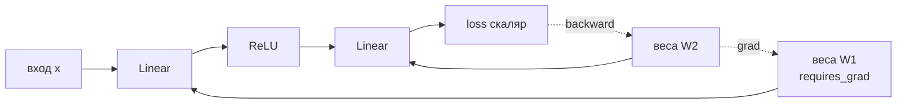

# PyTorch-беглость: autograd, отладка градиентов, mixed precision

Файнтюн (`2.2a-sft`) и любая отладка обучения требуют понимать, что
происходит под `loss.backward()` и `optimizer.step()`, а не просто вызывать их.
Эта заметка — рабочий минимум: как autograd строит граф и копит градиенты, почему
обучение требует кратно больше памяти, чем инференс (`2.5-gpu-minimum`), как ловить
NaN и затухающие градиенты, как читать loss curves и какие рычаги (mixed precision,
gradient accumulation/checkpointing) позволяют обучать в ограниченной VRAM.
Механика затухающих/взрывающихся градиентов как явления — DSWoK §3.7; здесь —
прикладная дельта: как это диагностировать и чинить в PyTorch.

## Суть

PyTorch — это **define-by-run** автодифференцирование: граф вычислений строится
динамически по мере выполнения forward, а `backward()` идёт по нему в обратном
порядке, применяя правило цепочки. Три вещи, которые отличают «вызываю
`.backward()`» от «понимаю обучение»: (1) градиенты **накапливаются** в `.grad`, а
не перезаписываются — отсюда обязательный `zero_grad()`; (2) обучение держит в
памяти градиенты и состояния оптимизатора, поэтому 8B не влезает туда, куда влезал
на инференсе; (3) loss curve и норма градиента — главные приборы: по ним видно
расходимость, переобучение, мёртвый LR и битые данные раньше, чем по метрикам.

## Механика

### Autograd: динамический граф и правило цепочки

Каждый тензор с `requires_grad=True` запоминает операцию, его породившую
(атрибут `grad_fn`). Цепочка этих операций — **направленный ацикличный граф (DAG)**
вычислений. `loss.backward()` обходит граф от корня (скаляр loss) к листьям
(параметрам), на каждом узле умножая входящий градиент на локальную производную
(правило цепочки) — это **обратное распространение (backpropagation)**.



Ключевые свойства, которые надо держать в голове:
- **Граф строится заново на каждом forward** (define-by-run) и по умолчанию
  освобождается после `backward()`. Повторный `backward()` по тому же графу —
  ошибка (нужен `retain_graph=True`, что почти всегда симптом ошибки в коде).
- **Только листовые тензоры** (параметры, входы с `requires_grad`) получают `.grad`;
  промежуточные — нет (если не `retain_grad()`).
- **`torch.no_grad()`** отключает построение графа — обязателен на инференсе/валидации,
  экономит память и время (не хранит активации для backward).

### Накопление градиентов и почему нужен zero_grad

`backward()` **прибавляет** новые градиенты к существующему `.grad`, а не заменяет
их. Это сделано намеренно (позволяет накапливать по нескольким forward), но значит:
без обнуления градиенты разных шагов суммируются и обучение ломается. Канонический
цикл:

```
optimizer.zero_grad()   # обнулить .grad (иначе накопится с прошлого шага)
loss = model(x)         # forward: строит граф
loss.backward()         # backward: заполняет .grad по графу
optimizer.step()        # обновить веса по .grad
```

Это же свойство — основа **gradient accumulation** (см. ниже): намеренно НЕ обнулять
между микро-батчами.

### Память обучения: почему 8B не влезает туда, куда влезал инференс

Обучение хранит, помимо весов: **активации** forward-прохода (нужны для backward),
**градиенты** (по тензору на параметр) и **состояния оптимизатора**. Для Adam с
mixed precision это ~16 байт/параметр против ~2 на инференсе (полный вывод и
worked example — `2.5-gpu-minimum`). Активации масштабируются с
`batch × seq_len × hidden × n_layers` и часто доминируют при длинном контексте —
именно их режет gradient checkpointing.

### Отладка градиентов: NaN, норма, поток

DSWoK §3.7 объясняет, *почему* градиенты затухают/взрываются. Прикладная дельта —
как это поймать:

- **Норма градиента (`grad_norm`)** — главный прибор. После `backward()` считается
  $\|g\|_2 = \sqrt{\sum_i g_i^2}$ по всем параметрам. Логировать каждый шаг.
  Симптомы: норма **растёт к ∞** → взрыв (расходимость); норма **→ 0** → затухание
  (мёртвое обучение); резкий спайк → битый батч/слишком большой LR.
- **Gradient clipping** (`clip_grad_norm_`) — обрезает норму до порога (типично
  **1.0** для трансформеров) перед `step()`. Это страховка от спайков, а не лечение
  систематического взрыва.
- **NaN/Inf в loss или градиентах** — самая частая поломка. Источники: деление на
  ноль, `log(0)`, переполнение в fp16 (см. mixed precision), слишком большой LR,
  битые данные. Диагностика: `torch.autograd.set_detect_anomaly(True)` указывает
  операцию, породившую NaN (медленно — только для отладки).
- **Поток градиента** — повесить hook (`tensor.register_hook`) или смотреть
  `param.grad` по слоям: если у ранних слоёв норма на порядки меньше, чем у поздних,
  градиент не доходит (затухание) — сигнал к проверке нормализации/инициализации/
  остаточных связей.

### Чтение loss curves: что говорит форма кривой

Loss curve — первый прибор диагностики, читать её до метрик:

| Симптом на кривой | Вероятная причина | Действие |
|---|---|---|
| Loss растёт / NaN | LR слишком большой, нет clipping, fp16-переполнение | снизить LR, clip, bf16 |
| Loss плоский с начала | LR слишком мал, мёртвые ReLU, нет потока градиента | поднять LR, проверить grad_norm |
| Train ↓, val ↑ (расходятся) | переобучение | регуляризация, ранняя остановка, больше данных |
| Пилообразные спайки | большой LR / битые батчи / нет warmup | warmup, clipping, проверить данные |
| Loss падает «ступенькой» при смене эпохи | data leakage / порядок данных | перемешать, проверить сплит |
| Loss не падает ниже плато при низком LR | LR-schedule не разгоняется | warmup + cosine decay |

Базовая гигиена (Karpathy, «A Recipe for Training Neural Networks»): сначала
**переобучить один батч** до near-zero loss (проверка, что граф/loss/данные не
сломаны), потом масштабировать. Если один батч не переобучается — баг, не
гиперпараметры.

### Mixed precision: bf16 vs fp16 и роль GradScaler

Mixed precision (Micikevicius et al., arXiv:1710.03740) считает forward/backward в
16 битах (быстрее, вдвое меньше памяти активаций), но держит **fp32 master-копию
весов** для аккуратного применения мелких обновлений. Два 16-битных формата
устроены принципиально по-разному:

| Формат | Экспонента / мантисса | Динамический диапазон | Нужен GradScaler? |
|---|---|---|---|
| **fp16** | 5 / 10 | узкий (как у half) | **да** — иначе underflow градиентов |
| **bf16** | 8 / 7 | **как у fp32** | нет (или мягко) |

- **fp16** даёт больше мантиссы (точнее), но узкий диапазон экспоненты → малые
  градиенты **обнуляются (underflow)**. Лечится **loss scaling**: loss умножается
  на масштаб `S` перед `backward()` (сдвигает градиенты в представимый диапазон),
  затем градиенты делятся на `S` перед `step()`. `GradScaler` подбирает `S`
  **динамически**: растит при стабильности, делит при появлении Inf/NaN и
  **пропускает** такой шаг.
- **bf16** жертвует мантиссой ради диапазона экспоненты, равного fp32 → underflow
  практически нет, loss scaling не нужен. На Ampere+ это дефолт для обучения LLM:
  стабильнее и проще. Цена — чуть меньше точности на единичной операции (на обучении
  не критично).

Практика: **есть bf16 (Ampere/Hopper/Ada) → бери bf16** и забудь про GradScaler. fp16
+ GradScaler — для старого железа без bf16 (например, до Ampere).

### Gradient accumulation: большой эффективный батч в малой памяти

Если целевой batch не влезает в VRAM, его дробят на `K` микро-батчей: forward/backward
по каждому **без** `zero_grad` (градиенты накапливаются), `step()` — раз в `K`
микро-батчей. Эффективный batch = `micro_batch × K`. Важно: loss каждого
микро-батча делить на `K`, иначе градиент окажется в `K` раз больше (масштаб как у
суммы, а не среднего).

$$
\text{effective\_batch} = \text{micro\_batch\_size} \times K
$$

Это позволяет воспроизвести «батч 256» на карте, где влезает только 32 (`K=8`),
ценой `K`-кратного времени на шаг оптимизатора.

### Gradient checkpointing: память активаций за пересчёт

Активации forward хранятся для backward и доминируют память на длинном контексте.
Gradient (activation) checkpointing (Chen et al., arXiv:1604.06174) **не хранит**
промежуточные активации, а **пересчитывает** их во время backward, запоминая лишь
входы контрольных точек. Память активаций падает с $O(N)$ до **$O(\sqrt{N})$** по
числу слоёв `N`. Цена — лишний forward части графа: на практике **~60% экономии
памяти активаций за ~20–30% времени** (на H100 ближе к 20–25%). Включается
`model.gradient_checkpointing_enable()`. Комбинируется с accumulation: оба бьют по
разным статьям памяти (checkpointing — активации, accumulation — позволяет малый
micro-batch).

## Практические соображения

- **Порядок включения рычагов при OOM:** bf16 → gradient checkpointing → gradient
  accumulation (меньший micro-batch) → LoRA/QLoRA (`2.2a-sft`) → шардинг
  (ZeRO/FSDP). Каждый следующий жёстче по скорости/сложности.
- **`set_to_none=True` в `zero_grad`** (дефолт с PyTorch 2.0) — освобождает память
  градиентов вместо записи нулей; чуть быстрее и экономнее.
- **Всегда `model.eval()` + `torch.no_grad()` на валидации/инференсе** — иначе
  BatchNorm/Dropout ведут себя как в обучении, а граф жрёт память.
- **Логировать `grad_norm` и LR**, не только loss — половина проблем видна в норме
  градиента раньше, чем в loss.
- **Warmup + cosine decay** LR — дефолт для трансформеров; warmup (первые ~1–5%
  шагов) гасит ранние спайки, когда веса ещё «холодные».
- **Воспроизводимость:** фиксировать seed (`torch.manual_seed`), но помнить, что
  полная детерминированность на GPU требует `torch.use_deterministic_algorithms` и
  бьёт по скорости.

## Режимы отказа

- **Loss = NaN после нескольких шагов.** fp16-переполнение, большой LR, `log(0)`,
  битый батч. Симптом — резкий спайк нормы перед NaN. Фикс: bf16 вместо fp16,
  clipping (norm 1.0), снизить LR, `set_detect_anomaly` для локализации операции.
- **OOM на первом `optimizer.step()`, хотя forward прошёл.** Состояния оптимизатора
  Adam (8 байт/параметр) аллоцируются на первом шаге. Фикс: gradient checkpointing,
  меньший micro-batch + accumulation, 8-bit optimizer (bitsandbytes), QLoRA.
- **Loss не падает, grad_norm ≈ 0.** Затухание градиента / мёртвые нейроны / LR
  слишком мал / забыли `requires_grad`. Фикс: проверить поток градиента по слоям,
  поднять LR, проверить инициализацию/нормализацию (DSWoK §3.7).
- **Градиенты «накапливаются» между шагами, обучение деградирует.** Забыт
  `zero_grad()` (или неверная логика accumulation). Симптом — норма растёт монотонно
  от шага к шагу. Фикс: вернуть `zero_grad()` каждый шаг (или раз в `K` при
  accumulation).
- **Эффективный батч дал не тот результат, что цельный.** Не поделили loss на `K`
  при accumulation → градиент завышен в `K` раз. Фикс: `loss = loss / K`.
- **«bf16 медленнее fp32 на моей карте».** Нет аппаратной поддержки bf16 (до Ampere)
  → эмуляция. Фикс: fp16+GradScaler на старом железе, bf16 — на Ampere+.
- **Память течёт по эпохам.** Аккумулируете тензоры с графом в список (`losses.append(loss)`
  вместо `loss.item()`) — держится весь граф. Фикс: `.item()`/`.detach()` для
  логирования.

## Код

```python
import torch
from torch.amp import autocast, GradScaler

model = ...           # на CUDA
opt = torch.optim.AdamW(model.parameters(), lr=2e-5)
use_bf16 = torch.cuda.is_bf16_supported()      # Ampere+ -> bf16, иначе fp16
dtype = torch.bfloat16 if use_bf16 else torch.float16
scaler = GradScaler(enabled=not use_bf16)      # GradScaler нужен ТОЛЬКО для fp16
ACCUM = 8                                       # эффективный батч = micro_batch * 8

model.gradient_checkpointing_enable()          # активации: O(N) -> O(sqrt N)

for step, (x, y) in enumerate(loader):
    with autocast(device_type="cuda", dtype=dtype):   # 16-бит forward
        loss = model(x, labels=y).loss / ACCUM         # делим на ACCUM (среднее, не сумма)
    scaler.scale(loss).backward()                       # bf16: scale=1, эффект нулевой
    if (step + 1) % ACCUM == 0:                         # шаг раз в ACCUM микро-батчей
        scaler.unscale_(opt)                            # снять масштаб перед clipping
        gn = torch.nn.utils.clip_grad_norm_(model.parameters(), 1.0)  # лог grad_norm
        scaler.step(opt)                                # пропустит шаг, если был Inf (fp16)
        scaler.update()                                 # подстроить масштаб
        opt.zero_grad(set_to_none=True)                 # обнулить (иначе накопится)
        if step % 50 == 0:
            print(f"step {step} loss {loss.item()*ACCUM:.4f} grad_norm {gn:.2f}")
```

```python
# Диагностика потока градиента: средняя |grad| по слоям (затухание видно сразу).
def grad_flow(model):
    for name, p in model.named_parameters():
        if p.grad is not None:
            print(f"{name:40s} mean|grad|={p.grad.abs().mean():.2e}")
# Если у ранних слоёв на порядки меньше, чем у поздних — градиент не доходит.
```

## Вопросы для самопроверки

1. Почему `backward()` накапливает, а не перезаписывает `.grad`, и какие два разных
   приёма это свойство одновременно обслуживает?
2. У тебя loss = NaN на 200-м шаге в fp16. Перечисли проверки по убыванию
   вероятности и объясни, почему переход на bf16 часто решает проблему.
3. Зачем mixed precision держит fp32 master-копию весов, если forward/backward идут
   в 16 битах?
4. Почему fp16 требует GradScaler, а bf16 — нет? Свяжи с числом бит экспоненты и
   underflow.
5. Что именно делает loss scaling и почему масштаб подбирают динамически, а не
   ставят константой?
6. Выведи, почему при gradient accumulation loss надо делить на число шагов
   накопления. Что сломается, если не делить?
7. Чем gradient checkpointing отличается от gradient accumulation по тому, какую
   статью памяти они режут? Можно ли их совмещать?
8. Почему grad_norm — лучший ранний прибор, чем loss? Какие три формы кривой нормы
   о чём говорят?
9. Ты видишь train-loss ↓, val-loss ↑. Что это, и какие три рычага применишь?
10. Зачем «переобучить один батч» перед полноценным обучением, и что это исключает?
11. Почему `torch.no_grad()` на валидации экономит память, и что произойдёт, если
    его забыть в длинном цикле логирования?

## Ссылки

- [D] PyTorch — Autograd mechanics
  https://pytorch.org/docs/stable/notes/autograd.html
- [D] PyTorch — Automatic Mixed Precision (`torch.amp`, GradScaler)
  https://pytorch.org/docs/stable/amp.html
- [P] Micikevicius et al. — Mixed Precision Training (2017), arXiv:1710.03740
- [P] Chen et al. — Training Deep Nets with Sublinear Memory Cost (2016),
  arXiv:1604.06174 (gradient checkpointing, $O(\sqrt N)$)
- [G] PyTorch Blog — Activation Checkpointing Techniques (overhead, selective)
  https://pytorch.org/blog/activation-checkpointing-techniques/
- [G] Karpathy — A Recipe for Training Neural Networks
  https://karpathy.github.io/2019/04/25/recipe/
- Предпосылки: DSWoK §3.7 (затухающие/взрывающиеся градиенты — механика явления).
- Дальше: `2.5-gpu-minimum` (бюджет памяти обучения, 16 байт/параметр);
  `2.2a-sft` (SFT/LoRA-цикл поверх этих рычагов).
