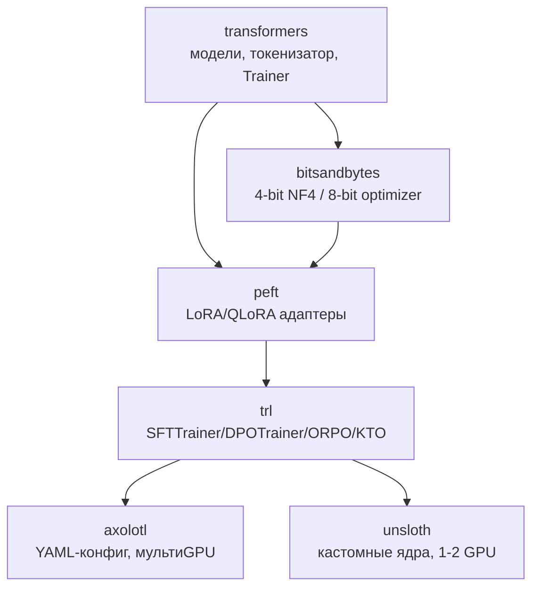

# Библиотеки файнтюна: transformers/peft/trl/axolotl/unsloth — когда что

Методы файнтюна (`2.2a-sft`, `2.2b-preference-optimization`) реализованы в стеке
библиотек, которые отличаются не возможностями, а **уровнем абстракции и
оптимизацией**. Эта заметка — карта стека: что на чём стоит, какую задачу каждая
закрывает, и как выбирать под «одна карта vs мультиGPU», «максимум скорости vs
гибкость конфига». Раздел **волатильный**: версии и бенчмарки скорости меняются —
сверяй `last_reviewed`.

## Суть

Стек послойный: **transformers** (модели/токенизаторы/Trainer) → **peft**
(LoRA/QLoRA-адаптеры) → **trl** (тренеры SFT/DPO/ORPO/KTO поверх первых двух). Над
ними — обёртки для удобства и масштаба: **axolotl** (YAML-конфиг, мультиGPU через
DeepSpeed/FSDP) и **unsloth** (кастомные ядра, 1–2 GPU, ×2 скорость / ~70% меньше
VRAM). Выбор — не «какая лучше», а «какой уровень контроля и какой масштаб нужен».

## Механика стека

### Слои и зоны ответственности



- **transformers** — базовые классы (`AutoModelForCausalLM`, `Trainer`),
  `apply_chat_template`, загрузка/сохранение. Всё остальное строится на ней.
- **peft** — параметр-эффективные методы: LoRA, QLoRA, prefix-tuning и пр.;
  `get_peft_model`, `merge_and_unload`. Дельта-механика — DSWoK §2.7, `2.2a-sft`.
- **bitsandbytes** — 4-bit NF4 (для QLoRA) и 8-bit optimizer (экономия состояний
  Adam). Зависимость QLoRA.
- **trl** — высокоуровневые тренеры под каждый метод выравнивания: `SFTTrainer`,
  `DPOTrainer`, `ORPOTrainer`, `KTOTrainer`. Это «дефолтный API» обучения.
- **axolotl** — декларативная обёртка: весь рецепт в одном YAML, готовая интеграция
  DeepSpeed ZeRO-2/3 и FSDP для мультиGPU. Для воспроизводимых пайплайнов и масштаба.
- **unsloth** — оптимизационный слой: переписанные на Triton ядра attention/MLP и
  ручной autograd → меньше памяти и быстрее, но фокус на 1–2 GPU и popular-моделях.

### Откуда у unsloth ускорение

Unsloth не «другой метод», а **быстрые ядра**: кастомные Triton-реализации
forward/backward для attention и MLP, отказ от лишних материализаций, ручной
backward. По бенчмарку с TRL — до **~2× скорости и ~74% меньше VRAM** против ванильного
`transformers`+TRL на той же QLoRA-задаче (single-GPU). Цена — поддерживается
ограниченный список архитектур и в основном один GPU; это **слой**, а не платформа
(совместим с peft/trl/Hub).

### МультиGPU: DeepSpeed ZeRO vs FSDP

Когда модель/батч не влезают на одну карту, обучение шардируют:
- **DeepSpeed ZeRO** (этапы 1/2/3) — шардирует состояния оптимизатора (1), +градиенты
  (2), +параметры (3) по GPU; ZeRO-3 ≈ полный шардинг (как FSDP).
- **FSDP (Fully Sharded Data Parallel)** — нативный PyTorch-шардинг параметров/
  градиентов/состояний. Axolotl поддерживает оба; unsloth — преимущественно одиночный
  GPU. Это и есть граница «axolotl для масштаба».

## Практические соображения

### Матрица выбора

| Сценарий | Инструмент | Почему |
|---|---|---|
| Учусь / нужен полный контроль кода | transformers + peft + trl напрямую | прозрачно, гибко, без магии |
| 1–2 GPU, важна скорость/память | **unsloth** (+ trl) | ×2 скорость, ~70% меньше VRAM |
| Воспроизводимый рецепт, мультиGPU | **axolotl** | YAML, DeepSpeed/FSDP из коробки |
| DPO/ORPO/KTO «как в статье» | trl-тренеры | готовые лоссы, минимум кода |
| Только LoRA-адаптеры, мультитенант | peft | переключение адаптеров на лету |
| Большая модель не влезает | axolotl + ZeRO-3 / FSDP | шардинг параметров |

Можно **комбинировать**: axolotl умеет использовать unsloth как backend (скорость +
мультиGPU-оркестрация).

### Общие практики (независимо от библиотеки)

- **Сначала родной chat-шаблон и completion-only loss** (`2.2a-sft`) — большинство
  багов не в библиотеке, а в данных/шаблоне.
- **Версии пинить.** Стек быстро движется; несовместимости transformers↔peft↔trl —
  частый источник «вчера работало». Фиксируй версии в окружении (`3.1`, `3.2`).
- **Логировать в W&B/MLflow** (`3.2-cicd-versioning-tracking`): loss, grad_norm, LR,
  примеры генераций.
- **Эвал — отдельным шагом** (`1.4-evaluation`), не доверять падающему train-loss.

## Режимы отказа

- **«Вчера работало, сегодня ImportError/несовместимость».** Рассинхрон версий
  transformers/peft/trl/unsloth. Фикс: пинить версии, отдельное окружение на проект.
- **unsloth не поддерживает мою модель/мультиGPU.** Архитектура вне списка или нужно
  >2 GPU. Фикс: axolotl + FSDP/ZeRO, либо trl напрямую.
- **OOM на мультиGPU, хотя «карт хватает».** Не включён шардинг (просто data-parallel
  дублирует модель). Фикс: DeepSpeed ZeRO-3 или FSDP (через axolotl).
- **Результаты невоспроизводимы между запусками/машинами.** Не зафиксированы версии,
  seed, конфиг. Фикс: YAML-конфиг (axolotl), пины, логирование артефактов (`3.2`).
- **Кастомный код на trl ломается при обновлении.** API высокоуровневых тренеров
  меняется. Фикс: пин версии trl, читать changelog перед апгрейдом.

## Код

```python
# Один и тот же QLoRA-SFT: голый стек vs unsloth — разница только в загрузке модели.

# Вариант А: transformers + peft + trl (полный контроль) — см. 2.2a-sft.

# Вариант Б: unsloth (быстрые ядра, 1 GPU) — API совместим с trl.
from unsloth import FastLanguageModel
model, tok = FastLanguageModel.from_pretrained(
    MODEL, load_in_4bit=True, max_seq_length=2048)     # 4-bit + быстрые ядра
model = FastLanguageModel.get_peft_model(
    model, r=16, lora_alpha=32, target_modules="all-linear")
# дальше — обычный trl.SFTTrainer(model, tok, ...): unsloth прозрачно ускоряет.
```

```yaml
# Вариант В: axolotl — весь рецепт декларативно (фрагмент config.yml), мультиGPU.
base_model: meta-llama/Meta-Llama-3-8B
load_in_4bit: true            # QLoRA
adapter: qlora
lora_r: 16
lora_alpha: 32
lora_target_linear: true      # все линейные слои
sequence_len: 2048
sample_packing: true          # packing коротких примеров
chat_template: llama3         # родной шаблон целевой модели
deepspeed: deepspeed_configs/zero3.json   # шардинг на мультиGPU
# запуск: accelerate launch -m axolotl.cli.train config.yml
```

## Вопросы для самопроверки

1. Нарисуй стек transformers/peft/trl/axolotl/unsloth и объясни зону ответственности
   каждого слоя.
2. Откуда у unsloth ускорение, и почему это «слой», а не отдельный метод обучения?
3. Когда unsloth не подойдёт и чем его заменить?
4. Чем DeepSpeed ZeRO-3 отличается от наивного data-parallel и зачем он, если «карт
   и так несколько»?
5. Почему «вчера работало, сегодня нет» — типичная болезнь этого стека и как её
   предотвратить?
6. Ты хочешь воспроизводимый мультиGPU-рецепт DPO. Какой инструмент и почему?
7. Что общего у всех библиотек по части chat-шаблона и loss-masking, и почему баги
   чаще там, а не в самой библиотеке?

## Ссылки

- [D] HuggingFace TRL (SFT/DPO/ORPO/KTO тренеры)
  https://huggingface.co/docs/trl/index
- [D] HuggingFace PEFT (LoRA/QLoRA)
  https://huggingface.co/docs/peft/index
- [D][V] Axolotl (YAML, DeepSpeed/FSDP)
  https://docs.axolotl.ai/
- [D][V] Unsloth (быстрые ядра, 1–2 GPU)
  https://docs.unsloth.ai/
- [G][V] Unsloth + TRL — бенчмарк ×2 скорость / ~74% VRAM
  https://huggingface.co/blog/unsloth-trl
- [G][V] Сравнение Unsloth vs Axolotl vs LLaMA-Factory
  https://theaiengineer.substack.com/p/unsloth-vs-axolotl-vs-llama-factory
- Предпосылки: `2.2a-sft`, `2.2b-preference-optimization` (методы, которые эти
  библиотеки реализуют); DSWoK §2.7 (LoRA).
- Дальше: `3.2-cicd-versioning-tracking` (трекинг экспериментов, версии);
  `3.1-containers-orchestration` (окружение, пины, GPU).
