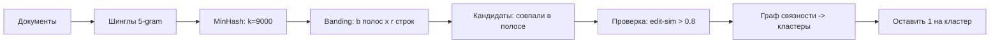

# Подготовка данных: фильтрация, дедупликация, разметка, синтетика

> Качество дообученной модели потолком ограничено качеством данных, а не объёмом
> compute. Этот раздел — про то, как из сырого корпуса (веб-дамп, логи, выгрузки)
> получить обучающий набор: отсеять мусор (**фильтрация**), убрать повторы
> (**дедупликация**), назначить метки (**разметка**) и при нехватке — догенерировать
> (**синтетика**). Эмбеддинги, двухбашенные модели и языковая идентификация —
> предпосылка из DSWoK (§2.1, §3.2, §3.5); здесь — прикладная дельта: какие пороги,
> какие алгоритмы на масштабе, чем ломается. Раздел волатильный: SOTA-рецепты
> курации и числа бенчмарков меняются — проверяй `last_reviewed`.

## Суть: данные как управляемый артефакт

Подготовка данных — это пайплайн преобразований сырого корпуса в обучающий набор с
измеримыми свойствами (доля языка, дубль-фактор, уровень контаминации, согласие
аннотаторов). Четыре независимые оси: **фильтрация** (что выкинуть по качеству,
безопасности, языку, контаминации), **дедупликация** (убрать повторы — точные,
near-duplicate, семантические), **разметка** (откуда метки — человек, LLM, слабый
надзор) и **синтетика** (как догенерировать данные и не словить коллапс). Это
вход для дообучения (`2.2a-sft`, `2.2b-preference-optimization`); ошибки здесь
проявляются как переобучение на дублях, утечка теста (`1.4-evaluation`) и тихая
деградация при синтетике. Каждый шаг — это компромисс между recall (не потерять
полезное) и precision (не пропустить мусор), и почти всё настраивается порогами.

## Фильтрация: качество, безопасность, язык, контаминация

**Фильтрация** (filtering) — удаление документов по предикату. Современные веб-пайплайны
(FineWeb, Penedo et al., 2024, arXiv:2406.17557) выстраивают её каскадом, потому что
дешёвые фильтры идут первыми.

1. **Языковая идентификация (language id).** fastText-классификатор (механика — DSWoK
   §3.5, не переписываю) присваивает документу язык + score. FineWeb оставляет
   английский при `score ≥ 0.65`. Порог — рычаг recall/precision: выше отсекает
   code-switching и мусор, но теряет короткие/смешанные тексты.
2. **Эвристики качества (Gopher/MassiveText-правила).** Пороги по числу слов,
   доле стоп-слов, доле символов-повторов, средней длине строки, доле строк с
   bullet/«…». FineWeb добавляет C4-фильтры + правила на дубль-строки и короткие
   строки. Большинство выброшенных Gopher-фильтром документов отсекаются именно по
   длине (слишком коротко/длинно).
3. **Классификатор качества.** Лёгкая модель (часто линейная над эмбеддингами или
   fastText), обученная отличать «эталон» (Wikipedia/книги/референс) от случайного
   веба. Даёт скор «похоже на качественный текст».
4. **Безопасность.** Блок-листы доменов, PII-редактирование, toxicity-классификаторы,
   фильтры NSFW. Это и юридическое требование, и защита от заучивания вредного.

### Контаминация: train/test contamination и n-gram overlap

**Контаминация бенчмарков** (benchmark contamination) — попадание тестовых примеров
(или их перефразировок) в обучающий корпус. Симптом — завышенные метрики, не
воспроизводящиеся на свежих данных. Базовый детектор — **n-gram overlap**:
документ считается загрязнённым, если он делит длинную n-грамму с тестом.
Исторические пороги: **GPT-3** (Brown et al., 2020) — пересечение **13-грамм**
(на части датасетов диапазон 8–13); **PaLM** — **8-граммы** с порогом **≥70%
перекрытия** теста. Эти числа сверены по обзору контаминации (arXiv:2406.04244) и
GPT-3.

Критический предел: n-gram overlap **легко обходится перефразировкой**. Yang et
al. (Rephrased Samples, arXiv:2311.04850) показали, что 13B-модель, дообученная на
перефразированных вариантах теста, выходит «на уровень GPT-4» по бенчмарку, не
будучи пойманной n-gram-декso. Поэтому к n-gram добавляют семантическую проверку
(эмбеддинг-сходство тест↔train, см. ниже) и LLM-детекторы перефразировок. Дедуп
теста против трейна — обязательный шаг перед любым eval (`1.4-evaluation`).

## Дедупликация: точная, near-duplicate (MinHash-LSH), семантическая

**Дедупликация** (deduplication) удаляет повторы. Зачем: повторы раздувают вес
заученных строк (модель эмитит запомненный текст в ~10 раз чаще на
недедуплицированных данных), тратят шаги обучения и завышают валидацию утечкой
дублей train→val (Lee et al., 2022, arXiv:2107.06499). Три уровня — по «строгости»
совпадения.

### Точная дедупликация (exact dedup)

Хеш всего документа (или нормализованного: lowercase, collapse-whitespace) →
группировка по хешу → оставить один. O(N) по памяти и времени, ловит только
байт-в-байт совпадения. Дёшево, обязательный первый шаг. Не ловит «то же с одной
изменённой датой».

### Near-duplicate: MinHash + LSH

**Near-duplicate** — документы с высоким **Jaccard-сходством** множеств их
n-грамм. Jaccard двух множеств шинглов $A, B$:

$$ J(A,B) = \frac{|A \cap B|}{|A \cup B|} $$

Считать попарно — $O(N^2)$, нереально на миллиардах документов. **MinHash** (Broder,
1997) сжимает каждое множество в сигнатуру из $k$ минхешей так, что вероятность
совпадения одного минхеша = Jaccard:

$$ \Pr[\min h(A) = \min h(B)] = J(A,B) $$

— берём $k$ независимых хеш-функций, для каждой запоминаем минимум хеша по шинглам
документа. **LSH (locality-sensitive hashing) с бандингом** избегает $O(N^2)$:
сигнатуру из $k$ минхешей режут на $b$ полос (bands) по $r$ строк ($k = b\cdot r$).
Две сигнатуры — кандидаты, если совпали **целиком хотя бы в одной полосе**.
Вероятность стать кандидатом при сходстве $s$:

$$ P(s) = 1 - (1 - s^{r})^{b} $$

- $s$ — Jaccard-сходство пары; $s^{r}$ — вероятность совпасть во всех $r$ строках
  одной полосы; $(1-s^r)^b$ — не совпасть ни в одной из $b$ полос; $1-(\dots)$ —
  совпасть хотя бы в одной.

Это **S-образная кривая**: точка крутого подъёма (порог) $t \approx (1/b)^{1/r}$
(сверено: Mining of Massive Datasets гл.3 и обзоры LSH). Подбор $b/r$ —
центральный компромисс: **много полос / мало строк** ($b\uparrow, r\downarrow$) →
порог ниже, ловим менее похожие пары (больше recall, больше false positives);
**мало полос / много строк** → порог выше, только очень похожие (меньше FP, больше
false negatives — пропуск дублей).

| Стратегия | Эффект на порог $t$ | FP (ложн. дубли) | FN (пропущ. дубли) | Когда |
|---|---|---|---|---|
| $b$ большое, $r$ малое | низкий | много | мало | агрессивный дедуп, важен recall |
| $b$ малое, $r$ большое | высокий | мало | много | осторожный, важна чистота кандидатов |
| $k\uparrow$ (растёт оба) | резче S-кривая | падают оба | падают оба | точнее, дороже память/время |

**Конкретные числа (Lee et al., 2022, NearDup — сверено ar5iv-HTML + ACL Anthology):**
шинглы — **5-граммы**; **$k=9000$** хеш-функций; банды: **$r=20$** строк на полосу,
**$b=450$** полос ($20\times450=9000$); кандидат при **Jaccard $\geq 0.8$**, затем
подтверждение **edit-similarity $> 0.8$** (отсев false positives). Их `ExactSubstr`
(вторая ветка, на суффиксных массивах) убирает дословно повторяющиеся подстроки
длиной **$\geq 50$ токенов** (авторы отмечают: «колено» зависимости — на 10 токенах,
порог удвоен для запаса).



### Семантическая дедупликация (semantic dedup)

MinHash ловит лексические повторы, но не парафраз («Париж — столица Франции» vs «Столицей
Франции является Париж» — Jaccard низкий). **SemDeDup** (Abbas et al., 2023,
arXiv:2303.09540) использует эмбеддинги (предпосылка — DSWoK §2.1, §3.2; те же
эмбеддинги, что в `1.2-rag-applied`): эмбеддит документы, кластеризует k-means
(чтобы не считать $O(N^2)$ — только внутри кластера, $\approx O(N^2/k)$), внутри
кластера считает косинусное сходство и режет пары выше порога. Заявленный результат:
на LAION можно убрать **до ~50%** данных с минимальной потерей и ускорить обучение;
на C4 — аналогично с приростом эффективности. Порог косинуса — гиперпараметр под
датасет (типично 0.9–0.95 для near-dup-семантики). Цена: дороже MinHash (нужны
эмбеддинги + кластеризация), риск выкинуть легитимное разнообразие при низком пороге.

## Разметка: человек, LLM-as-annotator, слабый надзор

**Разметка** (annotation/labeling) — назначение меток. Три источника, по убыванию
стоимости и качества.

### Человек

Эталон качества, но дорого и медленно. Ключевая метрика — **межаннотаторное
согласие** (inter-annotator agreement): **Cohen's κ** (два аннотатора) или
**Fleiss' κ** (несколько), корректирующая на случайные совпадения:

$$ \kappa = \frac{p_o - p_e}{1 - p_e} $$

- $p_o$ — наблюдаемая доля согласий; $p_e$ — ожидаемая случайно. $\kappa \in [-1,1]$;
  ориентир (Landis & Koch): >0.8 почти идеально, 0.6–0.8 существенно, <0.4 слабо.
  Низкий κ → инструкция неоднозначна, не «аннотаторы плохие».

### LLM-as-annotator

Модель размечает данные (классы, предпочтения, скоры). Дёшево и быстро, но требует
**калибровки**: LLM-судья имеет позиционный bias, verbosity-bias, self-preference
(склонность к своим выходам) — см. `1.4-evaluation` и Zheng et al. (MT-Bench,
arXiv:2306.05685). Практика: фиксировать промпт, рандомизировать порядок вариантов,
сверять подвыборку с человеком (считать согласие с человеком как κ), а уверенность
модели **калибровать** (модель часто переуверена — реальная точность ниже заявленной
вероятности). LLM-разметка предпочтений — вход для DPO/ORPO (`2.2b-preference-optimization`).

### Слабый надзор (weak supervision)

**Weak supervision** (Snorkel, Ratner et al., arXiv:1711.10160) — вместо ручных
меток инженер пишет **labeling functions (LF)**: шумные эвристики (regex, словари,
внешние БД), каждая возвращает метку или abstain. **Generative label model**
оценивает точности и корреляции LF **без ground truth** (по их согласию/расхождению)
и агрегирует в вероятностные метки для обучения. Заявлено: SME строят модели
**в 2.8× быстрее** и **+45.5% качества** против ручной разметки, выходя **в пределах
~1 F1** от полностью размеченного вручную набора. Зачем: метки на миллионы примеров,
которые нельзя купить руками; цена — шум и зависимость качества от покрытия/точности LF.

| Источник меток | Стоимость | Качество | Масштаб | Когда брать |
|---|---|---|---|---|
| Человек | высокая | эталон | низкий | золотой набор, eval, калибровка |
| LLM-as-annotator | низкая | среднее (+bias) | высокий | предпочтения, классы, после калибровки |
| Weak supervision | низкая (разовая) | шумное | очень высокий | есть эвристики/словари, нет меток |

## Синтетика: дистилляция, Self-Instruct, коллапс, лицензии

**Синтетика** (synthetic data) — данные, сгенерированные моделью, не собранные у
людей. Два режима.

**Дистилляция (distillation):** размечает/генерирует сильная модель-учитель, на её
выходах учат ученика. **Stanford Alpaca** (CRFM, 2023): **52 000** инструкций от
`text-davinci-003`, стоимость **< $500**, дообучили LLaMA-7B до качества, близкого к
учителю. Дёшево, но (1) ученик не превзойдёт учителя по покрытию, (2) **юридический
риск**: ToS OpenAI запрещают использовать выходы для разработки конкурирующих
моделей; Alpaca наследует ещё и non-commercial-лицензию LLaMA. Сверено: Stanford
CRFM-анонс + репозиторий tatsu-lab.

**Self-Instruct (Wang et al., 2022, arXiv:2212.10560):** модель **бутстрапит сама
себя**. Из небольшого сид-набора задач (~175) итеративно: модель генерирует новые
инструкции → классифицирует тип → генерирует input/output → **фильтрует**. Главный
фильтр разнообразия: новую инструкцию добавляют в пул, только если её **ROUGE-L с
любой существующей < 0.7** (иначе дубль); плюс отсев инструкций с «image/picture/
graph» (модель их не выполнит) и некорректных. ROUGE-L<0.7 — это near-dup-порог на
уровне разметки, сверено по тексту статьи + HF-резюме.

### Коллапс модели (model collapse)

**Model collapse** (Shumailov et al., Nature 2024, doi:10.1038/s41586-024-07566-y):
при **рекурсивном** обучении модели на выходах предыдущих поколений распределение
схлопывается к центру — теряются хвосты (редкие, но корректные явления). Механизм:
LLM пере-предсказывает частое и недо-предсказывает редкое; ошибка накапливается из
поколения в поколение (раннее — теряются хвосты, позднее — сужение к одной моде,
падение дисперсии). Практический вывод и **митигейшн**: подмешивать реальные данные.
Эксперимент Shumailov — добавление **~10% реальных данных** к синтетике существенно
**замедляет** коллапс. Сверено: Nature-статья + независимые разборы (arXiv:2410.12954).
Прикладной рецепт против коллапса: (1) не учить только на синтетике, держать долю
real, (2) фильтровать синтетику по качеству/разнообразию (как Self-Instruct), (3)
не замыкать петлю «генерим→учим→генерим» без свежего человеческого сигнала.

## Режимы отказа

- **Утечка теста в трейн (train/test contamination).** Сломать: дедуплицировать
  только внутри трейна, не сверяя с бенчмарком. Симптом: метрика на бенчмарке
  высокая, на свежих/перефразированных данных падает. Фикс: n-gram-decontamination
  (8–13-граммы) трейна против всех eval-сетов **плюс** семантическая сверка
  (эмбеддинги/LLM-детектор перефразировок), т.к. n-gram обходится парафразом.
- **MinHash настроен «осторожно», дубли остаются.** Сломать: $b$ малое, $r$ большое
  → порог $t$ слишком высокий. Симптом: модель эмитит заученные строки, дубль-фактор
  в логах высокий. Фикс: повысить $b$ / снизить $r$ (порог вниз) или снизить Jaccard
  до 0.7–0.8; пересчитать $t\approx(1/b)^{1/r}$ под целевое сходство.
- **MinHash «съел» легитимное разнообразие.** Сломать: слишком низкий порог +
  слишком мелкие шинглы. Симптом: набор схлопнулся, упало покрытие тем. Фикс: вернуть
  5-граммы, поднять порог, проверить размер кластеров (гигантский кластер = слиплось
  лишнее).
- **LLM-разметка калибрована неверно.** Сломать: брать метки судьи как истину без
  сверки с человеком. Симптом: метрика расходится с ручным аудитом, систематический
  сдвиг (позиционный/verbosity bias). Фикс: рандомизация порядка, фиксированный
  промпт, сверка подвыборки (κ с человеком), температурное масштабирование уверенности.
- **Коллапс на синтетике.** Сломать: учить поколение N на выходах N-1 без реальных
  данных. Симптом: падает разнообразие/перплексия на реальном холд-ауте, ответы
  однообразны. Фикс: ≥10% реальных данных, фильтр разнообразия (ROUGE/эмбеддинг),
  разорвать рекурсивную петлю.
- **Слабый надзор: коррелированные LF.** Сломать: 5 LF на одном и том же сигнале
  (синонимы) — модель считает их «независимым подтверждением». Симптом: метки уверенно
  ошибочны там, где LF дружно неправы. Фикс: моделировать корреляции LF (Snorkel это
  умеет), добавить независимые источники, сверить с золотым набором.
- **Юридическая утечка лицензии.** Сломать: дистиллировать коммерческую модель и
  выкатить продукт. Симптом: нарушение ToS/лицензии на выходы. Фикс: проверять ToS
  учителя, использовать модели с разрешённым на выходы лицензированием, или генерить
  своей моделью.

## Код

```python
# Near-dup дедуп: MinHash + LSH banding. Параметры под Lee et al. (5-gram, Jaccard~0.8).
# Почему datasketch: реализует MinHashLSH с бандингом, не считая O(N^2) попарно.
from datasketch import MinHash, MinHashLSH

def shingles(text, n=5):
    # 5-граммы СЛОВ: устойчивее к мелким правкам, чем посимвольные; Lee et al. брали 5.
    toks = text.lower().split()
    return {" ".join(toks[i:i+n]) for i in range(max(len(toks)-n+1, 1))}

def make_minhash(text, num_perm=128):
    # num_perm = k минхешей. 128 — рабочий дефолт (компромисс память/точность);
    # Lee et al. на масштабе брали 9000 ради резкой S-кривой. datasketch сам делит на b/r.
    m = MinHash(num_perm=num_perm)
    for sh in shingles(text):
        m.update(sh.encode("utf8"))
    return m

# threshold=0.8: целевой Jaccard. datasketch ВЫБИРАЕТ b/r так, чтобы порог S-кривой
# = 0.8 (минимизируя FP+FN) — это и есть t ~= (1/b)^(1/r) на практике.
lsh = MinHashLSH(threshold=0.8, num_perm=128)
docs = {"d1": "столица франции это париж город",
        "d2": "париж это столица франции город",     # near-dup d1
        "d3": "берлин столица германии большой город"}

mh = {k: make_minhash(v) for k, v in docs.items()}
for k, m in mh.items():
    lsh.insert(k, m)                 # вставляем в LSH-индекс (по полосам)

seen, keep = set(), []
for k in docs:                       # union-find «на коленке»: оставляем 1 на кластер
    if k in seen:
        continue
    dups = lsh.query(mh[k])          # кандидаты, совпавшие хотя бы в одной полосе
    keep.append(k)                   # представитель кластера
    seen.update(dups)                # остальные кандидаты — выкинуть
print("оставлено:", keep)            # d1 и d3; d2 отсеян как near-dup d1
```

## Вопросы для самопроверки

1. Почему MinHash оценивает Jaccard несмещённо, и при чём здесь $\Pr[\min h(A)=\min
   h(B)]=J(A,B)$? Что произойдёт с дисперсией оценки при росте $k$?
2. Тебе нужен дедуп с порогом сходства 0.85. Как выберешь $b$ и $r$ при $k=128$,
   и почему именно так (выведи через $t\approx(1/b)^{1/r}$)?
3. Почему n-gram-overlap (даже 13-граммы GPT-3) не ловит контаминацию, и чем это
   опасно для отчётных метрик? Чем дополнишь?
4. Когда MinHash-LSH пропустит дубль, который поймает SemDeDup, и наоборот? Почему
   не использовать только семантический дедуп?
5. Self-Instruct отсекает инструкцию при ROUGE-L ≥ 0.7. Что сломается, если
   опустить порог до 0.4? А если поднять до 0.95?
6. Почему добавление 10% реальных данных замедляет коллапс модели? Что именно
   теряется в распределении при чистой рекурсии?
7. Низкий Cohen's κ между аннотаторами — это проблема людей или инструкции? Как
   диагностировать и что чинить?
8. LLM-судья даёт метки дешевле человека. Какие три bias-а нужно нейтрализовать до
   того, как доверять его меткам, и как именно?
9. Дистилляция из коммерческой модели дала отличный датасет. Какой нетехнический
   риск это создаёт и как его обойти, сохранив подход?
10. В weak supervision пять labeling functions согласно голосуют за метку. Почему
    это не гарантирует правоту, и как Snorkel это учитывает?
11. Почему дедуп нужно делать train↔val/test, а не только внутри train? Что иначе
    завысит валидация?

## Ссылки

- [P] Lee et al. — Deduplicating Training Data Makes Language Models Better (ACL 2022),
  arXiv:2107.06499 — NearDup (5-gram, Jaccard 0.8, k=9000, b=450/r=20), ExactSubstr 50 ток.
- [P] Broder — On the Resemblance and Containment of Documents (1997); Leskovec/Rajaraman/
  Ullman — Mining of Massive Datasets, гл.3 (MinHash, LSH-бандинг, $t\approx(1/b)^{1/r}$)
  http://www.mmds.org/
- [P] Abbas et al. — SemDeDup: Data-efficient learning at web-scale (2023), arXiv:2303.09540
- [P] Wang et al. — Self-Instruct (ACL 2023), arXiv:2212.10560 (ROUGE-L<0.7)
- [P][G] Stanford CRFM — Alpaca (2023) https://crfm.stanford.edu/2023/03/13/alpaca.html;
  репозиторий https://github.com/tatsu-lab/stanford_alpaca (52K, <$500, ToS)
- [P] Shumailov et al. — AI models collapse when trained on recursively generated data
  (Nature 2024) https://www.nature.com/articles/s41586-024-07566-y (10% real митигейшн)
- [P] Ratner et al. — Snorkel: Rapid Training Data Creation with Weak Supervision (VLDB 2018),
  arXiv:1711.10160 (label model, 2.8x, +45.5%, ~1 F1)
- [P][V] Penedo et al. — FineWeb (NeurIPS 2024), arXiv:2406.17557 (fastText EN≥0.65,
  Gopher/MassiveText, C4-фильтры, MinHash per-dump)
- [P] Yang et al. — Rethinking Benchmark and Contamination (Rephrased Samples),
  arXiv:2311.04850; обзор: arXiv:2406.04244 (GPT-3 13-gram, PaLM 8-gram/70%)
- [G][V] datasketch (MinHashLSH); EleutherAI lm-eval-harness — decontamination docs
- Предпосылки и связи: DSWoK §3.5 (fastText langid), §2.1/§3.2 (эмбеддинги для семантич.
  дедупа); `2.2a-sft` и `2.2b-preference-optimization` (потребители данных);
  `1.4-evaluation` (контаминация, LLM-судья, bias); `1.2-rag-applied` (эмбеддинги);
  `2.5-gpu-minimum` (где крутить эмбеддинг/генерацию синтетики)
