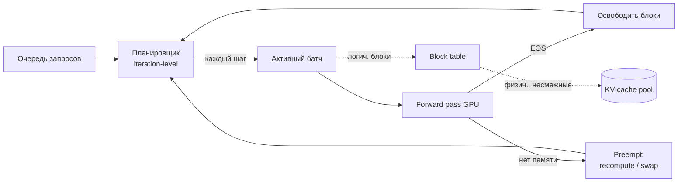

# Инференс и сервинг открытых моделей

Запуск обученной/открытой LLM так, чтобы держать нужную пропускную способность
(throughput), латентность (TTFT/ITL) и SLO при приемлемой стоимости за токен. Это
не «вызвать `model.generate()`»: наивная генерация через `transformers` на проде
проигрывает специализированному движку в разы по throughput. Механика attention и
его варианты (MHA/MQA/GQA) — предпосылка, см. DSWoK §1.1, §1.1.4–1.1.5; здесь —
что из них следует для сервинга. Раздел волатильный: конкретные числа
бенчмарков, поддержка форматов движками и SOTA-методы меняются — проверяй
`last_reviewed` и даты источников.

## Суть

Авторегрессионная генерация — цикл «предскажи следующий токен по всем
предыдущим». У него две фазы с принципиально разной природой нагрузки (prefill
compute-bound, decode memory-bound), и почти вся инженерия инференса — это (1)
борьба за память KV-cache, (2) удержание GPU загруженным между запросами разной
длины, (3) сокращение числа дорогих forward-проходов. Рычаги по убыванию
универсальности: **continuous batching** (не простаивать на разной длине),
**PagedAttention** (не терять память на фрагментации), **квантизация** (влезть в
меньшую память и читать меньше байт), **speculative decoding** (меньше
forward-проходов целевой модели), **P/D-дизагрегация** и **параллелизм** (для
масштаба и больших моделей). Поверх — выбор движка, метрики и capacity planning.

## Механика

### Авторегрессия и две фазы

Генерация делится на две фазы с разными бутылочными горлами.

**Prefill (обработка промпта).** Весь входной промпт прогоняется за один проход:
attention считается по всем токенам сразу, заполняется KV-cache. Это
**compute-bound** — много параллельной матричной арифметики, GPU загружен по
FLOPs. Определяет TTFT и растёт ~линейно (attention — квадратично) с длиной
промпта.

**Decode (генерация).** Токены выдаются по одному; на каждый шаг модель читает из
памяти **все веса** и **весь KV-cache**, а арифметики делает мало (один новый
токен). Это **memory-bound** — узкое место не FLOPs, а пропускная способность
памяти (memory bandwidth). Определяет ITL (inter-token latency) и скорость
генерации.

Понятие, объясняющее различие, — **арифметическая интенсивность** (FLOPs на байт,
прочитанный из памяти; roofline-модель). У prefill она высокая (много операций на
прочитанный вес), у decode низкая (один токен на полный проход весов). Отсюда два
практических следствия:

1. **Decode упирается в bandwidth**, поэтому H100 (~3.35 TB/s) генерирует токены
   заметно быстрее 4090 (~1 TB/s) на той же модели (см. `2.5-gpu-minimum`), даже
   если по FLOPs разрыв меньше.
2. **Батчинг почти бесплатен для decode по арифметике.** Веса модели читаются один
   раз и переиспользуются для всех запросов в батче: добавление запросов
   повышает арифметическую интенсивность, не пропорционально увеличивая чтение
   памяти. Поэтому continuous batching так сильно поднимает throughput decode-фазы.
3. **Квантизация весов ускоряет именно decode** (меньше байт читать на токен); на
   prefill при упоре в compute даёт мало.

### KV-cache: почему он доминирует память

В decode attention нового токена требует ключи (K) и значения (V) **всех**
предыдущих токенов (DSWoK §1.1). Чтобы не пересчитывать их каждый шаг, K и V
кэшируют — KV-cache. Он растёт линейно с длиной последовательности и числом
параллельных запросов и на длинном контексте/большом батче легко превышает по
объёму сами веса.

$$
\text{KV}_{\text{bytes}} = 2 \times n_{\text{layers}} \times n_{\text{kv\_heads}} \times d_{\text{head}} \times L_{\text{seq}} \times B \times b
$$

- `2` — K и V раздельно; `n_layers` — слои; `n_kv_heads` — число **KV**-голов
  (не query-голов!); `d_head` — размер головы; `L_seq` — длина (промпт +
  сгенерированное); `B` — параллельные последовательности; `b` — байт/элемент
  (2 для fp16/bf16).

**Worked example — Llama-3-8B** (32 слоя, 8 KV-голов, head_dim 128, bf16):
на один токен = `2·32·8·128·2 = 131072` байт = **128 KiB/токен**. При контексте
8192 одна последовательность держит `128 KiB · 8192 = 1 GiB` KV-cache. Веса 8B в
bf16 ≈ 16 GB.

**Worked example — Llama-3-70B** (80 слоёв, 8 KV-голов, head_dim 128, bf16):
на токен = `2·80·8·128·2 = 327680` байт = **320 KiB/токен**. При батче 8 и
контексте 4096: `320 KiB · 4096 · 8 = 10 GiB` (совпадает с расчётом Lyceum
Technology). Веса 70B в bf16 ≈ 140 GB → не влезают на одну карту, нужен
параллелизм (см. ниже) на 2× H100/A100 80GB через NVLink.

**Рычаг GQA.** `n_kv_heads` — единственный архитектурный множитель, которым можно
сократить KV-cache без потери контекста. Llama-3-8B использует 32 query-головы и
8 KV-голов (4:1), 70B — 64 и 8 (8:1) (см. обзоры архитектуры Llama-3). Если бы 8B
был на MHA (32 KV-головы), KV-cache был бы в 4 раза больше — 512 KiB/токен, 4 GiB
на полный контекст. Поэтому почти все serving-модели используют GQA: не ради
качества, а ради того, чтобы влезло больше параллельных запросов.

**Квантизация KV-cache.** KV можно хранить в fp8/int8 вместо bf16 → ×2 экономия
памяти KV (а значит вдвое больше параллельных запросов или вдвое длиннее
контекст). Цена — небольшая потеря качества; проверять эвалами.

**Sliding-window attention (SWA).** Модели вроде Mistral ограничивают окно
внимания W токенами → KV-cache перестаёт расти после W, память ограничена сверху
независимо от длины. Цена — модель «не видит» дальше окна напрямую.

### Continuous batching: не ждать самый длинный запрос

Static (классический) batching собирает N запросов, прогоняет батч и ждёт, пока
**все** закончат генерацию, прежде чем взять новые. Если один запрос просит 5
токенов, а другой — 500, короткий простаивает (head-of-line blocking). На
разнородном трафике так теряется бóльшая часть пропускной способности.

**Continuous batching** (iteration-level scheduling) меняет состав батча на
**каждом decode-шаге**: выдавшая EOS последовательность освобождает слот,
планировщик тут же подсаживает запрос из очереди. GPU не простаивает между
запросами. По данным vLLM — до ~24× throughput относительно наивной генерации в
HF Transformers/TGI (vLLM paper; RedHat).

Управляющие параметры планировщика (на примере vLLM):
- `max_num_seqs` — потолок одновременных последовательностей в батче;
- `max_num_batched_tokens` — потолок токенов на итерацию (ограничивает суммарный
  prefill+decode за шаг);
- **preemption** — когда памяти под KV не хватает, планировщик вытесняет часть
  последовательностей: либо **recompute** (выбросить KV и пересчитать prefill
  заново при возврате — дёшево по памяти, дорого по compute), либо **swap**
  (выгрузить KV в CPU-память и вернуть — наоборот). Частые preemption — симптом
  перегруза памяти, бьёт по латентности.

### PagedAttention: KV-cache как виртуальная память ОС

До vLLM движки резервировали под KV непрерывный кусок памяти на максимально
возможную длину. Две беды: **внутренняя фрагментация** (зарезервировали под 2048
токенов, сгенерировали 50 — остальное впустую) и невозможность плотно паковать
запросы. По разборам, так терялось 60–80% памяти KV-cache.

PagedAttention (UC Berkeley Sky Computing Lab, SOSP 2023, arXiv:2309.06180)
применяет идею страничной виртуальной памяти ОС. KV режется на блоки
фиксированного размера (в vLLM — 16 токенов на блок). Каждая последовательность
адресует свой кэш через **таблицу блоков** (как таблица страниц процесса),
отображающую логические блоки в **несмежные** физические блоки GPU-памяти.

Следствия:
- **нет внешней фрагментации** и почти нет внутренней (последний блок недобит
  максимум на 15 токенов);
- блоки выделяются по мере роста последовательности, не наперёд;
- **prefix sharing**: общий префикс (системный промпт, few-shot) хранится в одних
  физических блоках для многих запросов;
- **copy-on-write**: при parallel sampling/beam search (несколько продолжений
  одного промпта) общие блоки шарятся, копируются только при расхождении — экономит
  память на n-best генерации.



### Prefill/decode-интерференция, chunked prefill, P/D-дизагрегация

В колокации (prefill и decode на одной GPU в одном батче) тяжёлый prefill
длинного промпта блокирует decode-шаги уже идущих запросов → скачки ITL. Два
подхода:

- **Chunked prefill**: резать prefill на куски и перемежать с decode-шагами других
  запросов. Сглаживает ITL ценой небольшого роста TTFT. Включается в vLLM/SGLang.
- **P/D-дизагрегация** (prefill–decode disaggregation): prefill и decode исполняются
  на **разных пулах GPU**, KV-cache передаётся между ними (часто по RDMA). Идея —
  ортогональность бутылочных горл: prefill compute-bound, decode memory-bound, их
  выгодно масштабировать и параллелить независимо. DistServe (arXiv:2401.09670,
  OSDI 2024) сообщает до 7.4× больше запросов или 10.2× более жёсткий SLO при
  сохранении латентности у >90% запросов; Splitwise — параллельная работа с той же
  идеей; на 2025–2026 дизагрегация встроена в NVIDIA Dynamo, llm-d, SGLang, vLLM,
  Mooncake (Hao AI Lab). Понятия TTFT/TPOT популяризованы именно через эту оптику.

### Prefix caching / RadixAttention

Переиспользовать KV общего префикса между запросами вместо повторного prefill.
vLLM — automatic prefix caching; **SGLang RadixAttention** — префиксы хранятся в
radix-дереве, что даёт агрессивное переиспользование на ветвящихся диалогах и
агентах. Для длинных стабильных системных промптов экономит и TTFT, и память
(перекликается с `1.3-agents-from-scratch`, `1.5-backend`).

### Speculative decoding: меньше forward-проходов целевой модели

Decode упирается в bandwidth, GPU по compute недогружен → можно «угадывать»
несколько токенов вперёд дешёвой моделью и **верифицировать их одним проходом**
целевой. Принятые токены идут в выход; **качество не меняется** (верифицирует
целевая модель по правилу принятия). Варианты:

- **Draft-model (Leviathan/Chen, 2023)**: отдельная маленькая модель того же
  семейства предлагает K токенов.
- **Medusa**: к целевой модели добавляют несколько параллельных decoding-голов
  (позиции +1, +2, …); тренировки draft-модели не нужно.
- **EAGLE / EAGLE-3**: обучаемая спекулятивная голова, использующая скрытые
  состояния целевой (EAGLE-3 — фьюжн ранних/средних/поздних слоёв). Acceptance
  ~0.75–0.85 на чат-нагрузке; speedup 2–6× (больше на крупных моделях).
- **MTP (Multi-Token Prediction)**: встроена в DeepSeek-V3, ~1.8× при >80%
  acceptance из коробки.

Интуиция выигрыша: ожидаемое число токенов за один проход целевой растёт с
**acceptance rate** α и длиной спекуляции K. Типичный продакшен-выигрыш 2–3×
(EAGLE-3 до 2–6×). **Важный нюанс**: при высоком батче целевая модель становится
compute-bound (батч уже загрузил GPU), и выигрыш спекуляции падает — она помогает
прежде всего при низкой/средней конкурентности и tail-латентности.

### Attention-ядра на инференсе

- **FlashAttention** (arXiv:2205.14135, см. `2.5-gpu-minimum`): IO-aware точный
  attention, тайлинг + инкрементальный softmax, память O(N) вместо O(N²);
  используется в prefill.
- **PagedAttention**: ядро decode, читающее KV из несмежных блоков по block table.
- **FlashInfer** и аналоги: оптимизированные ядра под разные паттерны
  prefill/decode и квантованный KV. Движок сам выбирает ядро под фазу.

### Параллелизм для больших моделей

Когда модель не влезает на одну карту (70B ≈ 140 GB) или нужен throughput:
- **Tensor parallelism (TP)**: слои (attention/MLP) шардируются **внутри** по
  головам/каналам; требует частого all-reduce → **критичен быстрый интерконнект
  (NVLink)**. На картах без NVLink (4090) TP неэффективен (см. `2.5-gpu-minimum`).
- **Pipeline parallelism (PP)**: разные слои на разных GPU; меньше трафика, но
  bubble-простои; комбинируется с TP на мультинодах.
- **Expert parallelism (EP)**: для MoE — эксперты раскладываются по GPU.
P/D-дизагрегация позволяет подбирать **разную** стратегию параллелизма под prefill
и decode независимо.

### Квантизация: оси, алгоритмы, ядра

Квантизация снижает точность ради памяти и скорости. Разбираем по трём осям.

**Ось 1 — что квантуем.**
- **Weight-only (W4A16, W8A16)**: только веса в 4/8 бит, активации в fp16/bf16.
  Главный выигрыш — память весов и bandwidth decode. Дефолт для одиночных моделей.
- **Weight+activation (W8A8, FP8 W8A8)**: и веса, и активации в 8 бит. Даёт
  ускорение и на compute (prefill, большие батчи) за счёт int8/fp8-матумножений,
  но активации квантовать труднее из-за выбросов.

**Ось 2 — гранулярность масштабов** (от грубой к точной): per-tensor → per-channel
(на канал весов) → **per-group** (группы по `group_size=128` — рабочий дефолт) →
per-token (динамически на токен для активаций). Мельче гранулярность — выше
качество, чуть выше оверхед.

**Ось 3 — алгоритм.**
- **GPTQ** (наследник OBQ): post-training, использует информацию второго порядка
  (гессиан) — оценивает распространение ошибки веса по сети и минимизирует её.
  Точнее всех «вес-в-вес» при той же битности, но дороже готовить (по разборам,
  2–4 ч на 7B на A100, калибровка ~2048+ примеров).
- **AWQ** (activation-aware): по магнитудам активаций находит ~1% критичных весов и
  защищает их, остальное round-ит жёстко; grid-search масштаба. Быстрее GPTQ
  (10–30 мин на 7B, 128–512 примеров). 4-бит AWQ обычно ≥ 4-бит GPTQ по качеству.
- **SmoothQuant** (ICML 2023): для W8A8 — **переносит** трудность квантования с
  активаций на веса через канальное масштабирование (выбросы активаций возникают
  систематически на одних каналах при масштабе >6.7B). Делает W8A8 почти без
  потерь; интегрирован в TensorRT-LLM, llmcompressor. Типичный рецепт:
  SmoothQuant + GPTQ(W8A8) + per-token динамические активации.
- **FP8** (E4M3: 1 знак/4 экспонента/3 мантисса, макс ±448; E5M2: 1/5/2):
  аппаратно на Hopper/Ada (H100/4090-Ada). vLLM: FP8 W8A8 даёт ~2× экономию памяти
  и до ~1.6× throughput при минимальной потере; динамический per-tensor FP8
  не требует калибровки.
- **GGUF k-quants** (llama.cpp): scale-and-zero-point с блок-субблочной структурой
  (Q4_K_M: блок 256 весов, 8 субблоков по 32, свои масштабы). Опциональная
  importance-matrix-калибровка, чаще пропускается. Заточен под CPU/Mac.
- **bitsandbytes NF4**: квантует на лету при загрузке, без калибровки; формат для
  **обучения** (QLoRA, см. `2.2a-sft`), не для throughput-инференса.
- **QAT vs PTQ**: всё выше — PTQ (после обучения). QAT (quantization-aware
  training) вставляет симуляцию квантизации в обучение — лучше качество на низких
  битах, но дорого; редко для готовых LLM.

**Ядра решают скорость отдельно от алгоритма.** Marlin/Machete (W4A16 на NVIDIA),
ExLlamaV2 — оптимизированные ядра; без них квантованная модель может быть медленнее
fp16. Бенчмарк Qwen2.5-32B через vLLM (Jarvislabs): Marlin-AWQ 741 tok/s,
Marlin-GPTQ 712, fp16 461, bitsandbytes 168, GGUF 93; те же AWQ/GPTQ **без** Marlin
— 67 и 276. По качеству Pass@1 (код): базлайн 56.1%, AWQ/GGUF-Q4_K_M/bnb ≈51.8%,
GPTQ ≈46%; перплексия всех — в пределах ~6% базлайна.

**Критический инсайт: формат вторичен к стеку.** Скорость определяет, какие ядра
поддерживает движок. «AWQ медленный» — почти всегда AWQ без Marlin; «GGUF
медленный» — GGUF, прогнанный через GPU-движок (его layout не заточен под
GPU-загрузчики, поэтому GGUF фактически привязывает к llama.cpp).

### Сводка выбора квантизации

| Сценарий | Формат | Почему |
|---|---|---|
| GPU-сервинг под трафик, vLLM/SGLang/TGI | AWQ (+Marlin) или FP8 на Hopper/Ada | лучшее throughput, AWQ держит качество |
| Большие батчи / нужен compute-выигрыш | W8A8 (SmoothQuant) или FP8 W8A8 | ускоряет и активации, не только память |
| Локально CPU/Mac/потребит. GPU | GGUF Q4_K_M | k-quants, но привязка к llama.cpp |
| Обучение QLoRA | bitsandbytes NF4 | на лету, без калибровки (см. 2.2) |
| Память KV — узкое место | KV-cache fp8/int8 | ×2 запросов/контекста |

### Движки

| Движок | Сильная сторона | Когда брать |
|---|---|---|
| **vLLM** | PagedAttention + continuous batching, OpenAI-совместимый сервер, AWQ/GPTQ/FP8/W8A8, prefix cache, spec decoding, TP/PP, P/D | дефолт для GPU-сервинга под параллельный трафик |
| **SGLang** | RadixAttention (агрессивный prefix-кэш), быстрый structured output, spec decoding | много общих префиксов, агенты, constrained decoding |
| **TensorRT-LLM** | скомпилированные движки NVIDIA, in-flight batching, FP8, SmoothQuant | выжать последний % на NVIDIA, готов к сложной сборке |
| **llama.cpp** | GGUF, CPU/Metal/CUDA, минимум зависимостей, k-quants | edge, ноутбук, Mac, нет GPU |
| **TGI** | сервер HuggingFace, интеграция с экосистемой HF | стек на HF |
| **LMDeploy** | TurboMind-ядра, хороший throughput | альтернатива vLLM на NVIDIA |

### Метрики сервинга

- **TTFT** — prefill, растёт с длиной промпта; критичен для чата/стриминга.
- **ITL / TPOT** — decode, определяется bandwidth и батчем.
- **Throughput** — токенов/с (или запросов/с) суммарно по серверу.
- **Goodput** — throughput **при соблюдении SLO** по TTFT/ITL; ключевая метрика:
  можно гнать высокий throughput, нарушая латентность у части запросов (см.
  DistServe — оптимизация именно goodput).
- Полная латентность запроса ≈ TTFT + ITL × число_выходных_токенов.

**Конфликт throughput↔латентность.** Больше батч → выше throughput, но выше ITL
каждого запроса. Существует «колено» (knee): до него батч добавляет throughput
почти бесплатно (decode недозагружен), после — латентность растёт быстрее
throughput. Настройка батч-окна/приоритетов/SLO — про поиск этого колена под твой
SLO.

## Практические соображения

- **Не меряй формат в вакууме.** Меряй формат+ядро+нагрузку: GGUF через vLLM или
  AWQ без Marlin дадут обманчиво низкие числа.
- **GQA-модель** = сразу больше параллельных запросов (меньше KV). Учитывай при
  выборе модели под сервинг.
- **`max_model_len` и `max_tokens`** прямо определяют резерв KV. Завышенные —
  фрагментируют и режут число слотов. Ставь реалистичные.
- **`gpu_memory_utilization`** в vLLM — доля VRAM под (веса + KV-pool). Слишком
  высоко → OOM на пиках активаций; слишком низко → мало слотов.
- **Prefix caching** окупается при длинных общих системных промптах (агенты, RAG).
- **Spec decoding** включай при низкой/средней конкурентности и жёстком SLO на
  латентность; на высоком батче эффект тает.
- **KV-cache fp8** — дешёвый способ удвоить вместимость, если упёрся в память KV.
- **Проверяй квантованную модель задаче-специфичными эвалами** (`1.4-evaluation`):
  «~6% перплексии» не гарантирует твой кейс.

### Capacity planning (worked example)

Цель: сколько параллельных запросов держит **одна H100 80GB** на **Llama-3-8B**.

1. Бюджет памяти: `gpu_memory_utilization=0.9` → ~72 GB используемых.
2. Веса bf16 ≈ 16 GB → KV-pool ≈ `72 − 16 = 56 GB`.
3. KV на токен (8B) = 128 KiB. При средней длине 2048 токенов на запрос:
   `128 KiB · 2048 = 256 MiB = 0.25 GiB` на запрос.
4. Параллельных запросов ≈ `56 / 0.25 ≈ 224`.

Рычаги в этом примере:
- FP8-веса (≈8 GB) → KV-pool 64 GB → ~256 запросов.
- KV fp8 (0.125 GiB/запрос) → удвоение до ~448.
- контекст 8192 вместо 2048 → KV/запрос ×4 → запросов вчетверо меньше.

Это и есть основа выбора железа и установки `max_num_seqs`.

### Стоимость

Стоимость за токен ≈ (цена GPU-часа) / (throughput токенов в час). Пример: если
H100 стоит C $/час и сервер на ней выдаёт T токенов/с, то цена за 1M токенов ≈
`C / (T · 3600) · 1e6`. Отсюда: всё, что поднимает throughput (батчинг,
квантизация, spec decoding, дизагрегация), линейно снижает $/токен. Поэтому
serving-оптимизации — это не «инженерный перфекционизм», а прямая экономика
(меньше GPU на тот же трафик).

## Режимы отказа

- **OOM при росте трафика, хотя одна сессия влезала.** KV-cache × параллельные
  запросы. Симптом — падения/preemption на пике. Фикс: ниже `max_num_seqs`,
  модель с GQA, квантизация весов (освободить под KV), KV fp8, короче контекст.
- **Частые preemption, скачет латентность.** Памяти под KV не хватает,
  планировщик вытесняет (recompute/swap). Фикс: уменьшить батч/контекст, добавить
  память (квантизация), включить chunked prefill.
- **Низкий throughput при «правильной» квантизации.** Формат без оптимального ядра
  (AWQ без Marlin, GGUF через vLLM). Фикс: включить Marlin/выбрать формат под движок.
- **Высокий ITL у коротких запросов при наплыве длинных промптов.** Prefill
  блокирует decode. Фикс: chunked prefill, лимит длины промпта, P/D-дизагрегация,
  отдельная очередь под длинные.
- **Spec decoding не ускоряет.** Низкий acceptance (draft плохо угадывает) или
  высокий батч (целевая уже compute-bound). Фикс: лучше draft/EAGLE-голова, или
  отключить спекуляцию на высоком батче.
- **TP «не масштабирует» на 4090.** Нет NVLink → all-reduce по PCIe душит. Фикс:
  одна карта + квантизация, либо карты с NVLink (см. `2.5-gpu-minimum`).
- **Потеря качества после квантизации, незаметная по перплексии.** Перплексия не
  ловит деградацию на задаче (ср. DSWoK §5.1.4). Фикс: задаче-специфичные эвалы.
- **Деградация на длинном контексте при достатке памяти.** «Lost in the middle» /
  модель не обучена на такую длину — не серверный баг (см. `1.2-rag-applied`).

## Код

```python
# vLLM: оффлайн-инференс, AWQ+Marlin, контроль памяти, prefix cache, spec decoding.
from vllm import LLM, SamplingParams

llm = LLM(
    model="some-org/Qwen2.5-32B-Instruct-AWQ",
    quantization="awq_marlin",        # формат+ядро вместе: без Marlin будет медленно
    gpu_memory_utilization=0.90,      # доля VRAM под веса + KV-pool
    max_model_len=8192,               # потолок L_seq -> прямо влияет на KV-cache
    max_num_seqs=256,                 # потолок параллельных последовательностей
    enable_prefix_caching=True,       # шарить KV общего префикса
    enable_chunked_prefill=True,      # не блокировать decode тяжёлым prefill
    # speculative_config={"method": "eagle", "num_speculative_tokens": 5},
)
# continuous batching и PagedAttention — это суть движка, не флаги.
params = SamplingParams(temperature=0.0, max_tokens=512)  # резерв слотов KV
print(llm.generate(["Объясни KV-cache одним абзацем."], params)[0].outputs[0].text)
```

```python
# KV-cache на запрос (байты) и оценка числа параллельных запросов.
def kv_bytes_per_token(n_layers, n_kv_heads, d_head, dtype_bytes=2):
    return 2 * n_layers * n_kv_heads * d_head * dtype_bytes  # 2 = K и V

def max_concurrent(vram_gb, weights_gb, util, per_token_b, avg_seq_len):
    kv_pool = vram_gb * util - weights_gb
    per_req = per_token_b * avg_seq_len / 1024**3            # GiB на запрос
    return kv_pool / per_req

# Llama-3-8B: 32 слоя, 8 KV-голов, head_dim 128, bf16
ppt = kv_bytes_per_token(32, 8, 128)        # 131072 байт = 128 KiB/токен
print(max_concurrent(80, 16, 0.9, ppt, 2048))   # ~224 запросов на H100 80GB
# Контрфакт MHA (32 KV-головы): то же делёж, но per-token x4 -> запросов вчетверо меньше.
```

## Вопросы для самопроверки

1. Почему decode memory-bound, а prefill compute-bound? Свяжи с арифметической
   интенсивностью и roofline.
2. Почему батчинг почти не увеличивает чтение памяти на decode-шаге, и как это
   объясняет ×24 throughput от continuous batching?
3. Выведи KV-cache/токен для Llama-3-70B и объясни, почему GQA 8:1 решает именно
   проблему сервинга, а не качества.
4. Что плохого в выделении KV «сразу на max_len» и «по одному токену»? Почему блок
   в 16 токенов — компромисс?
5. Чем recompute-preemption отличается от swap-preemption и когда что выбрать?
6. Зачем нужен chunked prefill и какую метрику он улучшает ценой какой?
7. Что такое P/D-дизагрегация, какая «ортогональность» её мотивирует и почему она
   оптимизирует goodput, а не просто throughput?
8. Почему speculative decoding не меняет распределение выхода? Когда его выигрыш
   стремится к нулю?
9. Разложи квантизацию по трём осям (что квантуем / гранулярность / алгоритм) и
   объясни, почему W8A8 требует SmoothQuant, а weight-only W4A16 — нет.
10. Тебе говорят «AWQ медленнее fp16» и «GGUF медленнее AWQ». Какие два вопроса ты
    задашь до того, как поверить?
11. Когда квантизация весов почти не ускорит инференс? (фаза + bottleneck)
12. Посчитай, сколько Llama-3-8B-запросов влезет на H100 80GB при контексте 8k, и
    как изменится число при FP8-весах и KV fp8.
13. Почему tensor parallelism бессмысленен на стенде из 4090 без NVLink?
14. Перплексия квантованной модели в пределах 1% базлайна — почему этого мало для
    выката и чем проверишь?
15. Как throughput-оптимизации напрямую превращаются в $/токен? Напиши формулу.

## Ссылки

- [P] Kwon et al. — Efficient Memory Management for LLM Serving with PagedAttention
  (SOSP 2023), arXiv:2309.06180
- [P] Zhong et al. — DistServe: Disaggregating Prefill and Decoding (OSDI 2024),
  arXiv:2401.09670; Splitwise (параллельная работа); ретроспектива Hao AI Lab
  https://haoailab.com/blogs/distserve-retro/
- [P] Dao et al. — FlashAttention (2022) arXiv:2205.14135 (см. `2.5-gpu-minimum`)
- [P] Xiao et al. — SmoothQuant: W8A8 PTQ (ICML 2023)
  https://github.com/mit-han-lab/smoothquant
- [D][V] vLLM — FP8 W8A8 (E4M3/E5M2, Hopper/Ada)
  https://docs.vllm.ai/en/latest/features/quantization/fp8/
- [G][V] Бенчмарки квантизации в vLLM (Qwen2.5-32B, tok/s, Pass@1)
  https://jarvislabs.ai/blog/vllm-quantization-complete-guide-benchmarks
- [G][V] Квантизация на практике: формат-ядро-нагрузка, Marlin
  https://theaiengineer.substack.com/p/quantization-in-practice-gptq-vs
- [G] GPTQ vs AWQ vs GGUF vs bnb — алгоритмы и выбор
  https://newsletter.maartengrootendorst.com/p/which-quantization-method-is-right
- [G] Расчёт KV-cache (Llama-3-70B worked example)
  https://lyceum.technology/magazine/kv-cache-memory-calculation-llm/
- [G][V] Speculative decoding: EAGLE-3 / Medusa / MTP, acceptance, speedup
  https://www.e2enetworks.com/blog/Accelerating_LLM_Inference_with_EAGLE
- [D] llama.cpp (GGUF); SGLang (RadixAttention); TensorRT-LLM; LMDeploy
- Предпосылки: DSWoK §1.1 (attention), §1.1.4–1.1.5 (MQA/GQA);
  `2.5-gpu-minimum` (VRAM, bandwidth, NVLink, FP8, H100 vs 4090);
  квантизация для обучения — `2.2a-sft`
