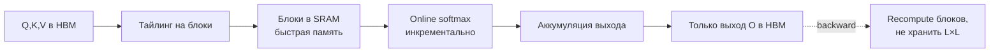

# GPU-минимум: VRAM, bandwidth, FlashAttention, H100 vs 4090

Прежде чем выбирать движок инференса или рецепт файнтюна, нужно уметь по двум
числам видеокарты — **объём памяти (VRAM)** и **пропускная способность памяти
(memory bandwidth)** — сказать, влезет ли модель и с какой скоростью она будет
работать. Эта заметка — арифметическая база для `2.4-inference-serving` (сервинг)
и `2.2-finetuning` (обучение): формулы VRAM, почему генерация упирается в
bandwidth, как FlashAttention снимает квадрат памяти у attention, и чем H100
отличается от 4090 не маркетингово, а по последствиям. Механика самого attention —
предпосылка, см. DSWoK §1.1; здесь — что из неё следует для железа. Раздел
**волатильный**: цены, доступность карт и SOTA-ядра меняются — сверяй
`last_reviewed` и даты источников.

## Суть

Любая работа с LLM на GPU упирается в один из двух ресурсов: **сколько влезает**
(VRAM) и **как быстро гоняется память** (bandwidth). Эти два числа объясняют почти
все практические решения: можно ли запустить 70B на одной карте, почему обучение
требует в разы больше памяти, чем инференс, почему генерация на потребительской
карте не катастрофически медленнее серверной, и почему для модели на двух картах
критичен NVLink. Третий ресурс — вычислительная производительность (FLOPs) —
упирается реже, чем кажется: на генерации (decode) GPU почти всегда недозагружен
по FLOPs и ждёт память. Понять это различие (compute-bound vs memory-bound) — и
есть «минимум по железу».

## Механика

### Два числа решают почти всё: ёмкость и bandwidth

У видеокарты для LLM есть два ключевых параметра, и они отвечают за разные вопросы:

- **VRAM (ёмкость, GB)** — *влезет ли*. Веса + KV-cache + активации + (при
  обучении) градиенты и состояния оптимизатора должны поместиться, иначе OOM.
- **Memory bandwidth (ГБ/с или ТБ/с)** — *как быстро*. На каждый шаг генерации GPU
  читает из памяти все веса; скорость чтения и есть потолок скорости генерации.

Третий параметр — **compute (TFLOPS тензорных ядер)** — определяет скорость на
*compute-bound* операциях (prefill длинного промпта, обучение, большие батчи), но
на одиночной генерации почти не лимитирует. Поэтому «во сколько раз карта мощнее
по TFLOPS» — обманчивая метрика для инференса.

Ориентиры (2026, проверять даты):

| Карта | VRAM | Bandwidth | BF16 tensor (dense) | FP8 tensor (dense) | NVLink | TDP |
|---|---|---|---|---|---|---|
| **H100 SXM5** | 80 GB HBM3 | **3.35 ТБ/с** | 989 TFLOPS | 1979 TFLOPS | 900 ГБ/с | 700 Вт |
| **A100 SXM 80GB** | 80 GB HBM2e | ~2.0 ТБ/с | 312 TFLOPS | — (нет FP8) | 600 ГБ/с | 400 Вт |
| **RTX 4090** | 24 GB GDDR6X | **~1.01 ТБ/с** | ~165 TFLOPS | ~660 TFLOPS | **нет** | 450 Вт |

(Числа из datasheet NVIDIA H100 и спецификаций Ada/Ampere; «sparse» значения в
маркетинге вдвое выше — здесь приведены *плотные*, реальные для LLM. FP8 4090 — с
учётом, что у Ada FP8 есть аппаратно, в отличие от A100.)

Ключевые следствия из таблицы:
- 4090 по bandwidth **в 3.3 раза** медленнее H100 → примерно во столько же раз
  медленнее на decode одиночного запроса (см. roofline ниже).
- A100 **не имеет FP8** (Ampere) — это отсекает FP8-квантизацию и FP8-обучение.
- 4090 **не имеет NVLink** — модель на двух 4090 через PCIe масштабируется плохо.

### VRAM под инференс: «байты на параметр»

Базовая прикидка памяти под веса модели:

$$
\text{VRAM}_{\text{веса}} \approx N_{\text{params}} \times b_{\text{param}}
$$

- `N_params` — число параметров; `b_param` — байт на параметр в выбранной точности.

Байт на параметр по точности: fp32 = 4, **fp16/bf16 = 2** (дефолт инференса), fp8 =
1, int4/NF4 ≈ 0.5. Отсюда правило большого пальца: **в bf16 модель занимает
≈ 2 ГБ на миллиард параметров**.

| Модель | fp16/bf16 (2 Б) | fp8 (1 Б) | 4-бит (0.5 Б) |
|---|---|---|---|
| 7–8B | ~16 GB | ~8 GB | ~4 GB |
| 13B | ~26 GB | ~13 GB | ~6.5 GB |
| 70B | ~140 GB | ~70 GB | ~35 GB |

Поверх весов на инференсе нужен запас ~10–20% под активации и, главное, под
KV-cache (см. ниже). Поэтому 8B в bf16 (16 GB) на 24 GB-карте оставляет лишь ~6–7
GB под KV — мало для большого батча; в fp8 (8 GB) запас под KV втрое больше.

### VRAM под обучение: откуда берутся 16 байт на параметр

При full-fine-tune с оптимизатором Adam и mixed precision память на параметр в
**разы** больше инференса. Каноническая раскладка (ZeRO, Rajbhandari et al.,
arXiv:1910.02054):

$$
b_{\text{train}} = \underbrace{2}_{\text{fp16 веса}} + \underbrace{2}_{\text{fp16 градиенты}} + \underbrace{4}_{\text{fp32 master-веса}} + \underbrace{4}_{\text{Adam momentum}} + \underbrace{4}_{\text{Adam variance}} = 16 \text{ байт/параметр}
$$

- **fp16 веса (2)** — копия для быстрых forward/backward;
- **fp16 градиенты (2)** — результат backward;
- **fp32 master-веса (4)** — точная копия для аккуратного применения мелких
  обновлений (см. mixed precision в `2.1-pytorch-fluency`);
- **momentum + variance (4+4)** — два состояния Adam в fp32.

**Worked example — 8B full-FT:** `8e9 × 16 = 128 GB` только под
веса+градиенты+оптимизатор, без активаций. Не влезает на одну 80GB-карту → нужны
ZeRO-шардинг по нескольким GPU, либо оффлоад, либо параметр-эффективные методы
(LoRA). Это и есть причина, по которой full-FT крупных моделей — дорогое
многокарточное мероприятие, а LoRA/QLoRA — массовая практика.

**Активации** — отдельная статья, масштабируется с `batch × seq_len × hidden` и
числом слоёв; именно её режет gradient checkpointing (`2.1-pytorch-fluency`),
торгуя ~30% времени за кратное снижение памяти активаций.

### QLoRA: почему 4-битная база переворачивает арифметику

QLoRA (Dettmers et al., arXiv:2305.14314) хранит **замороженную** базовую модель в
4 битах (формат NF4), а обучает только маленькие LoRA-адаптеры в bf16. Память
обучения тогда ≈ `0.5 Б/параметр (база) + адаптеры + Adam только для адаптеров`.
Адаптеры — доли процента параметров, поэтому состояния оптимизатора почти ничего не
стоят. Плюс **paged optimizer** (выгрузка состояний в CPU при пиках) гасит OOM на
скачках длины.

**Worked example:** QLoRA-FT 70B: база 4-бит ≈ 35 GB + адаптеры/градиенты/активации
— влезает на одну 48–80GB карту, тогда как full-FT 70B требовал бы ~1.1 ТБ. Именно
это сделало файнтюн больших моделей доступным на одной карте. Механика LoRA/NF4 —
DSWoK §2.7 и `2.2-finetuning`; здесь важно только следствие для памяти.

### KV-cache: третий потребитель VRAM на инференсе

При генерации кэшируются ключи и значения всех предыдущих токенов (KV-cache).
Формула и подробный разбор — в `2.4-inference-serving`; здесь — итог, который нужен
для прикидки железа:

$$
\text{KV}_{\text{байт}} = 2 \cdot n_{\text{layers}} \cdot n_{\text{kv\_heads}} \cdot d_{\text{head}} \cdot L_{\text{seq}} \cdot B \cdot b
$$

Для Llama-3-8B (GQA, 8 KV-голов) это **128 КиБ на токен**: при контексте 8192 одна
последовательность держит 1 GiB KV. На батче 32 это уже 32 GiB — больше, чем сами
веса в fp8. Вывод для железа: **на длинном контексте и большом батче VRAM съедает
не модель, а KV-cache** — и именно ёмкость карты, а не её FLOPs, ограничивает число
параллельных пользователей. GQA (DSWoK §1.1.5) — главный архитектурный рычаг
уменьшить KV.

### Roofline: почему decode упирается в bandwidth, а не в FLOPs

Roofline-модель связывает достижимую производительность с **арифметической
интенсивностью** $I$ — числом операций (FLOP) на каждый прочитанный из памяти байт:

$$
P_{\text{достиж}} = \min\big(P_{\text{пик FLOPs}},\; I \times \text{Bandwidth}\big)
$$

- если $I$ мала → упираемся в `I × Bandwidth` (**memory-bound**);
- если $I$ велика → упираемся в пиковые FLOPs (**compute-bound**).

**Генерация одного токена (decode)** читает все веса модели, но делает мало
арифметики (один новый токен) → $I$ мала → memory-bound. Поэтому верхняя оценка
скорости генерации:

$$
\text{токенов/с} \lesssim \frac{\text{Bandwidth}}{\text{размер весов в байтах}}
$$

**Worked example — 8B bf16 (16 GB):** на H100 (3.35 ТБ/с) потолок ≈ `3350/16 ≈
209` ток/с; на 4090 (1.01 ТБ/с) ≈ `1010/16 ≈ 63` ток/с. Отношение ~3.3× — ровно
отношение bandwidth, **не** отношение TFLOPS (там разрыв ~6×). Отсюда два вывода:
1. на decode карту выбирают по bandwidth, а квантизация весов (меньше байт читать)
   прямо ускоряет генерацию;
2. **prefill** длинного промпта — наоборот, compute-bound (много токенов сразу,
   высокая $I$), и там решают FLOPs. Подробнее — `2.4-inference-serving`.

### FlashAttention: убрать квадрат памяти у attention

Наивный attention материализует матрицу оценок $QK^\top$ размером $L \times L$ в
HBM — память растёт как $O(L^2)$, и на длинном контексте это и узкое место по
памяти, и по скорости (лишние чтения/записи в HBM). FlashAttention (Dao et al.,
arXiv:2205.14135) — **IO-aware** точный (не приближённый!) алгоритм:



1. **Тайлинг (tiling):** Q, K, V режутся на блоки, помещающиеся в быструю
   on-chip SRAM; attention считается поблочно, не материализуя всю $L \times L$.
2. **Online softmax:** softmax пересчитывается инкрементально между блоками
   (running max и running sum), поэтому полную строку оценок держать не нужно.
3. **Recomputation в backward:** матрица attention не хранится для обратного
   прохода, а пересчитывается из блоков — экономит память ценой лишних FLOPs
   (которых на attention в избытке).

Итог: память attention — **$O(L)$ вместо $O(L^2)$**, плюс кратно меньше обращений
к HBM → быстрее. Это и enabler длинного контекста, и стандарт во всех движках.

**Эволюция (важно для выбора карты):**
- **FA2** (arXiv:2307.08691): лучше параллелизм по seq/головам, ~2× к FA1; на A100
  достигает 50–73% пиковых FLOPs, но **на H100 только ~35%** (не использует
  Hopper-фичи).
- **FA3** (arXiv:2407.08608, NeurIPS 2024): заточен под Hopper — асинхронность
  Tensor Cores и TMA, warp-specialization, поддержка **FP8**. FP16 достигает
  ~740 TFLOPS (≈75% утилизации H100), FP8 ~1.2 PFLOPS; в 1.5–2× быстрее FA2 на
  H100. Вывод: на H100 нужна FA3, чтобы не терять половину карты; на 4090/A100 —
  FA2.

## Практические соображения

### H100 vs 4090: что реально различает (не маркетинг)

| Критерий | H100 80GB | RTX 4090 24GB | Практический вывод |
|---|---|---|---|
| VRAM | 80 GB | 24 GB | 4090 не держит 70B даже в 4-бит с контекстом; потолок — ~32B 4-бит или 8–13B bf16 |
| Bandwidth | 3.35 ТБ/с | 1.01 ТБ/с | decode на 4090 в ~3.3× медленнее на ту же модель |
| FP8 | да | да (Ada) | обе умеют FP8; A100 — нет |
| NVLink | 900 ГБ/с | **нет** | tensor parallelism на 2× 4090 душит PCIe; на H100 — нормально |
| Лицензия | для ЦОД | **GeForce EULA запрещает datacenter** | 4090 в коммерческом ЦОД — юридический риск |
| Цена/час (облако) | дорого | дёшево | экономику считать на $/токен, не $/час |

**Когда 4090 рационален:** одиночная модель ≤13B (или ≤32B в 4-бит), низкая
конкурентность, dev/прототип, локальный инференс, бюджет. **Когда нужен H100/A100:**
модель >24 GB, нужен tensor parallelism (NVLink), FP8-сервинг под трафик, обучение,
длинный контекст с большим батчем.

### NVLink: почему он решает для multi-GPU

Tensor parallelism (шардинг слоёв по картам, см. `2.4-inference-serving`) на каждом
слое делает **all-reduce** между GPU — это интенсивный обмен. NVLink даёт сотни
ГБ/с между картами; PCIe 4.0 — лишь ~32 ГБ/с в одну сторону. Поэтому TP на двух
4090 (только PCIe) часто **медленнее** одной 4090: коммуникация съедает выигрыш. На
картах без NVLink стратегия — *одна карта + квантизация*, либо pipeline parallelism
(меньше трафика), но не TP.

### Экономика и лицензия

- **$/токен ≈ (цена GPU-часа) / (токенов в час).** Дешёвый $/час 4090 может
  проигрывать H100 по $/токен, если H100 за счёт bandwidth + FP8 + большего батча
  выдаёт кратно больше токенов. Считать всегда $/токен, не $/час.
- **Лицензия GeForce:** драйверный EULA NVIDIA ограничивает использование
  потребительских карт (включая 4090) в дата-центрах. Для прода — A100/H100/L40S
  или провайдеры, у которых это легально. Это не техническое, а юридическое
  ограничение, и его часто упускают.

## Режимы отказа

- **OOM при загрузке весов, хотя «N×2 ГБ влезало».** Забыли про KV-cache,
  активации и фрагментацию. Симптом — падает при первом длинном запросе/батче.
  Фикс: считать веса + KV (формула выше) + ~15% запас; снизить `max_model_len` и
  батч; квантизовать веса/KV (см. `2.4-inference-serving`).
- **Обучение падает по памяти на 8B, хотя инференс шёл.** Перепутали бюджеты:
  обучение — 16 Б/параметр (Adam) против 2 Б инференса. Симптом — OOM сразу на
  первом шаге оптимизатора. Фикс: QLoRA/LoRA, ZeRO-шардинг, gradient checkpointing,
  меньший batch + accumulation (`2.1-pytorch-fluency`).
- **Генерация «медленная», хотя карта мощная по TFLOPS.** Decode memory-bound, а вы
  смотрели на FLOPs. Симптом — низкий ток/с, GPU util высокий, но SM недозагружены.
  Фикс: смотреть bandwidth, квантовать веса, поднять батч (амортизирует чтение
  весов).
- **Tensor parallelism на 2× 4090 медленнее одной.** Нет NVLink, all-reduce по
  PCIe. Фикс: одна карта + квантизация, либо карты с NVLink, либо pipeline-параллель.
- **FP8 «не включается» на A100.** Ampere не имеет FP8 аппаратно (только Hopper/Ada).
  Фикс: int8/W8A8 (SmoothQuant) или другая карта.
- **На H100 attention медленнее ожидаемого.** Используется FA2 (35% утилизации
  Hopper). Фикс: обновить до FA3-совместимого ядра/движка.
- **«Влезло» на dev (1 запрос), падает на проде (трафик).** KV-cache масштабируется
  с числом параллельных запросов. Фикс: capacity planning по KV
  (`2.4-inference-serving`), лимит `max_num_seqs`.

## Код

```python
# Прикидка VRAM: инференс, обучение (Adam), QLoRA — и потолок скорости decode.
def weights_gb(n_params_b, bytes_per_param):
    # n_params_b — миллиарды параметров; bf16=2, fp8=1, 4bit=0.5
    return n_params_b * 1e9 * bytes_per_param / 1024**3

def train_gb_adam(n_params_b):
    # 16 байт/параметр: fp16 веса(2)+градиенты(2)+fp32 master(4)+momentum(4)+variance(4)
    return n_params_b * 1e9 * 16 / 1024**3

def qlora_gb(n_params_b, adapter_frac=0.01):
    # база в 4-бит заморожена + Adam только на адаптеры (доли %)
    base = n_params_b * 1e9 * 0.5 / 1024**3
    adapters = n_params_b * adapter_frac * 1e9 * 16 / 1024**3
    return base + adapters

def decode_tok_per_s_ceiling(bandwidth_tb_s, weights_gb_):
    # memory-bound потолок: вся память весов читается на каждый токен
    return bandwidth_tb_s * 1024 / weights_gb_   # ТБ/с -> ГБ/с делим на ГБ

print(f"8B bf16 веса:     {weights_gb(8, 2):.0f} GB")        # ~15 GB
print(f"8B full-FT Adam:  {train_gb_adam(8):.0f} GB")        # ~119 GB -> не на 1 карту
print(f"70B QLoRA:        {qlora_gb(70):.0f} GB")            # ~44 GB -> 1 карта 48-80GB
print(f"8B decode H100:   {decode_tok_per_s_ceiling(3.35, weights_gb(8,2)):.0f} tok/s")  # ~228
print(f"8B decode 4090:   {decode_tok_per_s_ceiling(1.01, weights_gb(8,2)):.0f} tok/s")  # ~69
# Отношение ~3.3x = отношение bandwidth, НЕ отношение TFLOPS (там ~6x).
```

## Вопросы для самопроверки

1. У тебя 8B-модель влезла в bf16 на 24GB-карту в dev. Почему она может упасть на
   проде, и какой именно потребитель VRAM ты не учёл?
2. Выведи 16 байт/параметр для full-FT с Adam и mixed precision. Зачем нужны
   *одновременно* fp16-веса и fp32 master-веса?
3. Почему отношение скоростей decode H100/4090 ближе к отношению их bandwidth, а не
   к отношению TFLOPS? Свяжи с арифметической интенсивностью.
4. Когда квантизация весов почти не ускорит работу? (укажи фазу и bottleneck)
5. Почему tensor parallelism на двух 4090 может оказаться медленнее одной карты, а
   на двух H100 — нет?
6. Что именно делает FlashAttention $O(L)$ по памяти, если матрица attention по
   определению $L \times L$? Где здесь компромисс?
7. Почему на H100 стоит требовать FA3, а не FA2, и что теряется при FA2 на Hopper?
8. Как QLoRA превращает «70B не обучить на одной карте» в «обучить на 48GB»? Назови
   три источника экономии памяти.
9. У тебя A100 80GB, а рецепт требует FP8. В чём проблема и какие альтернативы?
10. Почему $/час — плохая метрика для выбора карты под сервинг, и какой формулой её
    заменить?

## Ссылки

- [P] Dao et al. — FlashAttention: Fast and Memory-Efficient Exact Attention with
  IO-Awareness (2022), arXiv:2205.14135
- [P] Dao — FlashAttention-2 (2023), arXiv:2307.08691
- [P][V] Shah et al. — FlashAttention-3: Asynchrony and Low-precision (NeurIPS
  2024), arXiv:2407.08608 (Hopper, FP8, ~740 TFLOPS FP16)
- [P] Rajbhandari et al. — ZeRO: Memory Optimizations Toward Training Trillion
  Parameter Models (2020), arXiv:1910.02054 (раскладка 16 байт/параметр)
- [P] Dettmers et al. — QLoRA: Efficient Finetuning of Quantized LLMs (2023),
  arXiv:2305.14314 (NF4, paged optimizer)
- [D][V] NVIDIA H100 Product Brief / Datasheet (bandwidth, FP8, NVLink)
  https://www.nvidia.com/content/dam/en-zz/Solutions/Data-Center/h100/PB-11773-001_v01.pdf
- [G][V] Сводка спецификаций H100 (сверено с datasheet)
  https://www.spheron.network/blog/nvidia-h100-specs/
- [G][V] RTX 4090 для AI: VRAM, bandwidth, отсутствие NVLink, лицензия
  https://www.runpod.io/articles/guides/nvidia-rtx-4090
- Предпосылки: DSWoK §1.1 (attention — основа FlashAttention и KV-cache),
  §1.1.5 (GQA), §2.7 (LoRA/QLoRA-память).
- Дальше: `2.4-inference-serving` (KV-cache, квантизация, TP, roofline на сервинге);
  `2.2-finetuning` (QLoRA-пайплайн); `2.1-pytorch-fluency` (mixed precision,
  gradient checkpointing).
