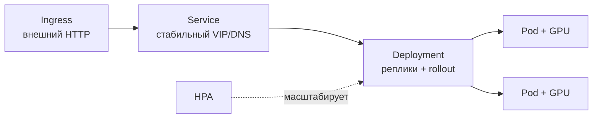

# Контейнеры и оркестрация для GPU: Docker, Kubernetes, экономика железа

Сервинг и обучение (`2.4-inference-serving`, `2.2c-libraries`) едут в контейнерах
на GPU, и тут добавляются три отличия от обычного бэкенда: контейнер должен видеть
GPU и нужную CUDA, оркестратор должен уметь GPU **планировать** (это не CPU, его не
порежешь свободно), а железо дорогое — выбор облако/bare-metal/spot прямо бьёт по
бюджету. Эта заметка — практический минимум по Docker-для-GPU, Kubernetes-для-GPU
и экономике размещения. Опирается на `2.5-gpu-minimum` (что за железо) и
`2.4-inference-serving` (что на нём крутится). Раздел **волатильный**: цены и версии
тулчейна меняются — сверяй `last_reviewed`.

## Суть

Контейнер с GPU работает так: **драйвер NVIDIA живёт на хосте**, а CUDA-runtime — в
образе; **NVIDIA Container Toolkit** прокидывает устройства и драйвер внутрь. В
Kubernetes GPU — это **расширенный ресурс** `nvidia.com/gpu`, выдаётся через
device-plugin, и по умолчанию **целиком** (нельзя попросить «полкарты» как
полъядра CPU). Дробление — отдельные механизмы (MIG/time-slicing/MPS). Поверх —
экономика: reserved/on-demand/spot/bare-metal, и граница окупаемости определяется
**утилизацией**.

## Механика

### Docker для GPU: драйвер на хосте, CUDA в образе

Ключевой принцип: **драйвер NVIDIA не кладут в образ**. Он установлен на хосте;
контейнер использует хостовый драйвер, а CUDA-toolkit/библиотеки — свои, из образа.
Связующее звено — **NVIDIA Container Toolkit** (ранее nvidia-docker): он
конфигурирует рантайм так, что устройства `/dev/nvidia*` и драйверные библиотеки
монтируются в контейнер (`docker run --gpus all`).

**Forward-совместимость CUDA:** CUDA в контейнере должна быть совместима с версией
**драйвера хоста**; точного совпадения не нужно — **более новый драйвер
поддерживает более старый CUDA-toolkit**. Поэтому базовый образ берут от версии
CUDA, а не драйвера. Симптом несовместимости — `CUDA driver version is insufficient
for CUDA runtime version`: на хосте драйвер старее, чем требует образ.

### Multi-stage и веса вне образа

Образ для GPU легко раздувается (CUDA + фреймворки — гигабайты). Практики:

- **Multi-stage build:** в build-стадии ставим компиляторы/зависимости, в финальную
  стадию копируем только нужное (артефакты, рантайм). Образ меньше, поверхность
  атаки уже.
- **Веса модели — НЕ в образ.** Гигабайтные веса в образе = медленный pull,
  раздутый реестр, пересборка на каждое обновление весов. Монтировать через volume /
  тянуть из объектного хранилища (S3) / PVC при старте. Образ versionируется кодом,
  веса — отдельно (`3.2-cicd-versioning-tracking`).
- **Пинить версии:** базовый образ по тегу+дайджесту, версии CUDA/torch/vLLM
  зафиксированы — иначе «собралось вчера, не собралось сегодня» (та же болезнь, что
  в `2.2c-libraries`).

### Kubernetes минимум: объекты и GPU как ресурс

Базовые объекты k8s, которых хватает для сервинга:



- **Pod** — минимальная единица (один+ контейнер); **Deployment** — управляет
  репликами и выкатом (rollout/rollback); **Service** — стабильный адрес поверх
  меняющихся подов; **Ingress** — внешний HTTP-вход с маршрутизацией.
- **GPU как ресурс:** device-plugin NVIDIA публикует `nvidia.com/gpu`; под просит
  его в `resources.limits`. Требует NVIDIA Container Toolkit (≥1.7) на нодах.
  GPU указывается **только в limits** (это неделимый расширенный ресурс).
- **По умолчанию GPU выдаётся целиком** — нельзя запросить долю карты как доли CPU.

### Дробление GPU: MIG vs time-slicing vs MPS

Одна карта часто избыточна под мелкую модель. Три способа делить:

| Механизм | Изоляция | Как делит | Когда |
|---|---|---|---|
| **MIG (Multi-Instance GPU)** | аппаратная (память+вычисления) | до **7** независимых инстансов (A100/H100) | надёжная мультитенантность, гарантии |
| **Time-slicing** | нет (по времени) | переключение контекста между подами | dev/тест, многозадачность без гарантий |
| **MPS (Multi-Process Service)** | слабая (пространственная) | параллельные процессы на одной карте | доверенные ко-локации, мелкие нагрузки |

MIG режет физически (своя память — нет соседского OOM), но фиксированными
профилями. Time-slicing просто переподписывает карту (нет изоляции памяти — сосед
может вызвать OOM, латентность скачет). Выбор: прод-мультитенант → MIG; экономия на
dev → time-slicing.

### Автоскейлинг (HPA) для LLM-сервинга

**HPA (Horizontal Pod Autoscaler)** добавляет/убирает реплики Deployment по метрике.
Нюанс для LLM: дефолтный CPU-таргет бесполезен (узкое место — GPU/очередь). Скейлить
по **кастомным метрикам**: длина очереди запросов, GPU-утилизация, p95-латентность
(`2.4-inference-serving`: goodput). Тонкости: холодный старт GPU-пода долгий (pull
образа + загрузка весов в VRAM — десятки секунд), поэтому реакция HPA запаздывает →
держать запас/прогрев, скейлить с гистерезисом.

## Практические соображения: облако vs bare-metal vs spot

| Вариант | Стоимость | Риск | Когда брать |
|---|---|---|---|
| **On-demand облако** | высокая ($/час) | нет | переменная/непредсказуемая нагрузка, старт |
| **Reserved/committed** | −30…50% к on-demand | платишь за простой | утилизация стабильно **>60–70%** неделями |
| **Spot/preemptible** | **−50…80%** | прерывание (~2 мин) | прерываемое (обучение с чекпойнтами, батч) |
| **Bare-metal** | низкий $/GPU-час при высокой загрузке | капзатраты, эксплуатация | постоянная высокая загрузка, контроль, объём |

**Граница окупаемости reserved:** если утилизация стабильно **выше ~60–70%** неделями —
reserved/bare-metal дешевле; ниже — on-demand (не платишь за простой). **Spot**
даёт 50–80% экономии, но инстанс отзывается с предупреждением ~2 минуты → **только
для прерываемого** с частыми чекпойнтами (обучение каждые ~5 мин, батч); под
latency-чувствительный онлайн-сервинг spot опасен. Конкретные цены **волатильны**
(H100 on-demand ~$2–12/час у разных провайдеров в 2026, spot заметно ниже) — считать
на момент, по `$/токен`, а не `$/час` (`2.5-gpu-minimum`).

## Режимы отказа

- **`CUDA driver version is insufficient`.** Драйвер хоста старее, чем требует CUDA
  образа. Симптом: контейнер падает на инициализации CUDA. Фикс: обновить драйвер
  хоста или взять образ с CUDA ≤ поддерживаемой драйвером (forward-compat).
- **Контейнер «не видит GPU» (`nvidia-smi` пуст / torch.cuda недоступен).** Не
  установлен/не настроен NVIDIA Container Toolkit или забыт `--gpus`. Фикс: toolkit
  на хосте, `--gpus all`; в k8s — device-plugin и `nvidia.com/gpu` в limits.
- **Под Pending, GPU есть на ноде.** Не запрошен `nvidia.com/gpu`, нет device-plugin,
  или все карты заняты (целые). Симптом: `0/ N nodes available: insufficient
  nvidia.com/gpu`. Фикс: добавить limit, поставить plugin, дробить (MIG/time-slicing).
- **Сосед по time-slicing вызывает OOM.** Нет изоляции памяти. Фикс: MIG (аппаратная
  изоляция) или выделенная карта.
- **Образ тянется минутами, рестарты медленные.** Веса зашиты в образ. Фикс: веса —
  в volume/S3/PVC, образ — только код+рантайм.
- **HPA не успевает за всплеском.** Холодный старт GPU-пода долгий, скейл по CPU.
  Фикс: скейлить по очереди/латентности, держать тёплый запас, гистерезис.
- **Spot-инстанс отозвали — потеряли прогресс обучения.** Нет чекпойнтов. Фикс:
  чекпойнт каждые N минут, возобновление с последнего; spot — только для
  прерываемого.

## Код

```dockerfile
# Multi-stage образ для GPU-сервинга: CUDA из образа, драйвер — с хоста, веса — НЕ внутри.
FROM nvidia/cuda:12.4.1-devel-ubuntu22.04 AS build
RUN pip install --no-cache-dir vllm==0.6.3            # пин версии (воспроизводимость)

FROM nvidia/cuda:12.4.1-runtime-ubuntu22.04           # runtime тоньше devel
COPY --from=build /usr/local/lib/python3* /usr/local/lib/python3*
COPY app/ /app                                        # только код
# Веса НЕ копируем: монтируем volume или тянем из S3 на старте.
ENV HF_HOME=/models                                   # путь к смонтированным весам
CMD ["python", "/app/serve.py"]
# Запуск: docker run --gpus all -v /data/models:/models ...  (драйвер хоста + Toolkit)
```

```yaml
# k8s Deployment: GPU как ресурс nvidia.com/gpu, веса через volume, не в образе.
apiVersion: apps/v1
kind: Deployment
metadata: {name: vllm}
spec:
  replicas: 2
  template:
    spec:
      containers:
        - name: vllm
          image: myrepo/vllm:0.6.3@sha256:...     # тег + дайджест (пин)
          resources:
            limits:
              nvidia.com/gpu: 1                    # ТОЛЬКО в limits; целая карта
          volumeMounts: [{name: models, mountPath: /models}]
      volumes:
        - name: models                            # веса монтируются, не в образе
          persistentVolumeClaim: {claimName: model-weights}
# HPA по кастомной метрике (очередь/латентность), не по CPU — иначе не масштабирует LLM.
```

## Вопросы для самопроверки

1. Почему драйвер NVIDIA не кладут в образ, и что делает NVIDIA Container Toolkit?
2. Что значит «forward-совместимость CUDA» и как из неё выбрать базовый образ под
   данный драйвер хоста?
3. Почему веса модели нельзя зашивать в образ? Перечисли последствия и альтернативы.
4. Чем `nvidia.com/gpu` как ресурс отличается от CPU при планировании в k8s, и
   почему его указывают только в limits?
5. Сравни MIG, time-slicing и MPS по изоляции. Когда time-slicing приведёт к OOM?
6. Почему дефолтный HPA по CPU бесполезен для LLM-сервинга, и по чему скейлить?
7. Что усложняет автоскейл GPU-подов по сравнению с обычными, и как это смягчить?
8. На какой утилизации reserved выгоднее on-demand и почему ниже неё — наоборот?
9. Какие нагрузки можно отдать на spot, а какие нельзя, и какой механизм делает это
   безопасным?
10. Почему железо считают по `$/токен`, а не `$/час`? (связь с `2.5-gpu-minimum`)

## Ссылки

- [D] NVIDIA Container Toolkit (прокидывание GPU/драйвера в контейнер)
  https://docs.nvidia.com/datacenter/cloud-native/container-toolkit/latest/
- [D] NVIDIA k8s device plugin — `nvidia.com/gpu`, time-slicing, MPS
  https://github.com/NVIDIA/k8s-device-plugin
- [D] NVIDIA MIG User Guide (до 7 инстансов на A100/H100)
  https://docs.nvidia.com/datacenter/tesla/mig-user-guide/
- [D] Kubernetes — Scheduling GPUs
  https://kubernetes.io/docs/tasks/manage-gpus/scheduling-gpus/
- [G][V] Spot/preemptible GPU — экономика и прерывания
  https://introl.com/blog/spot-instances-preemptible-gpus-ai-cost-savings
- [G][V] Сравнение цен GPU-облаков (проверять на дату)
  https://getdeploying.com/gpus
- Предпосылки: `2.5-gpu-minimum` (выбор карты, $/токен); `2.4-inference-serving`
  (что крутим, goodput для HPA).
- Дальше: `3.2-cicd-versioning-tracking` (выкат образов/моделей, версии весов);
  `3.3-production-monitoring` (метрики для автоскейла и стоимости).
