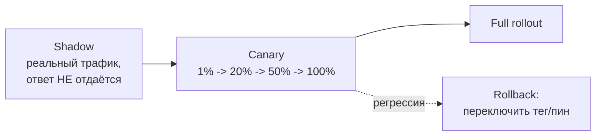

# CI/CD, версионирование и трекинг для LLM-систем

LLM-система отличается от обычного сервиса тем, что её поведение зависит не только
от кода, а от связки **код × промпт × модель × данные**, и «правильность» —
вероятностная (`1.4-evaluation`). Поэтому CI прогоняет не только юнит-тесты, но и
**эвалы с порогами**; CD выкатывает модели/промпты осторожно (shadow/canary) с
**мгновенным откатом**; а версионировать надо все четыре компонента, чтобы любой
прод-результат был воспроизводим. Эта заметка — про эти три механизма. Опирается на
эвалы (`1.4-evaluation`), артефакты обучения (`2.2c-libraries`) и выкат образов
(`3.1-containers-orchestration`). Раздел **волатильный**: фичи трекеров и MLflow 3.0
меняются — сверяй `last_reviewed`.

## Суть

CI/CD для LLM строится вокруг идеи: **изменение любого из четырёх компонентов
(код/промпт/модель/данные) — это релиз, который надо проверить эвалом и выкатить
обратимо.** CI — это эвал-гейты (пороги на регрессионном наборе, не строгое
равенство). Версионирование — content-addressable хранилище для весов/данных (DVC)
и реестр промптов. CD — постепенный выкат (shadow → canary) с откатом по тегу/пину,
без пересборки. Трекинг — единое место истории экспериментов; три популярных
инструмента воплощают три разные философии.

## Механика

### CI с эвалами: пороги вместо равенства

Обычный CI проверяет «тест прошёл/нет». Для LLM выход недетерминирован, и точное
равенство строкам неприменимо. CI прогоняет **регрессионный набор** (10–20+ типовых
кейсов, `1.4-evaluation`) и сравнивает метрики с **порогом/дельтой**, а не с
эталонной строкой:

- gate проходит, если, например, точность на наборе ≥ baseline − допуск, и не
  выросли ключевые ошибки;
- метрики считаются judge'ом/правилами; результат — pass/fail для PR.

Это ловит регрессии промпта/модели до прода. Триггерится на изменении **промпта,
модели или кода ретривера** — не только Python-кода. Промпт-изменение без эвала —
типичная причина тихой деградации.

### Версионирование данных и весов: content-addressable vs S3+хеши

Веса и датасеты — гигабайты, в git их не положишь. Два подхода:

- **DVC (Data Version Control):** хранит файлы в **content-addressable storage** —
  по хешу содержимого (MD5). В git лежит крошечный `.dvc`-указатель с хешем, сами
  данные — в кэше/удалённом хранилище по пути вида `files/md5/ec/1d29...`. Свойства:
  **дедупликация** (одинаковое содержимое = один объект, даже под разными именами),
  воспроизводимость (хеш в git привязывает коммит кода к точной версии данных),
  откат данных вместе с кодом. По сути — git-подобный слой индирекции над большими
  файлами.
- **S3 + хеши вручную:** класть артефакты в объектное хранилище под именем-хешем/
  версией и хранить ссылку. Проще, но без автоматической дедупликации, линеджа и
  привязки к коммиту — это делаешь сам.

Принцип общий: **версия артефакта = хеш содержимого**, а не «latest». «latest»
ломает воспроизводимость (вчерашний `latest` ≠ сегодняшний).

### Версионирование промптов: реестр

Промпт — такой же релизный артефакт, как код. **MLflow Prompt Registry** (MLflow
3.0, заточен под GenAI) даёт git-подобное версионирование промптов: версии, commit
message, **откат**, алиасы для A/B и постепенного выката, хранение параметров
модели рядом с промптом (чтобы знать, с какой моделью/параметрами тестировалась
версия). Минимум без инструмента: промпты — в git как файлы с версией, версия
логируется в трейс (`1.5-backend`), чтобы по проду найти, какой промпт отвечал.

### CD моделей: shadow → canary → откат по тегу

Новую модель/промпт нельзя выкатывать «на всех сразу» — поведение могло измениться.
Лестница безопасности:



- **Shadow (теневой):** новая модель получает **реальный трафик**, но её ответы
  **не отдаются** пользователю — только логируются и сравниваются. Самый безопасный
  способ проверить на проде без риска.
- **Canary (канарейка):** новая модель **обслуживает** растущую долю трафика
  (1% → 20% → 50% → 100%); при росте ошибок — стоп и откат. Даёт реальную обратную
  связь при ограниченном ущербе.
- **Blue-green:** две среды; переключение трафика мгновенно, **откат = вернуть
  трафик на старую** среду (её держат «горячей» несколько дней).
- **Откат по тегу/пину:** модель раздаётся по версии из реестра/пину; откат —
  сменить указатель на предыдущую версию, **без пересборки** образа. Это требует,
  чтобы версии были иммутабельны и пинились (`3.1-containers-orchestration`).

### Трекинг экспериментов: три философии

Это не «какой лучше», а три стратегии:

| Инструмент | Философия | Сильная сторона | Когда |
|---|---|---|---|
| **MLflow** | open-source end-to-end платформа (Databricks) | открытость, без vendor lock-in, registry, MLflow 3.0 для GenAI | хочешь self-host, полный цикл, GenAI-промпты |
| **Weights & Biases** | developer-first продуктивность/UI | лучший UI визуализации, командная работа | приоритет на UX и быстрые итерации |
| **Neptune** | ML metadata store, governance | масштаб, композируемость, метаданные | очень много прогонов, строгий governance |

Минимум для любого — логировать: гиперпараметры, метрики/loss-кривые
(`2.1-pytorch-fluency`), версии данных/модели/промпта, артефакты. Без трекинга
эксперименты невоспроизводимы и несравнимы.

## Практические соображения

- **Эвал-гейт обязателен на изменение промпта/модели**, не только кода. Порог —
  дельта к baseline, а не равенство.
- **Никаких `latest` в проде.** Пины по хешу/версии везде: образ, веса, промпт.
- **Связывать четыре компонента одной версией релиза:** коммит кода ↔ хеш данных ↔
  версия модели ↔ версия промпта. Иначе прод-баг не воспроизвести.
- **Откат должен быть переключением указателя**, не пересборкой (секунды, не
  минуты). Держать предыдущую версию горячей.
- **Shadow перед canary** для рискованных изменений; canary с автоостановом по
  метрикам (`3.3-production-monitoring`).
- **Логировать версию промпта/модели в трейс** (`1.5-backend`) — мост между CD и
  мониторингом.

## Режимы отказа

- **Промпт поменяли — прод тихо деградировал.** Нет эвал-гейта на промпт-изменения.
  Симптом: метрики качества падают без релиза кода. Фикс: CI-эвал на промпты, реестр
  с версиями.
- **Прод-баг невозможно воспроизвести.** Не зафиксированы версии модели/данных/
  промпта на момент. Фикс: пины всех четырёх компонентов, логирование версий в трейс.
- **`latest` поехал.** Тег `latest` указывает на новую версию, поведение изменилось
  без релиза. Фикс: иммутабельные версии по хешу, явные пины.
- **Откат занимает минуты (пересборка).** Версии не пинятся, нет горячей предыдущей.
  Симптом: долгий MTTR при инциденте. Фикс: откат переключением пина/тега, blue-green.
- **Canary выкатили на 100% по таймеру, не по метрикам.** Нет автоостанова. Симптом:
  плохая версия дошла до всех. Фикс: гейт canary по метрикам/ошибкам, не по времени.
- **Дубли данных раздувают хранилище / нет линеджа.** S3+ручные хеши без дедупа.
  Фикс: content-addressable (DVC), привязка к коммиту.
- **Эксперименты несравнимы.** Нет единого трекинга, метрики в разных местах. Фикс:
  один трекер, логировать гиперпараметры/версии/метрики единообразно.

## Код

```yaml
# CI: эвал-гейт на изменение промпта/модели/кода (псевдо-GitHub Actions).
on: [pull_request]
jobs:
  eval-gate:
    steps:
      - run: pytest tests/                       # обычные юнит-тесты
      - run: python eval_suite.py --set regression --out metrics.json
      - run: |                                    # порог, а не равенство
          python - <<'PY'
          import json; m=json.load(open("metrics.json"))
          base=json.load(open("baseline.json"))
          assert m["accuracy"] >= base["accuracy"] - 0.02, "регрессия качества"
          assert m["bad_rate"] <= base["bad_rate"] + 0.01, "рост плохих ответов"
          PY
```

```bash
# DVC: версия данных = хеш содержимого; в git только указатель.
dvc add data/train.jsonl        # создаёт data/train.jsonl.dvc с md5-хешем
git add data/train.jsonl.dvc .gitignore   # сами данные НЕ в git
dvc push                        # данные -> удалённое хранилище по хешу
# Откат данных вместе с кодом: git checkout <commit> && dvc checkout
```

```python
# Canary с откатом по пину из реестра (псевдокод роутинга).
def route(req, weights={"v_new": 0.01, "v_old": 0.99}):  # 1% на новую
    version = weighted_choice(weights)        # canary: доля трафика
    model = registry.load(pin=version)        # пин из реестра, не "latest"
    resp = model(req)
    log_metric(version, resp)                 # сравнивать метрики версий
    return resp
# Откат: registry.set_alias("prod", "v_old") — переключение пина, без пересборки.
```

## Вопросы для самопроверки

1. Почему CI для LLM не может опираться на точное равенство выходов, и чем его
   заменить? Что триггерит эвал-гейт, кроме изменения кода?
2. Что значит «content-addressable» в DVC и какие три свойства это даёт? Чем плох
   подход «S3 + latest»?
3. Почему `latest` ломает воспроизводимость, и что класть вместо него?
4. Какие четыре компонента надо связать одной версией релиза и почему без этого
   прод-баг не воспроизвести?
5. Чем shadow-выкат отличается от canary по тому, что происходит с ответом новой
   модели? Когда какой?
6. Как устроен «мгновенный откат по тегу» и почему он требует иммутабельных пинов?
7. Почему canary нельзя докатывать до 100% по таймеру? Что должно быть условием?
8. В чём разница философий MLflow / W&B / Neptune и под какой сценарий каждый?
9. Зачем промпту реестр версий, если «это просто строка»? Что ломается без него?
10. Как версия промпта/модели в трейсе (`1.5-backend`) связывает CD и мониторинг?

## Ссылки

- [D] DVC — content-addressable storage (внутренние файлы, хеши)
  https://dvc.org/doc/user-guide/project-structure/internal-files
- [D][V] MLflow 3.0 — релиз (GenAI, версионирование)
  https://mlflow.org/releases/3/
- [D][V] MLflow Prompt Registry (версии/алиасы/откат промптов)
  https://mlflow.org/docs/latest/genai/prompt-registry/
- [G][V] Три философии: MLflow vs W&B vs Neptune
  https://uplatz.com/blog/the-2025-mlops-landscape-a-comparative-analysis-of-mlflow-weights-biases-and-neptune/
- [G] Shadow vs canary для ML-моделей
  https://www.qwak.com/post/shadow-deployment-vs-canary-release-of-machine-learning-models
- [G] Стратегии выката моделей (blue-green, откат)
  https://neptune.ai/blog/model-deployment-strategies
- Предпосылки: `1.4-evaluation` (эвалы для гейтов); `2.2c-libraries` (артефакты
  обучения); `3.1-containers-orchestration` (пины образов, выкат).
- Дальше: `3.3-production-monitoring` (метрики для автоостанова canary, дрейф).
