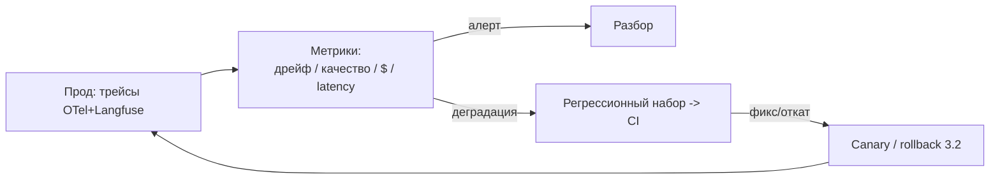

# Мониторинг LLM в проде: дрейф, качество без разметки, стоимость, latency

После выката (`3.2-cicd-versioning-tracking`) система живёт в проде, где меняется
всё: запросы пользователей, поведение провайдерской модели (её **тихо обновляют**),
стоимость и латентность. Классический ML-мониторинг ловит дрейф данных, но для LLM
добавляются специфичные проблемы: качество без разметки не измерить напрямую, а
выход недетерминирован. Эта заметка — что и как мониторить: дрейф (данных,
эмбеддингов, качества), стоимость и latency, и как собрать это в петлю с CI/CD.
Опирается на трейсы (`1.5-backend`) и эвалы (`1.4-evaluation`).

## Суть

Мониторинг LLM — это четыре оси: **дрейф входов** (распределение запросов уехало),
**дрейф качества** (ответы стали хуже — часто без видимых изменений с вашей
стороны, т.к. провайдер обновил модель), **стоимость** (токены/$ на фичу, выбросы
от агентных петель) и **latency** (TTFT/p95/p99, бюджет по этапам). Ключевая
сложность: «правильного ответа» в проде нет (нет меток), поэтому качество ловят
**прокси-метриками** и периодическим LLM-судьёй. Всё это строится поверх трейсов
OTel + Langfuse и замыкается обратно в CI/CD (`3.2`).

## Механика

### Дрейф данных: PSI и KS-тест

**Дрейф данных (data drift)** — распределение входных запросов сместилось от того,
на котором система настраивалась. Два инструмента:

**PSI (Population Stability Index, индекс стабильности популяции)** — насколько
сместилось распределение признака между baseline (expected) и текущим (actual):

$$
\text{PSI} = \sum_{i} (a_i - e_i)\cdot \ln\frac{a_i}{e_i}
$$

- `a_i` — доля наблюдений в бакете `i` в текущей выборке; `e_i` — в baseline;
  сумма по бакетам гистограммы.
- Пороги (де-факто стандарт из кредитного скоринга): **<0.1** — дрейфа нет;
  **0.1–0.25** — умеренный, наблюдать; **>0.25** — значимый, действовать.

**KS-тест (Колмогорова-Смирнова)** — ловит любое изменение распределения, но
**переоценивает значимость на больших выборках** (на проде их много) и плохо
работает на многомерных эмбеддингах. Поэтому для скалярных признаков — PSI/KS, для
смысла текста — отдельный приём ниже.

### Дрейф эмбеддингов: когда меняется смысл, а не текст

Поверхностный текст запросов может выглядеть похоже, а **смысл** — уехать (новая
тематика, новый класс пользователей). Это **дрейф эмбеддингов (embedding drift)**:
его не видно в простых метриках длины/языка. KS на каждой из сотен размерностей
эмбеддинга неэффективен (многомерность). Практика — многослойно: (1) быстрый
статистический сигнал (расстояние между распределениями эмбеддингов baseline vs
текущих — например, средний косинус к центроиду, доля «далёких» точек); (2)
семантическая интерпретация дрейфа (кластеризовать новые точки, посмотреть, *что*
за новые темы). Эмбеддер — из `1.2-rag-applied`.

### Дрейф качества без разметки

Самое трудное: в проде нет эталонных ответов, а качество может падать — особенно
из-за **тихого обновления провайдером** базовой модели (тот же endpoint, иное
поведение). Способы ловить без меток:

- **Прокси-метрики:** доля отказов модели, длина/формат ответа, доля ошибок
  парсинга (`1.1-provider-apis`), доля сработавших guardrails, пользовательские
  сигналы (👍/👎, регенерации, доля прерванных сессий).
- **Периодический LLM-судья (rubric drift):** на семпле прод-трафика регулярно
  гоняется judge (`1.4-evaluation`), оценки по рубрике (helpfulness/accuracy/tone)
  трендуются во времени; **снижение средней оценки = сигнал дрейфа качества**.
- **Ручной семпл:** периодически человек размечает небольшую случайную выборку —
  якорь против смещений judge (judge тоже может «поехать»).
- **Канарейка на эталонном наборе:** прогонять фиксированный регрессионный набор по
  расписанию (а не только в CI) — ловит тихий апдейт провайдера.

### Стоимость: токены/$ на фичу и алерты на петли

LLM-стоимость переменна и легко выходит из-под контроля.

- **Считать $/фичу и $/пользователя**, не только суммарный счёт: токены вход/выход ×
  цена, агрегировать по фиче/эндпоинту (из трейсов, `1.5-backend`).
- **Алерты на выбросы:** агентные петли (`1.3-agents-from-scratch`) и ретраи могут
  дать запрос на сотни вызовов — алерт на число шагов/токенов на запрос выше порога.
- **Связь с throughput-оптимизациями:** $/токен снижают кэш (`1.5-backend`),
  квантизация и батчинг (`2.4-inference-serving`) — мониторинг показывает, где
  утекает.

### Latency: TTFT, p95/p99 и бюджет по этапам

Латентность мерят **процентилями, не средним** (среднее прячет хвост):

- **TTFT (time-to-first-token)** — отдельно: для стриминга это и есть воспринимаемая
  задержка (`1.1-provider-apis`, `2.4-inference-serving`).
- **p95/p99** полной латентности — на них живут SLO; хвост (p99) бьёт по UX сильнее
  среднего.
- **Разбивка по этапам (latency budget):** retrieval + reranking (`1.2`) + LLM-вызов
  (TTFT+генерация) + постобработка. Бюджет распределяют по этапам; алерт — на
  превышение бюджета этапа, а не только общего. Это локализует регрессию.

### Сборка: OTel + Langfuse и петля с CI/CD

Всё держится на трейсах: **OpenTelemetry** (vendor-neutral) + **Langfuse**
(LLM-специфика) из `1.5-backend`. На них считаются дрейф/стоимость/latency, и
мониторинг **замыкается в CI/CD** (`3.2`):



Найденная в проде проблема (новый тип запросов, упавшее качество) становится новым
кейсом в регрессионном наборе (`1.4`) — система учится на инцидентах.

## Практические соображения

| Ось | Метрика | Порог/приём | Действие |
|---|---|---|---|
| Дрейф данных | PSI | >0.25 значимый | разобрать новые сегменты, дообучить/обновить |
| Дрейф смысла | embedding distance | рост к центроиду | кластеризовать новые темы |
| Дрейф качества | rubric (LLM-judge) на семпле | тренд вниз | сверить с ручным семплом, проверить апдейт провайдера |
| Стоимость | $/фича, токены/запрос | выброс/петля | алерт, лимит шагов, кэш |
| Latency | TTFT, p95/p99 по этапам | превышение SLO/бюджета | локализовать этап, оптимизировать |

- **Мониторить вход И выход.** Дрейф входа — ранний сигнал; дрейф качества — поздний.
- **Judge калибровать ручным семплом** — иначе дрейф самого judge примешь за дрейф
  системы (`1.4-evaluation`).
- **Базлайн обновлять осознанно** (после валидного изменения), не «само поедет».
- **Алерты на $ и петли — обязательны**: один баг в агенте = неожиданный счёт.

## Режимы отказа

- **Качество упало, а мы ничего не меняли.** Провайдер тихо обновил модель. Симптом:
  rubric-оценки/прокси трендуют вниз без релиза. Фикс: периодический judge +
  регрессионный набор по расписанию; пин версии модели, где возможно.
- **Дрейф «не виден», хотя запросы изменились.** Смотрели только длину/язык, не
  эмбеддинги. Симптом: качество падает, простые метрики стабильны. Фикс: embedding
  drift (расстояние + кластеризация новых тем).
- **Внезапный счёт за API.** Агентная петля/ретраи без лимита. Симптом: всплеск
  токенов/запрос. Фикс: алерт на шаги/токены, лимиты (`1.3`), кэш.
- **SLO «в среднем выполняется», юзеры жалуются.** Мерили среднее, а не хвост.
  Симптом: p99 в разы выше среднего. Фикс: мониторить p95/p99, TTFT отдельно.
- **Регрессию latency не локализовать.** Нет разбивки по этапам. Фикс: latency
  budget по spans (retrieval/LLM/постобработка) в трейсах.
- **Judge сам «поехал», приняли за дрейф системы.** Нет ручного якоря. Фикс:
  периодическая ручная разметка семпла, сверка с judge.
- **PSI кричит на каждый чих.** Слишком чувствительно/мелкие бакеты или большой
  семпл с KS. Фикс: пороги PSI (0.1/0.25), разумные бакеты, не полагаться только на
  KS на больших выборках.

## Код

```python
# PSI: насколько распределение признака уехало от baseline.
import numpy as np
def psi(expected, actual, bins=10):
    # бакеты по квантилям baseline (expected)
    edges = np.quantile(expected, np.linspace(0, 1, bins + 1))
    edges[0], edges[-1] = -np.inf, np.inf
    e = np.histogram(expected, edges)[0] / len(expected)
    a = np.histogram(actual,   edges)[0] / len(actual)
    e, a = np.clip(e, 1e-6, None), np.clip(a, 1e-6, None)   # избегаем log(0)/деления
    return np.sum((a - e) * np.log(a / e))
# <0.1 нет дрейфа; 0.1-0.25 наблюдать; >0.25 действовать.
```

```python
# Latency-перцентили по этапам из трейсов (а не среднее — оно прячет хвост).
import numpy as np
def stage_report(latencies_ms):   # {"retrieval":[...], "llm_ttft":[...], "total":[...]}
    for stage, xs in latencies_ms.items():
        p50, p95, p99 = np.percentile(xs, [50, 95, 99])
        print(f"{stage:12s} p50={p50:.0f} p95={p95:.0f} p99={p99:.0f} ms")
# Алерт: если p95 этапа превысил его бюджет — регрессия локализована в этом этапе.
```

## Вопросы для самопроверки

1. Запиши формулу PSI и объясни смысл каждого члена. Какие пороги и что они значат?
2. Почему KS-тест плохо подходит для дрейфа эмбеддингов и для больших прод-выборок?
3. Что такое дрейф эмбеддингов и почему его не видно в метриках длины/языка? Как
   ловить многослойно?
4. Как измерять дрейф качества, если в проде нет эталонных ответов? Назови три
   способа и их слабые места.
5. Что такое «тихий апдейт модели провайдером» и каким мониторингом его поймать?
6. Почему латентность мерят p95/p99, а не средним, и зачем TTFT отдельно?
7. Что даёт разбивка latency по этапам (budget) при регрессии?
8. Как агентная петля приводит к «внезапному счёту» и какие алерты это предотвращают?
9. Почему LLM-судью в мониторинге надо калибровать ручным семплом? Что иначе
   спутаешь?
10. Как замкнуть мониторинг в CI/CD: что происходит с проблемой, найденной в проде?

## Ссылки

- [G] Fiddler — Measuring Data Drift with PSI (формула, пороги 0.1/0.25)
  https://www.fiddler.ai/blog/measuring-data-drift-population-stability-index
- [G] Evidently AI — 5 методов детекта дрейфа эмбеддингов
  https://www.evidentlyai.com/blog/embedding-drift-detection
- [G] LLM drift как observability-проблема (тихий апдейт, rubric drift)
  https://insightfinder.com/blog/hidden-cost-llm-drift-detection/
- [D] AWS — Detecting drift in production GenAI applications
  https://docs.aws.amazon.com/prescriptive-guidance/latest/gen-ai-lifecycle-operational-excellence/prod-monitoring-drift.html
- [G] Что мониторить в LLM: quality / cost / latency / drift
  https://www.braintrust.dev/articles/what-is-llm-monitoring
- [D] OpenTelemetry — Traces (основа сбора метрик)
  https://opentelemetry.io/docs/concepts/signals/traces/
- Предпосылки: `1.5-backend` (трейсы OTel+Langfuse); `1.4-evaluation` (judge,
  калибровка, регрессионные наборы); `3.2-cicd-versioning-tracking` (петля с CI/CD,
  пины версий).
- Связи: `1.2-rag-applied` (эмбеддер для дрейфа смысла); `1.3-agents-from-scratch`
  (петли → стоимость); `2.4-inference-serving` (TTFT/латентность, $/токен).
