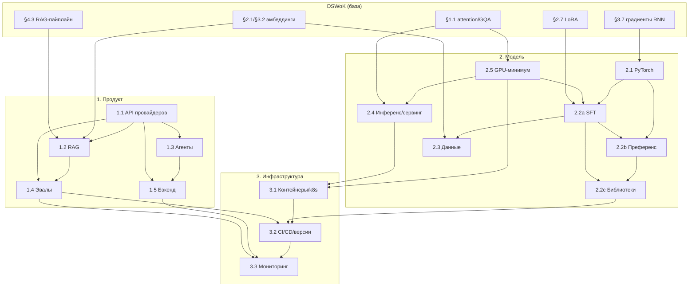

# llm-engineering-kb — оглавление и граф зависимостей

Корпус по прикладному LLM-инжинирингу уровня «свободного владения», в трёх слоях:
**продукт** (AI Product Engineer), **модель** (ML Engineer), **инфраструктура**.
Каждая заметка самодостаточна, держит планку глубины (механика с формулами и
числами, таблицы компромиссов, режимы отказа, код, вопросы самопроверки) и
ссылается на базовый [DSWoK](https://github.com/Erlemar/dswok) вместо дублирования.
Помечено: 🔥 — волатильная заметка (факты быстро устаревают, см. `MAINTENANCE.md`).

## Как читать

1. Идти по `prereqs` из frontmatter: тема опирается на указанные ниже неё.
2. Читать заметку целиком (суть → механика → практика → отказы).
3. По блоку «Вопросы для самопроверки» проверять владение, а не узнавание.
4. Прогонять код руками.

Рекомендованный порядок прохождения (по зависимостям): база железа и PyTorch →
сервинг и обучение → данные → продуктовый слой (API, RAG, агенты, эвалы, бэкенд) →
инфраструктура (контейнеры, CI/CD, мониторинг).

## Раздел 1. Продукт (AI Product Engineer)

- [1.1 API провайдеров: structured outputs, tool use, стриминг](01-product/1.1-provider-apis.md) — 🔥 intermediate. Гарантии JSON через constrained decoding, tool-use loop на своём коде, стриминг/SSE.
- [1.2 RAG на практике: эмбеддеры, векторные БД, чанкинг, гибрид и реранк](01-product/1.2-rag-applied.md) — 🔥 advanced. Дельта к DSWoK §4.3: выбор БД, HNSW/IVF/PQ, RRF, реранкеры.
- [1.3 Агентные системы на своём коде](01-product/1.3-agents-from-scratch.md) — 🔥 intermediate. Цикл агента, ReAct/reflection/router, лимиты и петли, workflow vs agent.
- [1.4 Оценка LLM-систем: ручные эвалы, LLM-as-judge, регрессии в CI](01-product/1.4-evaluation.md) — 🔥 advanced. Согласованность разметчиков, смещения судьи, эвал-гейты.
- [1.5 Бэкенд: async FastAPI, очереди, кэш, наблюдаемость](01-product/1.5-backend.md) — intermediate. Event loop, идемпотентность/DLQ/backpressure, семантический кэш, OTel+Langfuse.

## Раздел 2. Модель (ML Engineer)

- [2.1 PyTorch-беглость: autograd, отладка градиентов, mixed precision](02-model/2.1-pytorch-fluency.md) — intermediate. Граф autograd, NaN/grad_norm, bf16 vs fp16, accumulation/checkpointing.
- [2.2a SFT: supervised fine-tuning, loss masking, LoRA/QLoRA на практике](02-model/2.2a-sft.md) — intermediate. Completion-only loss, chat-шаблон, target_modules, слияние адаптеров.
- [2.2b Преференс-оптимизация: RLHF → DPO → IPO/ORPO/KTO](02-model/2.2b-preference-optimization.md) — advanced. Вывод DPO из Брэдли-Терри, роль β и референса, alignment tax.
- [2.2c Библиотеки файнтюна: transformers/peft/trl/axolotl/unsloth](02-model/2.2c-libraries.md) — 🔥 intermediate. Слои стека, когда что, мультиGPU (ZeRO/FSDP).
- [2.3 Подготовка данных: фильтрация, дедупликация, разметка, синтетика](02-model/2.3-data-preparation.md) — 🔥 advanced. MinHash-LSH, контаминация, model collapse, Self-Instruct.
- [2.4 Инференс и сервинг открытых моделей](02-model/2.4-inference-serving.md) — 🔥 advanced. Эталон глубины: PagedAttention, continuous batching, квантизация, движки.
- [2.5 GPU-минимум: VRAM, bandwidth, FlashAttention, H100 vs 4090](02-model/2.5-gpu-minimum.md) — 🔥 intermediate. Формулы памяти, roofline (decode memory-bound), NVLink, экономика.

## Раздел 3. Инфраструктура

- [3.1 Контейнеры и оркестрация для GPU: Docker, Kubernetes, экономика железа](03-infra/3.1-containers-orchestration.md) — 🔥 intermediate. CUDA forward-compat, nvidia.com/gpu, MIG/time-slicing, spot vs reserved.
- [3.2 CI/CD, версионирование и трекинг для LLM-систем](03-infra/3.2-cicd-versioning-tracking.md) — 🔥 intermediate. Эвал-гейты, shadow/canary/откат, DVC, MLflow/W&B/Neptune.
- [3.3 Мониторинг в проде: дрейф, качество без разметки, стоимость, latency](03-infra/3.3-production-monitoring.md) — advanced. PSI/KS, дрейф эмбеддингов, rubric drift, p95/p99.

## Граф зависимостей (prereqs)

Стрелка `A --> B` читается «A нужна до B» (A — предпосылка для B). Узлы `dswok:*` —
из базового DSWoK (внешние предпосылки).

## Связь с DSWoK

Базовый [DSWoK](https://github.com/Erlemar/dswok) покрывает теорию (attention,
Transformer, BERT, LoRA, RAG-пайплайн, эмбеддинги, RNN/LSTM/GRU и др.). Этот корпус
их **не дублирует**: ссылается «см. DSWoK §X.Y» и добавляет прикладную дельту.
Правило анти-дублирования и список покрытых DSWoK тем — в `BUILD_SPEC.md` §4.
